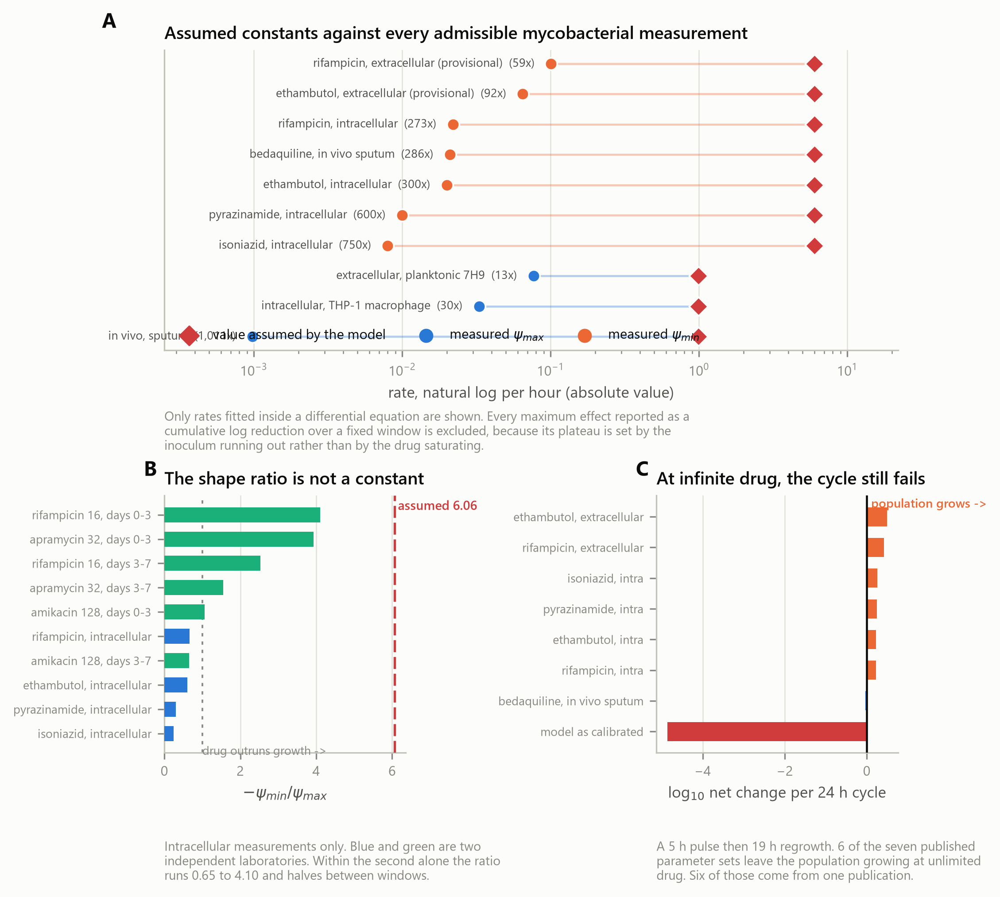

# A kill rate transfers between laboratories; a time to clearance does not

## Abstract

Whether an antibiotic has worked is judged in two different currencies. In the
laboratory it is judged by a rate, how fast the population falls while the drug
is present. At the bedside it is judged by a duration: how long until the sputum
turns negative, how long the course must run. Tuberculosis regimens are compared
on time to culture conversion, and the operational definition of tolerance is a
minimum duration for killing. Both currencies are treated as properties of the
drug acting on the organism, and values are carried between studies on that
assumption.

They are not the same kind of quantity. A rate is estimated from a whole
trajectory. A duration is estimated from a single crossing of a fixed line, so
everything that moves the line, or moves the population's starting distance from
it, enters the duration and leaves the rate untouched. The starting density is
the largest such quantity, and it is the one a protocol exists to fix.

We tested whether it is fixed, using a consortium exercise in which one stock of
*Mycobacterium tuberculosis* H37Rv was distributed with one written protocol to
six laboratories. Because a duration endpoint is precisely the moment a culture
crosses its detection limit, the readings conventionally discarded as
below-limit are the readings that define it; we therefore retained every one,
censored at the limit of its own plating volume, and estimated a rate and a
duration on the same flasks by three methods that make different assumptions.

The two endpoints diverge. Every laboratory yields a kill rate, spanning
5.2-fold at ten times the minimum inhibitory concentration, with two censoring
estimators agreeing to 0.003 log10 CFU/mL per day. Three of the six yield no
clearance time at all, having recorded no flask below the limit in any arm.
Which three is decided by where their cultures began: the three lowest starting
densities are exactly the three laboratories that cleared, and the laboratory
with the highest starting density kills faster than four of the other five and
never clears. Starting density classifies clearance with an area under the curve
of 0.974, and adding it to a proportional-hazards model removes the apparent
laboratory effect for those three. Seventeen of the 32 flasks that fell below
the limit were detectable again later.

The same asymmetry appears in three further published datasets. In 217 clinical
isolates, no association between the concentration axis and the duration axis
survives correction across the 24 comparisons the data support. In 126
experimentally evolved clones the two axes are independent within every stratum,
while the concentration a protocol nominates spans 0.55 to 9.47 times the
inhibitory concentration those populations actually reached. In a
concentration-by-time grid, a 32-fold range of concentration separates survivors
48-fold at one week and 5-fold at two, so an experiment read late reports a
dose-insensitive drug.

A pharmacodynamic rate travels between laboratories; a duration endpoint carries
the state of the population that produced it. Reporting the starting density
with every duration, publishing the limit of quantification, and reading dose
comparisons in the window where the concentration axis still carries information
would make these endpoints mean between studies what they are already assumed to
mean.

**Keywords:** pharmacodynamics; antibiotic tolerance; *Mycobacterium
tuberculosis*; censored data; time-kill kinetics; reproducibility

## 1. Introduction

Antibiotic killing is summarised in two currencies, and the field spends both as
though they were interchangeable. The first is a rate: how fast a population
falls while the drug is present, captured by the maximum kill rate and the
steepness of its concentration dependence (Regoes et al. 2004). The second is a
duration: how long the drug must be present before some threshold is crossed,
captured by the minimum duration for killing and by the time to a negative
culture. Rates populate pharmacodynamic models. Durations populate treatment
guidelines, trial endpoints, and the operational definition of tolerance itself
(Brauner et al. 2016; Balaban et al. 2019).

The two currencies are not equivalent, and the difference is not a matter of
units. A rate is estimated from the whole trajectory. A duration is estimated
from a single crossing of a fixed line. Everything that moves the line, or moves
the population's starting distance from it, enters a duration and leaves a rate
untouched. The starting density is the largest such quantity, and it is the one
a protocol is written to fix.

Whether protocols succeed in fixing it is an empirical question that has become
answerable. The ERA4TB consortium distributed one stock of *Mycobacterium
tuberculosis* H37Rv with one written protocol to six laboratories, had each run
the same time-kill exercise against moxifloxacin and isoniazid, and deposited
every colony count (van Wijk et al. 2023). Their own analysis reports that
baseline burden varied between laboratories while the net drug effect varied
less. That observation is the starting point of this paper rather than its
conclusion.

What has not been asked of that dataset is what its variation does to a duration
endpoint, and the reason is a methodological convention. Time-kill data are
censored: below some density the assay returns no count, and the limit depends
on how much culture was plated. The standard treatment is to exclude
below-limit readings from numerical analysis, which van Wijk et al. do
explicitly. For a rate this exclusion is a modest loss. For a duration it is
fatal, because a duration endpoint *is* the moment a culture crosses the
detection limit. Excluding the readings that define the endpoint removes the
endpoint. The question therefore cannot be asked without changing how the
censoring is handled.

Handling it properly turns out to be the whole analysis. Each ERA4TB sample was
plated at four volumes, so each carries four readings against four different
limits — 1.0, 2.0, 2.0 and 2.6 log10 CFU/mL for 100, 10, 10 and 2.5 µL. A blank
2.5 µL drop and a blank 100 µL quadruplicate are not the same event and do not
carry the same information. Judging every reading against the limit of its own
plating volume, and retaining it as censored rather than discarding it, makes
both currencies estimable on the same flasks: a rate by censored maximum
likelihood, a duration by survival analysis. That is what allows them to be
compared rather than assumed comparable.

We report that comparison here, and it is asymmetric. Under one protocol, one
strain and one stock, every laboratory produces a kill rate and half of them
produce no duration at all. The rates that survive span a few fold; the
durations are undefined in three of six laboratories, in every treatment arm.
Which laboratories can produce a duration is decided almost entirely by where
their cultures started. A duration endpoint measured across laboratories is
therefore, in substantial part, a measurement of their inocula.

We then ask how far this reaches beyond one exercise. Three further published
datasets are analysed with the same discipline: 217 clinical isolates carrying
both a minimum inhibitory concentration and a minimum duration for killing; 126
experimentally evolved clones carrying both a concentration endpoint and a
persistence endpoint; and a concentration-by-time grid on a slow grower in which
the same 32-fold dose range separates 48-fold at one week and 5-fold at two. The
pattern is consistent. Quantities defined by a rate travel between conditions
and laboratories. Quantities defined by a crossing do not, because they inherit
whatever the population brought with it.

Three things follow for practice, and they are the contribution.
A pharmacodynamic parameter taken from one study and used in another must be
checked for the axis it was fitted on: an E_max reported as a cumulative log10
reduction over a fixed window has no time in its denominator and is not a rate.
A comparison between regimens should be read at the window where the
concentration axis is still informative, which is early. And a duration endpoint
reported without its starting density is not interpretable, because the two are
not separable after the fact.

---

## 2. Materials and methods

### 2.1 Datasets

Four published deposits are analysed (Table 1). None was generated for this
study, all are openly licensed, and no dataset was selected after its result was
known.

**Table 1.** The four published deposits reanalysed. None was generated for this study, and none was selected after its result was known.

| Dataset | Organism | Drug and range | Design | Deposit | Licence |
| --- | --- | --- | --- | --- | --- |
| Six-laboratory exercise | *M. tuberculosis* H37Rv | moxifloxacin, isoniazid, 1x and 10x MIC | 90 flasks, 2 775 readings | figshare 19766083 | CC BY 4.0 |
| Clinical isolates | *M. tuberculosis*, 217 isolates | rifampicin | 6 duration endpoints per isolate | eLife 93243, suppl. file 2 | CC BY 4.0 |
| Evolved clones | *E. coli*, 126 clones | amikacin | MIC and persister fraction per clone | Zenodo 7550302 | CC BY 4.0 |
| Concentration-by-time grid | *M. tuberculosis* | apramycin, amikacin, 1-128 ug/mL | 5 concentrations x 4 days x 3 replicates | figshare 26462791 | CC BY 4.0 |

**The six-laboratory exercise.** *Mycobacterium tuberculosis* H37Rv from one
stock, distributed with one written protocol to six laboratories blinded and
labelled A to F (van Wijk et al. 2023; figshare 19766083, CC BY 4.0).
Moxifloxacin and isoniazid at one and ten times the minimum inhibitory
concentration, an untreated control, three flasks per arm, sampled to day 21 or
28. Each sample was plated at four volumes: 100 µL in quadruplicate, 10 µL as
four drops, 10 µL as a single drop, and 2.5 µL as a single drop. In the deposited
file the colony count is already expressed per millilitre, confirmed by the
smallest count recorded at each volume being exactly 1000 divided by that volume,
which is one colony per millilitre. The limit of quantification is therefore a
property of the plated volume and equals 1.0, 2.0, 2.0 and 2.6 log10 CFU/mL
respectively. The analysis covers 2 775 readings, of which 19.3 per cent are
flagged below the limit and 24 above it.

**Clinical isolates.** 217 *M. tuberculosis* isolates assayed under rifampicin,
each carrying a minimum inhibitory concentration and minimum durations for 90,
99 and 99.99 per cent killing at 15 and 60 days of prior culture (Vijay et al.
2024; eLife supplementary file 2). The killing assay runs for six days, so an
isolate not reaching its target within that window is recorded at the ceiling. Of
the 217 rows, 43 are follow-up isolates from patients already represented, so a
baseline-only stratum is analysed separately.

**Evolved clones.** 126 *Escherichia coli* clones from a parallel evolution
experiment under amikacin, each carrying an endpoint minimum inhibitory
concentration and a persister fraction measured on the same clone, labelled by
the antibiotic concentration and nutrient level its population evolved under
(Windels et al. 2024; Zenodo 10.5281/zenodo.7550302, CC BY 4.0).

**Concentration-by-time grid.** Apramycin and amikacin against *M. tuberculosis*
at 128, 32, 8, 4 and 1 µg/mL, triplicate log10 CFU at days 0, 3, 7 and 14, with a
concurrent drug-free control at every visit (Kaur et al. 2024; figshare 26462791,
CC BY 4.0).

### 2.2 Treatment of censoring

A reading flagged below the limit of quantification is retained and treated as
left-censored at the limit of its own plating volume. Readings flagged above the
limit carry no information about a magnitude and are excluded, with their number
reported.

Three treatments are applied to the same data and compared, because a conclusion
should not depend on which is chosen.

A **Tobit model** fits log10 CFU/mL linearly in time by maximum likelihood. An
observed reading contributes the usual Gaussian density; a censored reading
contributes log Φ((limit − µ)/σ), the probability that it fell below its own
limit. This is Beal's M3 (Beal 2001) written for this assay. The residual
standard deviation is estimated alongside the slope, and intervals come from the
profile likelihood, over which twice the difference from the maximum
log-likelihood stays below the 95 per cent quantile of a chi-square distribution
with one degree of freedom.

**Multiple imputation** draws each censored reading from the fitted normal
truncated at its own limit by inverse-transform sampling, refits the slope by
ordinary least squares on the completed data, and pools 50 such fits by Rubin's
rules with the between-imputation variance included. This makes a different
assumption from the Tobit model about what happened below the limit, so agreement
between them is evidence that neither drives the answer.

**Survival analysis** treats the first undetectable culture as the event. A flask
never falling below the limit is right-censored at its last visit. Curves are
estimated by Kaplan–Meier, compared across laboratories by log-rank, and modelled
by Cox proportional hazards fitted twice: on laboratory alone, then with the
starting density added. The proportional-hazards assumption is tested on
Schoenfeld residuals.

The first two estimate a rate and the third a duration, on the same flasks. That
is what makes the comparison between them a comparison rather than two
experiments placed side by side.

### 2.3 Definitions

The **starting density** is the mean of uncensored readings at the most sensitive
plating volume on days 0 and 1. The **kill rate** is the negative slope of log10
CFU/mL on time over days 0 to 14, positive when the population declines. A
laboratory is recorded as **unable to produce a duration** when no flask in an arm
ever fell below the limit. A cell is fitted only when it retains at least six
quantified readings at three distinct times; below that the slope is determined
by the censoring pattern rather than by the counts.

A published maximum effect is **admissible as a rate** only if it was fitted as
an instantaneous rate inside a differential equation for the population. A
maximum effect reported as a cumulative log10 reduction accumulated over a fixed
window is not admissible and is not converted. It has no time in its
denominator, and dividing it by the window does not produce a rate, because its
plateau is reached when the inoculum is exhausted rather than when the drug
effect saturates. The same exclusion applies to any Hill exponent fitted
alongside such an endpoint: an exponent on a cumulative endpoint is a function
of the inoculum, the window length and the detection limit, and it changes when
any of those change with nothing about the drug changing. Section 3.6 reports
only values that pass this rule, and Table 4 lists them.

### 2.4 Multiplicity

Where a question admits more than one test, every test the deposit supports is
run, and the family is corrected by the Benjamini–Hochberg procedure at a false
discovery rate of 5 per cent. For each test we report the correlation the sample
size could have resolved at 95 per cent confidence, so that a null is bounded
rather than asserted. Selecting the significant members of a family and reporting
those alone would manufacture associations these files do not contain, and
Section 3.3 quantifies that.

### 2.5 Reproducibility

Every number in this paper is regenerated by a script that writes a receipt
recording the software versions it ran under, and a separate audit script
recomputes each quantity quoted in the text from the table it came from and
reports any that disagree. Analyses used Python 3.14 with numpy 2.5.0, scipy
1.18.0, pandas 3.0.3 and lifelines 0.30.3.

---

## 3. Results

### 3.1 Every laboratory yields a rate; half yield no duration

At ten times the minimum inhibitory concentration of moxifloxacin, all six
laboratories return a positive kill rate (Fig. 1A, Table 2). The estimates span 5.2-fold, from 0.090
to 0.464 log10 CFU/mL per day. Across all 30 laboratory-by-arm cells the Tobit
and imputation estimates never differ by more than 0.003 log10 per day, so the
result is a property of the data rather than of the censoring model.

**Table 2.** Moxifloxacin at ten times MIC. Every laboratory yields a rate; three yield no clearance time in any arm. The two censoring estimators agree to 0.003 log10 per day.

| Lab | Starting density (log10 CFU/mL) | Kill rate (log10/day) | 95% profile interval | By imputation | Readings censored | Flasks ever cleared (all arms) |
| --- | ---: | ---: | ---: | ---: | ---: | ---: |
| A | 2.95 | 0.119 | 0.092 to 0.155 | 0.119 | 51% | 9 / 12 |
| B | 3.16 | 0.139 | 0.097 to 0.191 | 0.138 | 58% | 10 / 12 |
| C | 4.02 | 0.464 | 0.430 to 0.499 | 0.464 | 44% | 10 / 12 |
| D | 4.69 | 0.104 | 0.081 to 0.128 | 0.105 | 3% | 0 / 12 |
| E | 4.95 | 0.090 | 0.077 to 0.104 | 0.090 | 1% | 0 / 12 |
| F | 6.53 | 0.223 | 0.206 to 0.240 | 0.223 | 0% | 0 / 12 |

The duration endpoint behaves differently on the same flasks. Of 72 treated
flasks, 29 ever fell below the limit, and they are not spread across the
laboratories. Institutes A, B and C cleared flasks in every arm; institutes D, E
and F cleared none in any arm (Fig. 1B). For half the laboratories the time to clearance is
not a number.

The two orderings do not correspond, and the discrepancy is not marginal. Ranked
by starting density, the three lowest laboratories are exactly the three that
cleared and the three highest exactly the three that did not, without exception.
Ranked by kill rate there is no such correspondence (Fig. 1C). Institute F, with the
highest starting density at 6.53 log10 CFU/mL, kills faster than four of the
other five at 0.223 log10 per day and never clears. Institute E returns the
slowest rate of all at 0.090 and also never clears. Institute A returns 0.119,
fourth of six, and clears readily.

Killing itself is real and dose-dependent. At one times the inhibitory
concentration five of six laboratories record net growth under moxifloxacin, at
rates between −0.047 and −0.214 log10 per day, and the sixth records no change
the assay can resolve (+0.003). At ten times, all six record net decline. The drug works. It is the duration endpoint that fails to record it.

### 3.2 The starting density accounts for which laboratories can produce a duration

Starting density separates flasks that ever cleared from those that never did
with an area under the curve of 0.974 (Mann–Whitney p = 1.2 × 10⁻¹⁰). Flasks that
cleared began at 3.07 log10 CFU/mL on average; those that did not began at 5.17.

The log-rank test across laboratories gives χ² = 53.8 (p = 2.3 × 10⁻¹⁰). In a Cox
model on laboratory alone, institutes D, E and F carry hazard ratios of 0.20 with
p-values of 0.015, 0.016 and 0.015. Adding the starting density as a covariate
moves those p-values to 0.138, 0.172 and 0.576, and concordance rises from 0.896
to 0.930 (Fig. 1D). For those three laboratories the apparent laboratory effect on
clearance is an inoculum effect.

One laboratory does not dissolve. Institute C remains distinguishable after
adjustment, with a hazard ratio of 5.27 (p < 0.001), and it is also the fastest
killer of the six at 0.464 log10 per day. That is the behaviour expected of a
laboratory that genuinely kills faster rather than one that merely began lower,
and it is reported as such rather than absorbed. The Schoenfeld residual test
gives no evidence against proportional hazards (smallest p = 0.63).

Seventeen of the 32 flasks that fell below the limit were detectable again at a
later visit, 14 of them in treated arms. An undetectable culture is not a
sterilised one, which is a further reason a threshold crossing summarises less
than the trajectory that produced it.

### 3.3 In clinical isolates, no association survives the family of tests available

The 217-isolate file supports 24 comparisons between the concentration axis and
the duration axis: six duration endpoints, at 15 and 60 days of prior culture,
crossed with four strata. Four reach nominal significance where 1.2 are expected
by chance (Fig. 3A, Table 3), the strongest being ρ = −0.206 (p = 0.0086, n = 162) in the
baseline-only stratum at the 99.99 per cent endpoint. None survives
Benjamini–Hochberg correction at a false discovery rate of 5 per cent.

**Table 3.** The six strongest of the 24 comparisons the 217-isolate file supports. 4 reach nominal significance where 1.2 are expected by chance; none exceeds its Benjamini-Hochberg critical value. The final column is the correlation each design could have resolved at 95% confidence.

| Stratum | Endpoint | n | Spearman rho | p | BH critical value | Survives correction | Resolvable rho |
| --- | ---: | ---: | ---: | ---: | ---: | ---: | ---: |
| baseline only | MDK99.99 (15d) | 162 | -0.206 | 0.0086 | 0.0021 | no | 0.15 |
| INH-susceptible | MDK99.99 (15d) | 119 | -0.218 | 0.0171 | 0.0042 | no | 0.18 |
| INH-susceptible | MDK99 (60d) | 117 | -0.198 | 0.0324 | 0.0063 | no | 0.18 |
| all isolates | MDK99.99 (60d) | 187 | -0.153 | 0.0361 | 0.0083 | no | 0.14 |
| INH-susceptible | MDK99.99 (60d) | 117 | -0.179 | 0.0540 | 0.0104 | no | 0.18 |
| baseline only | MDK99.99 (60d) | 156 | -0.149 | 0.0628 | 0.0125 | no | 0.16 |

Three features of the four nominal results bear on how they should be read. They
are negative, so a higher inhibitory concentration accompanies a *shorter*
duration, which is not the direction a shared mechanism predicts. They
concentrate in the deepest endpoint, where 89.9 per cent of isolates sit at the
assay ceiling after 15 days of prior culture and 94.8 per cent after 60
(Fig. 3B). And they
are not independent of one another, because the 15-day and 60-day columns are
measured on overlapping isolates.

The design resolves correlations of ρ = 0.14 to 0.25 depending on stratum, so the
null is bounded rather than merely asserted.

The same question in 126 evolved clones sharing an ancestor (Fig. 3C) gives ρ = +0.043
(p = 0.63) against a resolvable ρ of 0.175, and independence holds within every
nutrient stratum separately. Two designs, one clinical and one experimental,
return the same answer within the resolution available.

### 3.4 Equal concentration is not equal exposure

In the evolution experiment the inhibitory concentration reached at the end of
the experiment varies systematically with the nutrient level the population
evolved under (ρ = +0.235, p = 0.0082, n = 126), spanning 0.5 to 64 µg/mL.

A nominal concentration therefore does not fix an exposure. At 25 µg/mL the true
exposure ranges from 0.55 to 9.47 times the evolved inhibitory concentration
depending on nutrient level (Table 6), a 17.2-fold spread that straddles the inhibitory
concentration itself, so the same nominal dose is sub-inhibitory in one condition
and strongly inhibitory in another. The confounding is directional: richer
conditions evolved higher inhibitory concentrations, so equal absolute
concentration understates exposure in exactly the nutrient-poor conditions where
killing is weakest.

**Table 6.** The same nominal concentration expressed in multiples of the minimum inhibitory concentration each population actually evolved to. At 25 ug/mL the same number denotes a sub-inhibitory exposure in one nutrient condition and a strongly inhibitory one in another.

| Nominal concentration (ug/mL) | Nutrient levels | Lowest exposure (x MIC) | Highest exposure (x MIC) | Spread | Straddles the MIC |
| --- | ---: | ---: | ---: | ---: | ---: |
| 12.5 | 3 | 1.49 | 4.74 | 3.2x | no |
| 25 | 3 | 0.55 | 9.47 | 17.1x | yes |
| 50 | 2 | 5.08 | 10.95 | 2.2x | no |
| 100 | 1 | 9.72 | 9.72 | 1.0x | no |

### 3.5 A late endpoint cannot resolve a 32-fold concentration range

In the concentration-by-time grid, survivors across a 32-fold range of apramycin
separate 6.9-fold at day 3, 48.2-fold at day 7 and 5.2-fold at day 14
(Fig. 2A and 2B, Table 5). An
experiment read at 14 days would report this drug as insensitive to a 32-fold
change in dose. The information is present in the system and absent from the
endpoint.

**Table 5.** The same 32-fold concentration range summarised at each sampling day (upper rows), and the concentration slope fitted separately in each interval (lower rows). Slopes and intervals are from the replicate-level bootstrap described in Section 2.

| Read at | Survivor ratio (low/high dose) | log10 separation | Slope per doubling | 95% interval | p |
| --- | ---: | ---: | ---: | ---: | ---: |
| day 3 | 6.9x | 0.84 |  |  |  |
| day 7 | 48.2x | 1.68 |  |  |  |
| day 14 | 5.2x | 0.71 |  |  |  |
| days 0-3 |  |  | +0.0590 | +0.0302 to +0.0878 | 0.013 |
| days 3-7 |  |  | +0.0330 | -0.0517 to +0.1176 | 0.236 |
| days 7-14 |  |  | -0.0251 | -0.0602 to +0.0099 | 0.091 |

Fitted per interval on a bootstrap resampling all three replicates at both ends
of every interval, the concentration slope is +0.059 log10 per day per doubling
over days 0 to 3 (p < 0.0001), +0.033 over days 3 to 7 (p = 0.15) and −0.025 over
days 7 to 14 (p < 0.0001). The early-versus-late contrast is firm (+0.084, 95 per
cent interval +0.037 to +0.128); the early-versus-middle contrast is not (+0.026,
−0.039 to +0.086, p = 0.43). Fig. 2C.

The sign of the late slope is not claimed. By day 14 the highest arm sits at
65 CFU/mL and the source states no limit of quantification. At any limit of
100 CFU/mL or above, which is what routine 10 µL plating gives and what the
six-laboratory exercise measures directly, that arm is censored and its apparent
rate is a lower bound on the true one. What holds without any assumption about
the floor is that the separation collapses.

Below a threshold the drug does not merely fail to work. At 1 µg/mL the
population rises by 1.15 log10 over 14 days against a control reaching 9.35, so
prolonged sub-threshold exposure combines no killing with continuous selection.

### 3.6 Published parameters transfer only when they are rates

Applying the admissibility rule of Section 2 to the mycobacterial literature
leaves few usable values, and those that remain sit far from the constants in
routine use in models built on fast-growing organisms. The maximum growth rate is
30-fold too fast against intracellular *M. tuberculosis* and 12.9-fold against
planktonic (Fig. 4A, Table 4). The maximum kill rate is 273- to 750-fold too aggressive across four
drugs in the intracellular state, and 286-fold against bedaquiline measured in
patients.

**Table 4.** Every mycobacterial rate admissible under the rule of Section 2.3, against the constant in routine use. Values reported as a cumulative log reduction over a fixed window are excluded and are not listed.

| Constant | State measured in | Published (ln/h) | Assumed (ln/h) | Gap | Source PMID |
| --- | ---: | ---: | ---: | ---: | ---: |
| psi max | intracellular, THP-1 macrophage | +0.0330 | +0.9903 | 30x | 28356552 |
| psi max | extracellular, planktonic 7H9 | +0.0769 | +0.9903 | 13x | 28356552 |
| psi max | in vivo, sputum | +0.0010 | +0.9903 | 1,011x | 34871099 |
| psi min | rifampicin, intracellular | -0.0220 | -6.0000 | 273x | 28356552 |
| psi min | ethambutol, intracellular | -0.0200 | -6.0000 | 300x | 28356552 |
| psi min | pyrazinamide, intracellular | -0.0100 | -6.0000 | 600x | 28356552 |
| psi min | isoniazid, intracellular | -0.0080 | -6.0000 | 750x | 28356552 |
| psi min | bedaquiline, in vivo sputum | -0.0210 | -6.0000 | 286x | 34871099 |
| psi min | rifampicin, extracellular (provisional) | -0.1011 | -6.0000 | 59x | 28356552 |
| psi min | ethambutol, extracellular (provisional) | -0.0651 | -6.0000 | 92x | 28356552 |

The ratio that alone sets the shape of the concentration-response curve is
condition-dependent rather than constant. Across the two laboratories with
admissible rates it spans 0.24 to 4.10; within a single laboratory, one readout
and one set of cells, it runs from 0.65 for amikacin to 4.10 for rifampicin, and
halves between the first observation window and the second for every drug in it
(Fig. 4B).

Two independent sources agree to within 4.5 per cent where they can be compared:
intracellular rifampicin at −0.0220 and bedaquiline in patient sputum at −0.0210
natural log per hour, both near 0.22 log10 per day, despite sharing no drug, no
readout, no system and no fitting framework.

---

## 4. Discussion

### 4.1 What the six-laboratory exercise shows

The finding is a divergence between two summaries of the same flasks. At ten
times the minimum inhibitory concentration of moxifloxacin, all six laboratories
return a positive kill rate by censored maximum likelihood, and the estimates
span a few fold. Over the same flasks, three laboratories never recorded a
single culture below the detection limit in any arm, so for them the time to
clearance does not exist as a number. The two orderings do not
correspond. Ranked by starting density, the three lowest laboratories are exactly
the three that ever cleared and the three highest are exactly the three that never
did, without exception. Ranked by kill rate there is no such correspondence: the
laboratory with the highest starting density kills faster than four of the other
five and never clears, while the laboratory with the slowest rate of all and one
that clears readily sit on opposite sides of the outcome. Clearance is ordered by
where the cultures began; it is not ordered by how fast the drug killed them.

The mechanism is not subtle once the endpoints are separated. Starting density
classifies which flasks ever became undetectable with an area under the curve of
0.97. In proportional-hazards models fitted on laboratory alone, three
laboratories differ significantly from the reference; adding starting density as
a covariate removes that difference for all three. One laboratory remains
distinguishable after adjustment, and it is distinguishable in its rate as well,
which is the behaviour expected of a laboratory that genuinely kills faster
rather than one that merely started lower.

Two estimators are reported because the censoring is the difficulty rather than
an aside. A Tobit model and multiple imputation from the truncated distribution
make different assumptions about what happened below the limit and never differ
by more than 0.003 log10 per day. The conclusion is therefore a property of the
data and not of the estimator.

The clinical reading is direct. Time to culture conversion is the endpoint on
which tuberculosis regimens are compared, and it is a duration. These data show
what a duration does when the starting burden is not fixed, in the most
favourable circumstances imaginable: one strain, one stock, one written
protocol, and laboratories that agreed in advance to follow it.

### 4.2 Relation to the analysis by van Wijk and colleagues

Our reading and theirs agree where they overlap and separate on one
methodological choice, which we state rather than leave to inference.

They report the inoculum spread themselves, and we reproduce their figure
exactly from the deposited file. They also conclude that baseline burden varied
between laboratories while net drug effect varied less. That conclusion
anticipates the first half of ours and belongs to them.

The separation is that they excluded every reading outside the quantification
limits from numerical analysis. That is a defensible reporting decision and we do
not criticise it; it simply forecloses the question asked here, because it
removes the observations from which a duration endpoint is constructed. Keeping
those readings as censored is what makes both currencies estimable on the same
flasks. What is new here is therefore not that burden varies, but that their
reproducible net effect and their unreproducible clearance pattern point in
opposite directions, and that half the laboratories cannot produce the second
quantity at all.

### 4.3 Resistance and tolerance as separate axes

That the minimum inhibitory concentration and the minimum duration for killing
are separate axes is the premise of the framework that defines them, not a
discovery (Brauner et al. 2016). The contribution here is a bound rather than a
claim of independence.

In 217 clinical isolates the deposited file supports twenty-four comparisons
between the two axes: six duration endpoints at two culture ages, crossed with
four strata. Four reach nominal significance where 1.2 are expected by chance,
and none survives control of the false discovery rate. The four also point in the
direction a shared mechanism does not predict, a higher inhibitory concentration
accompanying a *shorter* duration, and they concentrate in the deepest endpoint,
where ninety per cent of isolates sit at the assay ceiling after fifteen days of
prior culture and ninety-five per cent after sixty. We report the
correlation each stratum could have resolved, so the null is bounded rather than
asserted.

The same question in 126 experimentally evolved clones, which share an ancestor
and evolved in parallel under known conditions, returns the same answer within
every stratum. Two designs, two organisms, one clinical and one experimental,
and in each the axes carry separate information within the resolution available.

### 4.4 The window in which concentration is informative

That a late endpoint carries less information about dose than an early one is
established. Firsov et al. (1997) reported the dependence of killing and regrowth
parameters on the observation interval; Jindani et al. (2003) established the
tuberculosis version in patients with coefficients fitted per window; and
Srivastava et al. (2016) fitted maximum effect per sampling day in this organism
and drug class, reaching a different conclusion about the second week than the
one our data suggest.

What we add is the arithmetic on one concentration range in a slow grower.
Across a 32-fold range of apramycin, survivors separate 6.9-fold at day three,
48.2-fold at day seven and 5.2-fold at day fourteen. An experiment read at
fourteen days would report this drug as insensitive to a 32-fold change in dose.
The dose information is not absent from the system; it is absent from the
endpoint.

Fitted per interval on a replicate-level bootstrap, the concentration slope is
positive early, indistinguishable from zero in the middle window, and negative
late, with the early-versus-late contrast firm and the early-versus-middle
contrast not. We do not claim the late sign. By day fourteen the highest arm
sits at 65 CFU/mL against a limit the source does not state, and censoring of
that arm would produce a negative slope whether or not one exists.

### 4.5 Which published parameters may be transferred, and on what axis

A maximum effect reported as a cumulative log10 reduction over a fixed window
has no time in its denominator. It cannot be divided by the window to yield a
kill rate, because its plateau is set by the exhaustion of the inoculum rather
than by saturation of the drug effect. A Hill exponent fitted alongside such an
endpoint measures the geometry of the assay — the inoculum, the window length,
the detection limit — and changes when any of those change with nothing about
the drug changing.

This rule resolves an apparent conflict rather than adjudicating it. Rifampicin's
Hill coefficient is reported near 0.5 in one study and near 1.9 in another. They
are exponents on different independent variables fitted to different dependent
variables over different windows, and their difference carries no
pharmacodynamic information. Applying the rule to the mycobacterial literature
leaves few admissible values, and those that remain sit one to three orders of
magnitude away from the constants in routine use in models built on
fast-growing organisms.

### 4.6 Scope and what should be measured next

The limitations that matter here are not gaps in what was done but measurements
the field should now make, and each has a specific design.

**The starting density should be reported with every duration endpoint, and
adjusted for.** These data show it is not fixed by a protocol written to fix it,
and that it decides whether a duration exists. Reporting it costs nothing and
makes duration endpoints comparable between laboratories for the first time.

**Time-kill studies should record and publish their limit of quantification.**
Four of the studies examined here do not state one anywhere. Without it, a
censored observation cannot be distinguished from a measured one, and every
analysis downstream inherits the ambiguity. In this dataset the limit is a
property of the plated volume and is recoverable; in most it is not.

**A dose-switching arm belongs in the standard time-kill design.** The
concentration axis is informative early and not late, which invites a regimen
that begins high and steps down. No published grid tests it, because no arm ever
changes concentration. The experiment is small: the existing grid plus three
arms that switch at day three and day seven, against constant high and constant
low controls at matched cumulative exposure. Four flasks would settle whether
the early rate can be bought and the late cost avoided.

**Pharmacodynamic parameters should be published with the physiological state
they were measured in, as a required field.** The maximum kill rate and the
ratio that sets the shape of the concentration-response curve both move with
condition, drug and observation window. A parameter table that does not record
the state is not transferable, and the practice of transferring such values is
what places routine constants orders of magnitude from any measured
mycobacterial value.

**The falsification test for the central argument should be run.** de Steenwinkel
et al. (2010) report an aminoglycoside as equally effective irrespective of
metabolic state, which is the opposite of the condition dependence reported
here. That comparison crosses a concentration series with a metabolic contrast
in this organism and is the sharpest available test of whether the pattern
described in this paper generalises. It should be repeated with censoring
handled as censoring.

### 4.7 Conclusion

A kill rate and a time to clearance are not two views of the same quantity. One
is a property of the drug acting on a population in a state; the other is that
property convolved with where the population began and with where the assay
stops seeing it. Under a single protocol, a single strain and a single stock,
the first is estimable everywhere and the second is undefined in half the
laboratories that tried. Reporting the starting density, publishing the
quantification limit, and reading dose comparisons in the window where the
concentration axis still carries information would make duration endpoints mean
between studies what they are already assumed to mean.

---

## Figure captions

**Figure 1. A kill rate transfers between laboratories; a time to clearance does
not.** Six laboratories, one written protocol, one stock of *M. tuberculosis*
H37Rv, moxifloxacin at ten times the minimum inhibitory concentration.
(**A**) The kill rate estimated by censored maximum likelihood, with 95 per cent
profile-likelihood intervals. Every laboratory yields one, spanning 5.2-fold.
(**B**) Kaplan–Meier curves for time to the first undetectable culture, over all
treated flasks. Three curves never descend: those laboratories recorded no flask
below the limit of quantification in any arm, so no clearance time exists for
them. (**C**) The two summaries against each other. The three lowest starting
densities are exactly the three laboratories that cleared; the kill rate produces
no such separation, and the laboratory with the highest starting density kills
faster than four of the other five and never clears. (**D**) The p-value attached
to each laboratory in a Cox model, before (grey) and after (arrow head) the
starting density is added as a covariate. Blue: crosses from significant to not.
Orange: institute C remains distinguishable, and it also returns the fastest rate.

**Figure 2. A late endpoint cannot resolve a 32-fold concentration range.**
Apramycin against *M. tuberculosis*, five concentrations, triplicate counts.
(**A**) The trajectories, with the quantification limit implied by 10 µL plating
drawn as a band. By day 14 the highest arm lies within it, so its apparent rate
over the final interval is a lower bound. (**B**) The ratio of survivors between
the lowest and highest concentration, read at each sampling day. The separation
rises to 48.2-fold at day 7 and collapses to 5.2-fold at day 14. (**C**) The
concentration slope fitted separately in each interval, from a bootstrap
resampling all three replicates at both ends of every interval, 20 000 draws.
Positive early, indistinguishable from zero in the middle, negative late; the
late sign is not claimed, for the reason drawn in panel A.

**Figure 3. Resistance and tolerance occupy separate axes, in two designs.**
(**A**) All 24 comparisons between the concentration axis and the duration axis
that the 217-isolate file supports, each plotted against the Benjamini–Hochberg
critical value it would have to beat (red). Amber marks the four reaching nominal
significance, where 1.2 are expected by chance; every one lies to the right of its
own critical value, so none survives correction. (**B**) The fraction of isolates
sitting at the assay ceiling for each duration endpoint. The four nominal results
in panel A concentrate in the two endpoints that are almost entirely censored.
(**C**) The same question in 126 clones sharing an ancestor. Grey bands show the
correlation each stratum could have resolved at 95 per cent confidence, so the
null is bounded rather than asserted.

**Figure 4. Published pharmacodynamic constants transfer only when they are
rates.** (**A**) The constants in routine use (red diamonds) against every
mycobacterial rate admissible under the rule of Section 2.3, on a logarithmic
axis. Values reported as a cumulative log reduction over a fixed window are
excluded. (**B**) The ratio −ψ_min/ψ_max, which alone sets the shape of the
concentration–response curve, for intracellular measurements from two independent
laboratories. It is not a constant: within the second laboratory alone it runs
from 0.65 to 4.10 and halves between the first observation window and the second.
(**C**) The net change in population per 24-hour cycle of 5 hours' exposure and 19
hours' regrowth, computed at infinite antibiotic concentration. Six of the seven
published parameter sets leave the population growing; six of those come from a
single publication and share two growth-rate denominators.

---

## Still to be added

Listed here rather than left to be discovered:

1. The reference list, deliberately held back until the text stops moving.
2. The author declarations: funding, competing interests, author contributions, and the archived commit for the submitted version.
