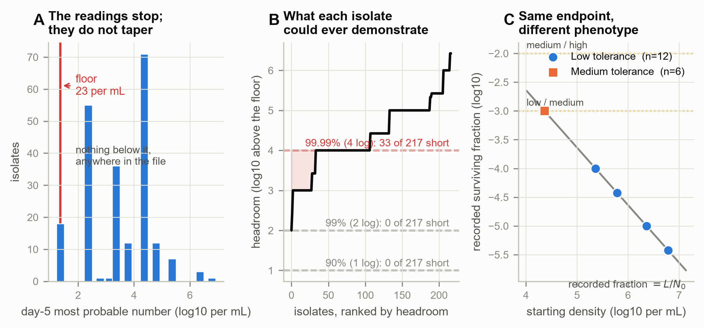
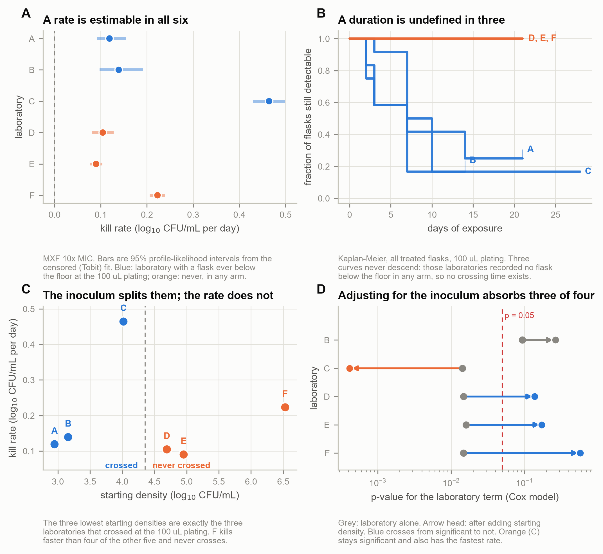
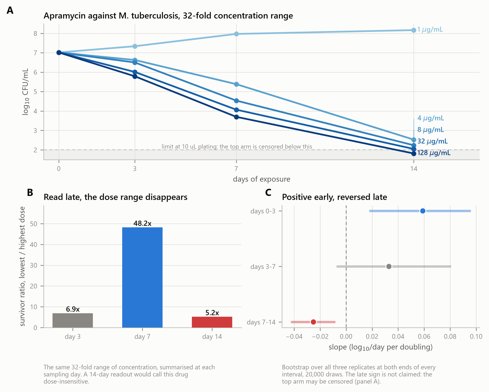
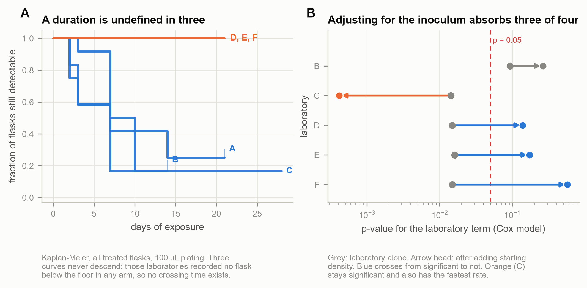
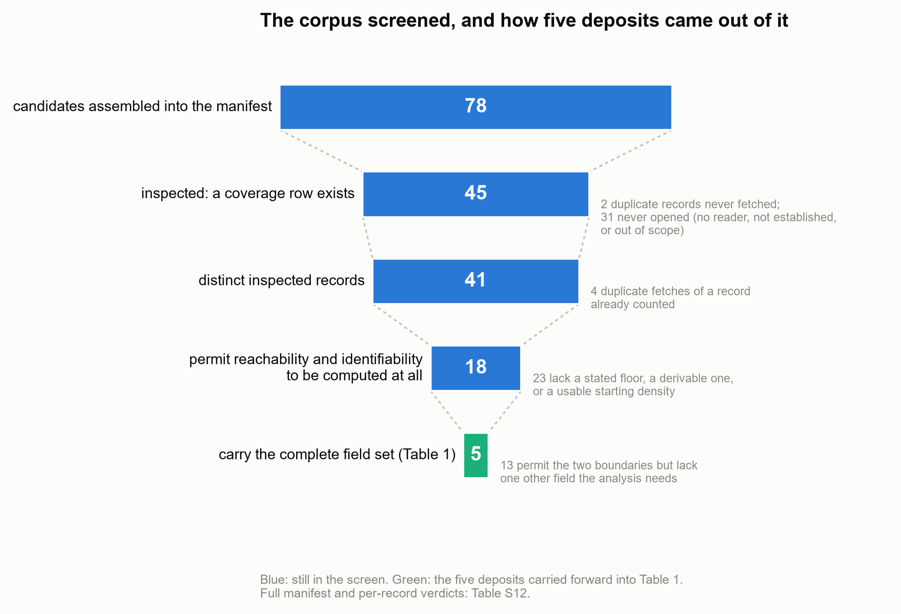
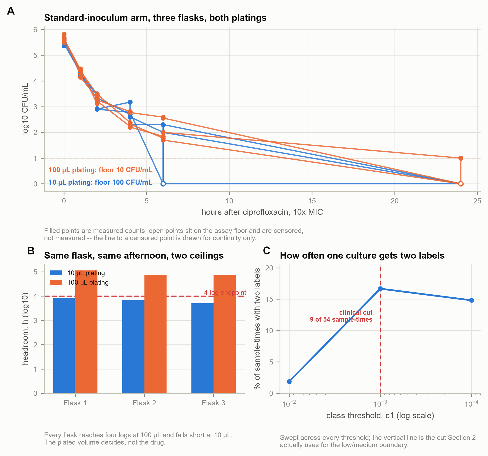
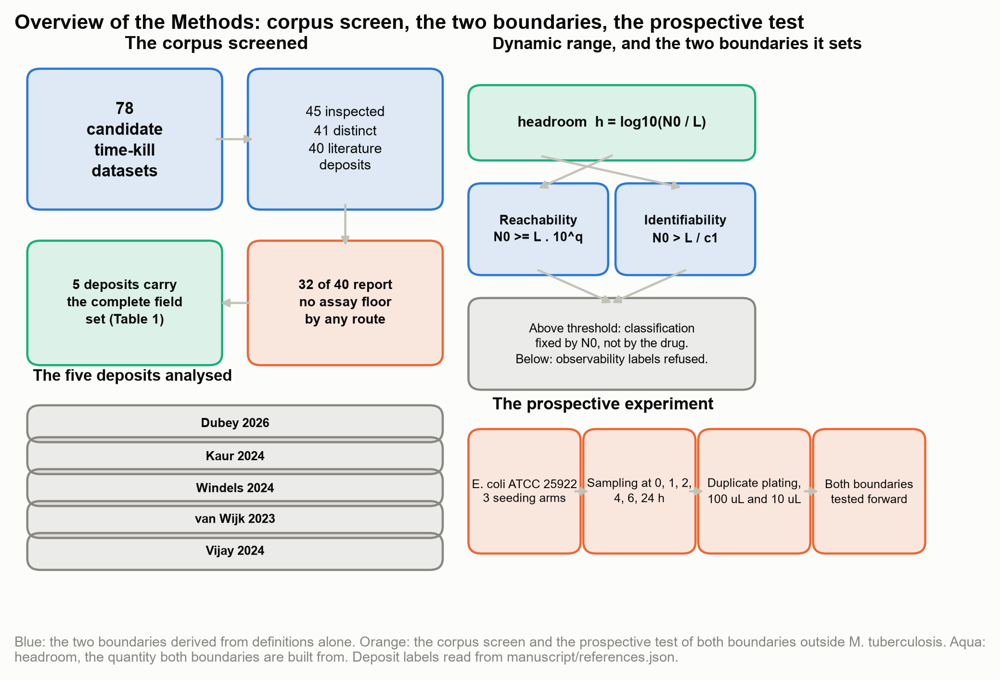

# Rifampicin tolerance classification is bounded by assay detection floor among clinical *Mycobacterium tuberculosis* isolates

**Author:** Vahhab Piranfar¹

¹Department of Microbiology, Iran University of Medical Sciences, Tehran, Iran

ORCID: [0000-0003-3653-5739](https://orcid.org/0000-0003-3653-5739)

**Correspondence:** Vahhab Piranfar, vahab.p@gmail.com

**Figures:** 2 | **Tables:** 15 | **Boxes:** 2 | **Supplementary figures:** 6 | **Supplementary tables:** 14

## Abstract

Time-kill assays are the standard method for evaluating antibiotic
tolerance, but starting bacterial density and the assay's detection floor
are frequently overlooked, causing systematic misclassification of
bacterial survival. We show how an unreported detection floor
structurally distorts rifampicin tolerance classification in
*Mycobacterium tuberculosis*.

We analyzed rifampicin tolerance against the detection floor in
217 clinical *M. tuberculosis* isolates, isoniazid-susceptible and
isoniazid-resistant alike, and derived two boundaries from the
assay's own definitions: a reachability boundary, below which starting
density cannot mathematically support the assigned log reduction, and an
identifiability boundary, below which a floor-level reading cannot be
distinguished from a lower tolerance class. We then ran a prospective *Escherichia coli*
time-kill experiment in our laboratory, testing both boundaries
independently of the tuberculosis collection.

The classification proved structurally compromised in the clinical cohort. Thirty-three of 217 isolates lacked the starting density needed to
reach their assigned 99.99 percent reduction, and none did. Eighteen isolates ended exactly at the detection floor; a third were
compatible with more than one tolerance class. These outcomes tracked growth rate, and isoniazid-resistant
isolates, seeded at a tenfold lower starting density than susceptible
ones, were disproportionately exposed.
Our *E. coli* experiment confirmed both boundaries outside
*M. tuberculosis*: adjusting the plated volume alone assigned two
conflicting tolerance labels to a single culture at six of 54 sample times.

A rifampicin tolerance classification made without reporting starting
density and detection floor is mathematically uninterpretable. Whether
starting density explains isoniazid-resistant isolates' disproportionate
exposure as a confounder or a mediator is unresolved here.

**Keywords:** time-kill assay; limit of quantification; minimum duration for
killing; antibiotic tolerance; colony counting; censored data;
*Mycobacterium tuberculosis*

## Introduction

Tuberculosis treatment runs for four to six months (1). Shortening it means
finding drugs that kill *Mycobacterium tuberculosis* faster, and that choice is
made in a flask: compounds are ranked by in vitro killing curves, counts of
surviving colonies read off a plate over time.

A plate count has a hard floor, and the pipette sets it. The smallest positive
result is one colony, and what one colony means depends on the volume spread:
plate 100 µL and a single colony is 10 bacteria per mL. Below that the plate
reports no growth, which is not the same as nothing there. A negative culture
taken after treatment has begun is not evidence of sterility, which is why blood
cultures are drawn before the first dose. We write *L* for that floor and *N₀*
for the starting density.

Tuberculosis makes that floor expensive, because the phenotype invoked to explain
why treatment takes so long is itself defined by a duration. Tolerance is the
capacity of a genetically susceptible population to survive an exposure that
should kill it: the drug still works, but the bacteria take a long time to die,
and that time is the measurement.

Rather than asking whether a culture has gone negative, the modern definition
asks how many logs the population fell. The minimum duration for killing (MDK),
the time to a specified fractional reduction of 90, 99 or 99.99 per cent, was
proposed as the tolerance counterpart to the minimum inhibitory concentration
(2, 3). The fraction is the whole point. A ratio to the starting
population is scale-free: if the count falls in a straight line on a log scale
at rate *b*, the time to a *q*-log reduction is *q/b*, and the starting density
cancels. By construction, MDK cannot be contaminated by how much culture
went into the tube.

MDK as originally defined is not a plate-count metric. It was measured from the
presence or absence of survivors in microwell arrays of about a hundred cells,
a design chosen to avoid dilution plating. The consensus guidelines say how the
smallest detectable count should be established (3, 4). What this paper
examines is the form the tuberculosis field adopted: log-reduction endpoints
computed from plate counts and most-probable-number series. The floor problem
belongs to that implementation, not to the definition.

The property holds in the definition and fails in the measurement, and that gap
is what this paper is about. To show a four-log kill you have to see four logs
down, and what is visible is bounded below by the floor. So an isolate has

    headroom  h = log10(N₀ / L)

and no experiment can demonstrate a reduction deeper than *h*, however completely
the drug worked. Where *h* < *q*, the endpoint is unreachable before the drug is
added. We call this first boundary reachability.

A second failure appears when the last count lands on the floor. The fraction
written down is then *L/N₀*, the floor divided by the starting density; the drug
has dropped out of it, and what is left is the pipette and the inoculum. A metric
designed to be inoculum-independent becomes a pure inoculum readout at exactly
the depth where tolerance is scored. We call this second boundary
identifiability.

The bound is already in the papers that defined the assays. Vijay and colleagues,
introducing the most-probable-number MDK for rifampicin, treated an MDK99.99
longer than ten days as high tolerance beyond the **time** window of the assay,
not as a statement about the count floor (5), and in the 217-isolate
classification that follows they report MDK99.99 at 15 days could be calculated
for only 22 of 209 isolates, the rest falling outside what that assay could
resolve (6). The ERA4TB consortium requires below- and
above-quantification-limit flags together with the limit of quantification
(7); the same six-laboratory comparison then excluded both from its numerical
analysis, and its 2025 protocol states the geometry explicitly: a 2.5 µL drop has
a limit of detection above 2.6 log10 CFU/mL (8). Independently, censoring
hollow-fibre counts below 10 CFU biases regimen ranking (9), and a within-host
tuberculosis tolerance study chose a shallower MDK threshold specifically so that
more isolates could enter the analysis (10). <!--supp-->

The closest statement of the bound is in the framework's own methods paper, and
we claim no priority over it. Brauner and colleagues, presenting a direct
measurement of tolerance that deliberately avoids time-kill curves, scale the
inoculum to the endpoint being measured: a hundred bacteria per well to determine
MDK99, a thousand for MDK99.9, and so on (3). That is the reachability
inequality of this paper, with the floor idealised at one cell per well and a
grew-or-did-not-grow readout in place of a count. What has not been done is to
carry the rule back into plate-count time-kill, where the floor is not one cell
but a concentration fixed by the plated volume (10 to 400 CFU/mL across the
deposits reanalysed here) and must therefore be measured sample by sample rather
than assumed; nor to ask what the published record looks like where the rule was
not applied. <!--supp-->

Inoculum-dependent tolerance measurements have been reported before under a
different mechanism. An *Escherichia coli* persister assay gave different
tolerant fractions depending on growth phase and culture history, attributed
there to prophage induction rather than to an assay floor (11). That report
and this one agree on the symptom and differ on the mechanism, and neither rules
out the other operating in a given assay.

What has not been recognised before is what a floor-level reading becomes: a
classification rule. When the last count sits at *L*, the recorded fraction is
*L*/*N*₀, and the low, medium or high label is then a cut on starting density.
That is the gap this paper fills. Two further failures stay distinct from it. A
duration ceiling, where the assay stopped looking, is not a count floor.
Recording a below-limit flag is not the same as scoring a duration from the
points so recorded.

This study asks how deep a log-reduction tolerance endpoint can be measured at
all, and whether isolates have been assigned tolerance phenotypes from outside
that range. Two boundaries on the starting density follow from the definitions.
One decides whether an endpoint is reachable, the other whether a floor-level
reading identifies a class, and both are computed from quantities a time-kill
protocol already records.

Answering that question needs data recording three quantities: a starting
density measured before treatment, a time series, and either a plated volume or
a stated floor. Most datasets do not record all three. Of 78 candidate time-kill
datasets assembled for this study, 45 were inspected in full; of the 40 distinct
literature deposits among them, **32 state no assay floor by any route**. That is
the first result, and it is why the five carried forward are five rather than
fifty (Table S12).

The requirement is older still: NCCLS M26-A ties the plated volume to the
endpoint and separately requires the smallest accurately detectable count
to be established by serial dilution of a known inoculum (12). The
endpoint has since moved and the rule did not travel with it, and the
persistence field's own consensus guideline raises neither the limit of
detection nor the plated volume nor how deep a reduction the assay can
report (4). <!--supp-->

If the hypothesis holds, a tolerance call reported without its starting density
and its assay floor cannot be interpreted, and the phenotypes assigned in its
name are in part a record of how the assay was set up.

The two boundaries are tested here on a published rifampicin-tolerance
classification of 217 clinical *M. tuberculosis* isolates, which deposits
alongside each call the starting most probable number, the growth rate, the
isoniazid susceptibility and the killing readings the call was built from
(6, 13); the class thresholds are not stated there and are recovered here
(Results Section 2). Four further deposits carry the question beyond one clinical
panel: a six-laboratory consortium exercise distributing one strain under one
written protocol (7, 14), a concentration-by-time grid in the same organism
(15, 16), a panel of evolved clones in which the concentration and duration
axes can be checked for independence (17), and a hollow-fibre deposit
(18, 19) held out until every boundary was fixed (Table 1). Both boundaries
are then tested forward in a prospective experiment built to break them, with
every prediction written down before a plate was counted. <!--supp-->
---

**Table 1.** The five published deposits reanalysed.

| Dataset | Organism | Drug and range | Design | Deposit | Licence |
| --- | --- | --- | --- | --- | --- |
| Six-laboratory exercise | *M. tuberculosis* H37Rv | moxifloxacin, isoniazid, 1x and 10x MIC | 90 flasks, 2 775 readings | figshare 19766083 | CC BY 4.0 |
| Clinical isolates | *M. tuberculosis*, 217 isolates | rifampicin | 6 duration endpoints per isolate | eLife 93243, suppl. file 2 | CC BY 4.0 |
| Evolved clones | *E. coli*, 126 clones | amikacin | MIC and persister fraction per clone | Zenodo 7550302 (17) | CC BY 4.0 |
| Concentration-by-time grid | *M. tuberculosis* | apramycin 1-128 ug/mL (amikacin arm not analysed) | 5 concentrations x 4 days x 3 replicates | figshare 26462791 | CC BY 4.0 |
| Analysed last, after the derivation was fixed | *E. coli*, hollow fibre | amoxicillin-clavulanate | 20 cultures, measured day-zero density, 100 uL plated | Nat Commun 2026 Source Data | CC BY 4.0 |

*Note.* Four carry the analysis and the fifth was analysed last, to test it. None was generated for this study. That fifth deposit was opened after every boundary and threshold was fixed: the headroom tool at 00:08 and the symbolic recovery of both boundary laws at 01:34 on 6 September 2026, against the deposit's arrival at 02:41 the same morning. The deposit entered in the same commit as the script that tests it, which git cannot order internally, so it is where reachability and identifiability were committed that dates the hold-out, not where the deposit arrived. This is an attestation and not a registration: the deposit had been public since its article appeared on 13 June 2026, so nothing outside this repository's own commit history evidences that it was not opened earlier, and a reader should weigh it accordingly. The other four were selected for the fields they carry, and that selection is not separately registered.

**Box 1. Four numbers that score an MDK.** *N₀* is the starting density. *L* is
the smallest positive count the method can report: one colony in a plated volume
*v* µL is *L* = 1 000/*v* per mL, and an MPN series uses the lowest table rung (20, 21).
Headroom is *h* = log10(*N₀*/*L*). A *q*-log endpoint is legal only if *h* ≥ *q*,
which is the same as seeding at or above *L* · 10^*q*. If the last reading sits
at *L*, the recorded fraction is *L*/*N₀*: an upper bound, not a measurement.

| Culture | *N₀* (per mL) | *L* (per mL) | Headroom | Legal endpoints | If the last reading is at *L* |
| --- | ---: | ---: | ---: | --- | --- |
| Thin clinical MPN | 23 000 | 23 | 3.00 | 90%, 99%, 99.9%; not 99.99% | Fraction 10⁻³. Low and medium both compatible: the rule cannot choose. |
| Adequate clinical MPN | 230 000 | 23 | 4.00 | all four, including 99.99% | Fraction 10⁻⁴. Only low is compatible. |
| 100 µL plate | 10⁵ | 10 | 4.00 | through 99.99%; not a 5-log call | Fraction 10⁻⁴. A 5-log MDK needs *N₀* ≥ 10⁶. |
| 10 µL drop, same *N₀* | 10⁵ | 100 | 3.00 | through 99.9%; not 99.99% | Fraction 10⁻³. The pipette, not the isolate, removed one log. |

The first two rows are the two starting densities that recur in the clinical
deposit analysed below, and Section 2 reports what became of the isolates that
began at each. The last two are why a written protocol does not standardise
measurable depth: the plated volume sets *L*. To make both a four-log endpoint
and a low class identifiable against *L* = 23 per mL, seed above
*L* · max(10⁴, 1/*c*₁) = 230 000 per mL, or choose a shallower endpoint.

Two of the claims this arithmetic supports are not testable and should not be
read as though they were. If the last reading sits at the floor, the recorded
reduction cannot exceed *h*, because a deeper one would require a count below
*L*. And the recorded fraction is then *L*/*N*₀, a monotone decreasing function
of *N*₀, so its rank correlation with *N*₀ is
−1 whatever the numbers are, including random ones. Both follow from the
definition of a censored reading, and neither is evidence about a drug. <!--supp-->

What is testable is what happens when one sample is plated at two volumes under a
fixed class threshold. If both readings sit at their own floors the labels are
*L*₁/*N*₀ and *L*₂/*N*₀, and they differ only when those two fractions fall on
opposite sides of the cut, which is again arithmetic. The empirical quantity is
how often a real experiment lands in that window. It could be none of the time. <!--supp-->

---

## Results

### 1. Rifampicin tolerance in 217 clinical isolates is scored against an unreported assay floor

Most-probable-number (MPN) readings take only the discrete values of an MPN
table (20, 21), a fixed ladder of rungs, not a continuous scale. The
day-5 column does not taper towards zero. It stops. Eighteen isolates sit at
exactly 23 per mL in the 15-day panel and six in the 60-day panel. Nothing in
the file lies below that (Fig. 1A). That is a floor, not a tail, and it is
treated as one throughout.

The deposit never states its limit of quantification (13), so the floor has
to be inferred, and the inference is quantified rather than asserted. A
posterior over the MPN rungs at or below the lowest observed value places 95
per cent support on 9.2 to 23 per mL, a span of 0.40 log10. That span is
narrow enough that the class labels of Section 2 are computed rather than
refused (Table 2). Where a deposit gives no such evidence, the labels are
refused instead of reported. <!--supp-->

**Table 2.** What is actually known about the assay floor in each deposit.

| Deposit | Verdict | Floor used | 95% support | Span (log10) | Refuse observability labels |
| --- | --- | ---: | ---: | ---: | ---: |
| Vijay 2024, clinical isolates (MPN per mL) | INFERRED | 23 | [9.2, 23.0] | 0.398 | no |
| ERA4TB, 100 uL plated (CFU per mL) | DERIVED | 10 | point mass | 0.000 | no |
| ERA4TB, 10 uL plated (CFU per mL) | DERIVED | 100 | point mass | 0.000 | no |
| ERA4TB, 2.5 uL plated (CFU per mL) | DERIVED | 400 | point mass | 0.000 | no |
| Kaur 2024, apramycin grid (log10 CFU per mL) | NONE | - | - | - | yes |
| Windels 2024, evolved clones (surviving fraction) | NONE | - | - | - | yes |
| Dubey 2026, hollow fibre (CFU per mL) | DERIVED | 10 | point mass | 0.000 | no |

*Note.* And the rule that follows from it. A floor derived from a recorded plated volume is a point mass: one colony in that volume, no inference required. A floor inferred from a pile-up on a most-probable-number rung carries a posterior over the rungs at or below the observed minimum, and the 95 per cent support is quoted. Where no floor is evidenced at all, or where the support spans more than one log10, the observability labels of Section 3 are refused rather than reported -- a label is only as good as the floor it is computed against.

The deposit carries a second classification, scored at day 2, on a different
floor. The day-2 column bottoms out at 230 per mL, with eighteen readings
resting there: *L* = 230, ten times the day-5 floor. That is a coincidence of
this deposit rather than one number written into two places, since the two
columns share no reading. Cuts at 10⁻² and 10⁻¹, one decade shallower than at
day 5, reproduce all 203 usable day-2 classes. The identifiability boundary
does not move (*N*_id = 230/10⁻² = 23,000 per mL, matching day 5). The
reachability boundary does move, by a full decade: 121 of 203 isolates lack
the room for a four-log reduction against the day-2 floor, against 31 against
the day-5 floor. At 60 days no pair of decade cuts reproduces the day-2
classes. <!--supp-->

Each isolate therefore carries a fixed budget of killing the assay can see. At
15 days of prior culture the starting densities run from 2,300 to 61,000,000
per mL (3.36 to 7.79 log10). Headroom, the distance from the starting density
down to the floor, therefore runs from 2.00 to 6.42 log10 (Fig. 1B, Table 3).
Both spans are the same 4.42 log10.

**Table 3.** The reduction each tolerance endpoint requires against the reduction the assay can resolve.

| Prior culture | Endpoint | Isolates | Short of headroom | Fraction short | At ceiling: short vs ample |
| --- | ---: | ---: | ---: | ---: | ---: |
| 15 days | 90% (1 log) | 217 | 0 | 0.0% | - |
| 15 days | 99% (2 log) | 217 | 0 | 0.0% | - |
| 15 days | 99.99% (4 log) | 217 | 33 | 15.2% | 100% vs 88% |
| 60 days | 90% (1 log) | 210 | 0 | 0.0% | - |
| 60 days | 99% (2 log) | 210 | 0 | 0.0% | - |
| 60 days | 99.99% (4 log) | 210 | 7 | 3.3% | 100% vs 95% |

*Note.* In the 15-day and the 60-day prior-culture panel alike. Headroom is the distance from an isolate's starting density down to the day-5 MPN floor of 23 per mL. An isolate short of headroom cannot reach that endpoint however completely the drug worked, and every such isolate is recorded at the assay ceiling.

Every log10 here is computed from the raw MPN rungs against a floor of 23 per
mL and rounded once, at the end. The deepest headroom therefore displays as
6.42 rather than as the 6.43 that 7.79 minus 1.36 returns. The fold figures
quoted throughout are likewise ten raised to the unrounded difference.
<!--supp-->

Against that budget the three deposited endpoints behave very differently.
Every isolate has room for a 90 or a 99 per cent reduction: 0 of 217 fall
short in either case. **Thirty-three of 217 isolates (15.2 per cent) lack the
headroom for the 99.99 per cent endpoint**, a four-log reduction that was
unobservable for them before rifampicin was added.

Two of those 33 carry a fourth label the deposit writes literally as "MDR"
(conventionally multidrug-resistant). That label is unordered with respect to
the other three, so no ordered analysis can place it (Table 5). Over the 203
isolates with an ordered label the count is 31. <!--supp-->

All 33 are recorded as not having reached the endpoint, sitting at the **assay
ceiling**. That is a census rather than an estimate, since the floor censors
the count while the ceiling censors time: an isolate not yet at its endpoint
after six days is recorded at the last day rather than at the day it would
have reached. Among the 184 isolates that did have four logs of headroom, 162
are also at the ceiling, 88.0 per cent.

No p-value is attached to that contrast. An isolate with less than four logs
of headroom cannot record a four-log reduction, so the 0-of-33 cell is fixed
by arithmetic. The null of independence between ceiling status and headroom is
false before any data are seen. The census is the finding: every isolate that
could not reach the endpoint is recorded as not having reached it, and 88.0
per cent of those that could are recorded the same way. The deepest endpoint
is the only one at risk, and it is the one the tolerance classification is
built on. <!--supp-->

### 2. The same floor-level reading yields opposite tolerance labels depending on starting density

The deposited tolerance level is a cut-off on the recorded surviving fraction,
with no overlap between classes. The thresholds themselves are not deposited.
Recovered here, at day 5 and 15 days of prior culture, low tolerance covers
fractions below 10⁻³, medium 10⁻³ to 10⁻², high above 10⁻². Those cuts
reproduce every usable class in the file, 203 of 203 (Table 4). Usable means
the 203 of 217 isolates whose label is one of the three ordered classes. The
other 14 carry the "MDR" category, which no ordered analysis can place
(Table 5). What follows is an argument about the fraction the assay recorded, not
about an independent clinical judgement.

**Table 4.** The deposited tolerance class at day 5 after 15 days of prior culture is a threshold on the recorded surviving fraction.

| Recorded class | n | Min fraction | Max fraction | Predicted from cuts | Disagreements |
| --- | ---: | ---: | ---: | ---: | ---: |
| Low | 33 | 3.8 × 10⁻⁶ | 4.7 × 10⁻⁴ | Low | 0 |
| Medium | 124 | 1.0 × 10⁻³ | 1.0 × 10⁻² | Medium | 0 |
| High | 46 | 2.7 × 10⁻² | 1.0 × 10¹ | High | 0 |
| All usable | 203 | - | - | - | 0 |

*Note.* With no overlap between classes: low below 10⁻³, medium from 10⁻³ to 10⁻² inclusive, high above 10⁻². Applying those cuts reproduces every usable class in the file. This matters because the argument that follows is about the fraction the assay recorded, not about an independent clinical judgement.

**Table 5.** Every analysis set in this paper, and the exclusion that produced it.

| Deposit | Panel | Stratum | Stage | n | Excluded here |
| --- | --- | --- | --- | ---: | ---: |
| Vijay clinical | 15-day | all isolates | rows in the deposit | 217 | - |
| Vijay clinical | 15-day | all isolates | tolerance label present | 217 | - |
| Vijay clinical | 15-day | all isolates | label is Low, Medium or High (drops 'MDR') | 203 | -14 |
| Vijay clinical | 15-day | all isolates | starting and day-5 readings present | 203 | - |
| Vijay clinical | 15-day | all isolates | susceptibility is IS or IR | 203 | - |
| Vijay clinical | 15-day | all isolates | growth proxy present (association family) | 202 | -1 |
| Vijay clinical | 15-day | baseline only (0M) | rows in the deposit | 174 | - |
| Vijay clinical | 15-day | baseline only (0M) | tolerance label present | 174 | - |
| Vijay clinical | 15-day | baseline only (0M) | label is Low, Medium or High (drops 'MDR') | 168 | -6 |
| Vijay clinical | 15-day | baseline only (0M) | starting and day-5 readings present | 168 | - |
| Vijay clinical | 15-day | baseline only (0M) | susceptibility is IS or IR | 168 | - |
| Vijay clinical | 15-day | baseline only (0M) | growth proxy present (association family) | 167 | -1 |
| Vijay clinical | 60-day | all isolates | rows in the deposit | 217 | - |
| Vijay clinical | 60-day | all isolates | tolerance label present | 211 | -6 |
| Vijay clinical | 60-day | all isolates | label is Low, Medium or High (drops 'MDR') | 197 | -14 |
| Vijay clinical | 60-day | all isolates | starting and day-5 readings present | 197 | - |
| Vijay clinical | 60-day | all isolates | susceptibility is IS or IR | 197 | - |
| Vijay clinical | 60-day | all isolates | growth proxy present (association family) | 196 | -1 |
| Vijay clinical | 60-day | baseline only (0M) | rows in the deposit | 174 | - |
| Vijay clinical | 60-day | baseline only (0M) | tolerance label present | 168 | -6 |
| Vijay clinical | 60-day | baseline only (0M) | label is Low, Medium or High (drops 'MDR') | 162 | -6 |
| Vijay clinical | 60-day | baseline only (0M) | starting and day-5 readings present | 162 | - |
| Vijay clinical | 60-day | baseline only (0M) | susceptibility is IS or IR | 162 | - |
| Vijay clinical | 60-day | baseline only (0M) | growth proxy present (association family) | 161 | -1 |
| Vijay clinical | 15-day | other sets quoted | isolates with a starting density | 217 | - |
| Vijay clinical | 60-day | other sets quoted | isolates with a starting density | 210 | -7 |
| Vijay clinical | 15-day | concentration-duration family | all isolates with an inhibitory concentration | 193 | - |
| Vijay clinical | 60-day | concentration-duration family | all isolates with an inhibitory concentration | 187 | - |
| Vijay clinical | 15-day | concentration-duration family | INH-susceptible with one | 119 | - |
| Vijay clinical | 60-day | concentration-duration family | INH-susceptible with one | 117 | - |
| Vijay clinical | 15-day | concentration-duration family | baseline only with one | 162 | - |
| Vijay clinical | 60-day | concentration-duration family | baseline only with one | 156 | - |
| ERA4TB six-laboratory | - | - | readings in the file | 2775 | - |
| ERA4TB six-laboratory | - | - | excluding inoculum controls | 2751 | -24 |
| ERA4TB six-laboratory | - | - | flasks (institute x arm x replicate) | 90 | - |
| ERA4TB six-laboratory | - | - | treated flasks | 72 | -18 |
| ERA4TB six-laboratory | - | - | treated flasks with a usable starting density | 67 | -5 |
| ERA4TB six-laboratory | - | - | laboratory-by-arm cells | 30 | - |
| ERA4TB six-laboratory | - | - | cells with a fitted kill rate | 29 | -1 |
| ERA4TB six-laboratory | - | - | series under the plating key (flasks x 4 platings) | 360 | - |
| ERA4TB six-laboratory | - | - | treated series | 288 | -72 |
| ERA4TB six-laboratory | - | - | cross-laboratory pairs in the same arm | 191 | - |
| ERA4TB six-laboratory | - | derived units | treated series with a quantified day-0 or day-1 reading in their own plating | 262 | -26 |
| ERA4TB six-laboratory | - | derived units | of those, not already below their own floor at day zero (the descriptive Cox set) | 261 | -1 |
| ERA4TB six-laboratory | - | derived units | cross-laboratory pairs, strict rate separation | 100 | - |
| ERA4TB six-laboratory | - | derived units | flasks contributing those pairs | 42 | - |
| ERA4TB six-laboratory | - | derived units | laboratory-by-arm-by-volume cells with a measured start | 56 | - |
| ERA4TB six-laboratory | - | derived units | treated series with three or more quantified readings at 100 uL | 64 | - |
| ERA4TB six-laboratory | - | derived units | flask units in the variance decomposition (all arms plus inoculum) | 85 | - |
| ERA4TB six-laboratory | - | derived units | untreated day-zero readings at 100 uL (4 laboratories x 3 flasks) | 12 | - |
| ERA4TB six-laboratory | - | derived units | below-limit flags in the analysis set | 498 | - |
| ERA4TB six-laboratory | - | derived units | readings in the kill-rate analysis set | 2580 | -171 |
| Dubey hollow fibre (held out) | - | - | cultures with a measured day-zero density | 20 | - |

*Note.* The manuscript quotes a dozen different denominators, each correct for its own analysis; this is where a reader checks which is which. The MDR tolerance label is a fourth, unordered category and is dropped wherever an ordered outcome is fitted; the growth proxy is missing for one isolate; and five treated flasks in the six-laboratory deposit carry no usable starting density, which is why a comparison over 72 flasks is reported on 67. Whether these exclusions are plausibly ignorable is tested in Table S1. The last rows of each block cover sets counted in units other than isolates or flasks -- pairs, flags, cells, readings -- because a reader meeting one of those figures in the text needs somewhere to look it up too.

Eighteen isolates ended at the floor. They share one reported floor-level
observation, but their true final counts are unknown below the floor, so the
assay cannot tell their surviving burdens apart down there. Their starting
densities span 265-fold, from 23,000 to 6.1 × 10⁶ per mL. The same terminal
reading therefore implies a different range of compatible reductions in each:
at least 3.00 logs for the isolate that began at 23,000, at least 5.42 for the
one that began at 6.1 × 10⁶. In either case the true reduction may be anything
from that bound down to complete kill. What the deposit records instead is a
single number per isolate, *L*/*N₀*, and those recorded fractions span the
same 265-fold, from 3.8 × 10⁻⁶ to 1.0 × 10⁻³ (Fig. 1C). They are upper bounds
on survival, not measurements of it.

The labels those eighteen received differ accordingly. Six isolates that began
at 23,000 per mL recorded a fraction of 10⁻³ and were classified **medium**
tolerance. Twelve that began at 230,000 or above recorded 10⁻⁴ or less and
were classified **low**. A single cut on the starting density alone reproduces
all eighteen (Table 6). Once a reading is censored at the floor, the starting
density fixes which label the published rule is able to return.

**Table 6.** Isolates whose day-5 reading was censored at the MPN floor.

| Prior culture | At the floor | Starting density spread | Recorded survival spread | Labels assigned at the floor | Ordered calls | Measured | Single compatible class | Multiple compatible classes |
| --- | ---: | ---: | ---: | ---: | ---: | ---: | ---: | ---: |
| 15 days | 18 | 265x | 265x | Low: 12, Medium: 6 | 203 | 185 | 12 | 6 |
| 60 days | 6 | 100x | 100x | Low: 6 | 197 | 191 | 6 | 0 |

*Note.* Starting densities differ across the row, so the same floor-level reading implies a different range of compatible fractional reductions in each; the recorded fraction is L/N0, so the spread in apparent survival equals the spread in starting density exactly, and the labels differ accordingly. The last four columns sort every call in the 15-day panel, not only the censored ones: a censored reading bounds the class from above, and sweeping the true count across the admissible range leaves twelve calls with a single compatible class and six with more than one. Reaching the floor at all is a property of the killing; which class is then compatible is a property of the starting density and the floor. Ordered calls is the denominator those four columns are taken over, and it is not the isolate count of Table 3: it counts only the isolates whose deposited label is one of the three ordered classes, leaving out the 14 at 15 days and the 13 at 60 days that carry the unordered fourth category.

The question this raises is which labels the rule could have returned, not
whether those labels are wrong. Sweeping the true count across the censored
interval [0, *L*] and applying the deposited thresholds gives the set of
classes compatible with each observation. For the twelve isolates that began
at 230,000 per mL or above, every count the assay admits yields a fraction
below 10⁻³, so low is the only compatible class. For the six that began at
23,000, the compatible set spans the low-medium threshold and the rule cannot
choose between two classes. <!--supp-->

Three questions have to be kept apart, and the rest of this paper keeps them
apart. Whether a culture reaches the floor at all is a question about the
drug: rifampicin has to reduce the population by that isolate's entire
headroom for it to happen. Which label the rule assigns once the reading is
censored is a question about arithmetic: there the starting density determines
the compatible set. How far the population actually fell is a question the
assay leaves open. <!--supp-->

So for twelve of the eighteen the recorded label carries no information beyond
the fact that the reading was censored, and for six it is not determinate at
all. None of the eighteen is a measurement of the surviving fraction. Sorting
every call in the panel this way separates the labels the assay measured from
the labels the censoring rule fixed (Table 6). At 15 days, 185 of 203 calls
rest on a reading above the floor and are measured, 12 are censored with a
single compatible class, 6 with more than one. At 60 days the counts are 191,
6 and none, because the cultures are denser and few readings reach the floor.
<!--supp-->

The shortfall falls unevenly on the groups a study would compare. The 99.99
per cent endpoint is unreachable for 22 of 84 isoniazid-resistant isolates,
26.2 per cent, against 9 of 119 susceptible ones, 7.6 per cent (Fisher exact p
= 0.00056 (22)). The remaining two of the 33 carry the MDR label and fall
outside that contrast. Median headroom differs by a full log, 4 against 5. A
comparison of tolerance between those groups is therefore in part a comparison
of how well each group could be measured. <!--supp-->

### 3. The floor predicts, before rifampicin is added, which isolates will be mislabeled

Sections 1 and 2 counted isolates. The two boundaries derived in the Methods
do more: given only the floor, the class thresholds and each isolate's
starting density, they say in advance which isolates are affected, before any
day-5 reading is used.

For this assay *N*_reach = 23 × 10⁴ = 230,000 per mL and *N*_id = 23/10⁻³ =
23,000 per mL. Applied to the 15-day panel, the first predicts the 33 isolates
unable to reach the 99.99 per cent endpoint. The second predicts that of the
eighteen isolates whose reading rests on the floor, twelve have only the
lowest class compatible and six have more than one. Those are the three counts
Sections 1 and 2 report.

Neither boundary predicts which isolates reach the floor. That depends on what
rifampicin does. Both predict what a reading at the floor can be made to mean
once it happens. There the agreement with the deposit is exact, isolate by
isolate: the set the algebra says has a single compatible class and the set
the deposit records in the lowest class are the same set.

That agreement is an identity rather than a passed test. The label is a cut on
the recorded fraction (Table 4) and every floor reading has a numerator of
exactly *L*, so the class of a floored isolate is a function of *N₀* alone.
The algebra therefore cannot disagree with the deposit. What could have
failed, and did not, is the premise: that the three classes separate cleanly
on the recorded fraction at all, in 203 of 203 calls. <!--supp-->

How finely the agreement resolves has to be stated too. Among the eighteen the
starting density takes only five values. They are 23,000 for six isolates,
then 230,000 for eight, and 610,000, 2.3 × 10⁶ and 6.1 × 10⁶ for one, one and
two, and **no isolate lies strictly between *N*_id and *N*_reach**. Any cut
placed anywhere in that decade reproduces the same twelve-six split, so the
split locates the boundary only to within an order of magnitude. <!--supp-->

What is sharp is the boundary case. Six isolates sit at exactly 23,000 per mL,
which is *N*_id itself. For them *L*/*N₀* equals *c*₁ exactly, the interval
[0, *L*/*N₀*] touches the threshold from below and spans two classes, and the
strict inequality fails. Those six are precisely the six the deposit records
as medium rather than low. A rule written with the inequality the other way
would have called all six low and been wrong six times out of six. That is a
test the arithmetic could have failed and did not.

Two numbers in this section rest on reading the floor as a plate would, and
both survive the assay's own likelihood. Recomputing the twelve-six split
under the MPN's own 95 per cent interval, reaching 120 per mL rather than
stopping at 23, and under a one-sided censoring bound at 95 and 99 per cent,
changes no verdict (Table S13). A posterior over class gives the same answer
probabilistically, with the twelve keeping their label at posterior
probability at least 0.999 and the six refused outright (Table S14).
<!--supp-->

The empirical findings are therefore consequences of the definitions rather
than properties of this deposit. Any dataset reporting a starting density, a
floor and a threshold classification can be checked against them.

### 4. Isoniazid-resistant isolates appear more rifampicin-tolerant, but the effect tracks a thinner inoculum, not resistance

There are two candidate predictors of the deposited label, each tested at two
culture ages and two endpoint depths, eight tests in all. Eight tests on one
question will throw up a false positive on their own, so they are corrected
together as one family. Two survive (Table 7).

**Table 7.** The family of 8 tests between the deposited tolerance label and its candidate determinants (BH: Benjamini-Hochberg; OD: optical density).

| Predictor | Prior culture | Reading day | For starting density | n | Odds ratio (95% CI) | p | Survives BH | Prop. odds p | Baseline isolates only |
| --- | --- | --- | --- | ---: | ---: | ---: | ---: | ---: | ---: |
| time to OD 0.4 | 15 d | day 5 | adjusted | 202 | 1.096 (1.03-1.16) | 0.0030 | yes | 0.152 | 1.12 (p=0.002, survives) |
| resistance | 15 d | day 5 | unadjusted | 202 | 2.317 (1.30-4.12) | 0.0042 | yes | 0.417 | 2.11 (p=0.031, no) |
| time to OD 0.4 | 60 d | day 2 | adjusted | 196 | 0.933 (0.87-1.00) | 0.0470 | no | 0.688 | 0.92 (p=0.032, no) |
| time to OD 0.4 | 15 d | day 2 | adjusted | 202 | 1.068 (1.00-1.14) | 0.0618 | no | 0.243 | 1.07 (p=0.108, no) |
| resistance | 15 d | day 2 | unadjusted | 202 | 1.295 (0.66-2.54) | 0.4529 | no | 0.479 | 1.07 (p=0.876, no) |
| time to OD 0.4 | 60 d | day 5 | adjusted | 196 | 0.976 (0.91-1.04) | 0.4605 | no | 0.875 | 0.99 (p=0.703, no) |
| resistance | 60 d | day 2 | unadjusted | 196 | 0.836 (0.47-1.48) | 0.5400 | no | 0.075 | 1.11 (p=0.774, no) |
| resistance | 60 d | day 5 | unadjusted | 196 | 1.111 (0.63-1.95) | 0.7150 | no | 0.067 | 1.61 (p=0.186, no) |

*Note.* Fitted as proportional-odds ordinal logistic regression and corrected together by the Benjamini-Hochberg procedure at a false discovery rate of 5%; the "survives BH" column is that correction. 2 survive. An odds ratio above one means higher odds of a higher tolerance class; time to an optical density (OD) of 0.4 is in days and runs inversely to growth rate, so above one there means *slower* growth accompanies a higher class. The proportional-odds column is a Brant test per predictor; the assumption holds for every predictor in this family. Starting density enters the adjusted fits as a covariate rather than as a member of the family, and it is where proportional odds fails, at 60 days at the deepest endpoint; that failure and the released fit are reported in Section 4. The final column repeats each test on the baseline isolates, one per patient by construction, which is where the resistance association stops clearing its corrected threshold. The deposit carries no patient identifier, so no standard error here can be clustered on the true grouping and every interval in this table is model-based; the baseline-isolate column is the sensitivity analysis that stands in for clustering, and Table S8 records what each conclusion is worth once it is applied.

The label has three levels in a fixed order, low, medium, high, and is
modelled as such. The model is proportional-odds ordinal logistic regression,
which does not assume the step from low to medium equals the step from medium
to high. That fit makes an assumption of its own, that a single odds ratio
applies to both cut points, and it was tested rather than assumed (Methods;
Table 7). <!--supp-->

The label tracks the **growth rate** of the isolate. Slower growth goes with a
higher tolerance class, and it survives adjustment for starting density (OR
1.096 per day of time to OD 0.4, 95 per cent CI 1.032 to 1.164, p = 0.0030, n
= 202; unadjusted OR 1.126, 1.062 to 1.193). The label also tracks **isoniazid
resistance**, until starting density enters the model. Unadjusted, a resistant
isolate has 2.32 times the odds of a higher tolerance class (1.30 to 4.12, p =
0.0042). Adjusted, the odds ratio falls to 1.31 (0.67 to 2.57, p = 0.42), and
the interval no longer excludes one. Starting density is the strongest term in
the file: every ten-fold rise in the starting MPN halves the odds of a higher
tolerance class (OR 0.480, 0.340 to 0.677, p = 2.9 × 10⁻⁵).

The unadjusted 2.32 is the total effect of resistance on the label. The
adjusted 1.31 is the controlled direct effect with the inoculum held fixed,
under an assumption this deposit cannot test on its own: that starting density
sits on the causal path as a mediator rather than beside it as a confounder.
The reverse reading is equally available a priori. If slow growth both thins
the inoculum and causes genuine tolerance, adjusting for starting density
would remove real signal rather than a confounder (Discussion weighs the two
readings against each other). What is not in question, whichever reading is
right, is that the association weakens once starting density enters the model.
<!--supp-->

Why the adjustment does that is measurable. Isoniazid-resistant isolates go
into this assay at 5.36 log10 against 6.36 for susceptible isolates, ten-fold
thinner (Mann-Whitney p = 9.1 × 10⁻¹⁴ (23)). Of the 84 resistant isolates
carrying an ordered label, 22 lack the headroom for the deepest endpoint, 26.2
per cent, against 9 of 119 susceptible, 7.6 per cent. They are one log short
of observable killing before the experiment begins.

The total effect of resistance on tolerance class splits into a part that runs
through log10 starting density and a part that does not. On the 203 isolates
with a usable class, the mediated part is +0.166 classes (bootstrap 95 per
cent CI +0.067 to +0.279), the direct part +0.091 (−0.116 to +0.287). About 65
per cent of the association travels through the inoculum, and the direct path
covers zero. Restricting to baseline isolates leaves the mediated path intact
(+0.159, +0.053 to +0.295), and collapsing the outcome to two levels agrees
(Table S3). <!--supp-->

Two things bound that estimate. It rests on sequential ignorability, that
nothing unmeasured drives both the starting density and the class, which no
observational file can establish. A residual correlation of about −0.23
between the mediator and outcome errors would nullify the point estimate, and
one ordinary measured covariate already moves it about forty per cent of that
way. More fundamentally, the step in the middle is the denominator of the
ratio the outcome is cut on. The tolerance class is a threshold on *N*₅/*N₀*,
so a decomposition that routes resistance through *N₀* is in part recovering
the censoring arithmetic this paper is about rather than a biological pathway
from resistance to tolerance. That is not a reason to discard the estimate,
since it says how much of the association is carried by the label's own
denominator. It is a reason not to read it as a mechanism. Only a design that
fixes the inoculum separates the two. <!--supp-->

That objection can be tested, not merely conceded, because the isolates it
applies to can be named. The recorded fraction is *L*/*N₀* exactly for the
eighteen isolates whose day-5 reading sits on the floor, and for no others. In
the remaining 185 the numerator was counted and is free to move independently
of *N₀*. Refit on those 185 alone and the mediated path does not weaken but
strengthens, to +0.227 classes (+0.118 to +0.348). The direct path collapses
to +0.008 (−0.197 to +0.208) and the proportion mediated rises from 0.65 to
0.96. Deleting exactly the isolates the criticism is about leaves the effect
larger, so it is not an artefact of them. <!--supp-->

These 217 isolates are not 217 independent observations. Forty-three are
follow-up isolates taken during treatment from patients who also gave a
baseline isolate, so up to 86 rows sit in clusters of two. The deposit carries
no patient identifier. Archive and Sample-ID are unique to each row, and none
of the 48 columns repeats the way a patient key would have to, so the pairing
cannot be recovered and no standard error can be clustered on the true
grouping. What is available is the exact substitute, a baseline-only stratum
in which every isolate is from a different patient by construction (Time_point
= 0M, n = 167 at 15 days). <!--supp-->

In that stratum the two associations part company. Growth holds and still
survives correction (OR 1.116, 1.040 to 1.198, p = 0.0024). Resistance returns
OR 2.11 (1.07 to 4.16, p = 0.031) nominally, but ranks second in the family of
eight and fails its Benjamini-Hochberg critical value of 0.0125. The
resistance association therefore leans on isolates that are not independent of
one another, and it is already the association that starting density explains
away. We report it as the weaker of the two on both counts.

Why resistant isolates seed lower is not established here, and the obvious
explanation fails. They do not grow measurably more slowly (median time to OD
0.4 of 19 against 17, p = 0.24), and 85 of them carry *katG* S315X, the
mutation that predominates clinically precisely because it is close to
fitness-neutral (24, 25). Seven of the nine pretreatment covariates the
file carries cannot adjust this association, and they fail in two different
ways. Five are recorded almost only for resistant isolates, so their
missingness *is* the exposure: the two susceptibility calls are present for 82
of 84 resistant isolates and none of the 119 susceptible, the two Mykrobe
calls for 76 and none, the mutation identity for 79 and one. Adjusting for
such a column adjusts for resistance itself. That is why the two
susceptibility rows agree to three significant figures: they are missing on
exactly the same rows. The mutation identity's apparent 22 per cent
attenuation is an artefact of that same circularity, not a real effect. The
two Mykrobe columns hold a single value wherever they are recorded in this
stratum, so no adjusted coefficient exists for them and Table S4 prints none.
<!--supp-->

The other two, the isoniazid and rifampicin MICs, are missing in the opposite
direction. They are recorded for all 119 susceptible isolates and 67 of 84
resistant ones, so what is absent sits inside the exposed group rather than
across the contrast. That does not make them confounders. The isoniazid MIC
separates the two groups completely in this deposit, since no resistant
isolate overlaps any susceptible one. It is therefore the exposure measured on
a graded scale rather than something to adjust the exposure for. With it in
the model, the standard error on the resistance coefficient inflates from
0.103 to 0.181, and the complete case drops 17 resistant isolates and no
susceptible one, leaving 186 rows against 203. The seeding gap also grows from
−0.85 to −0.96, an amplification of 13 per cent rather than an attenuation.
The rifampicin MIC, which does not separate the groups, moves it by less than
half a per cent. <!--supp-->

The remaining two covariates, the growth proxy and months on treatment, are
missing at rates unrelated to susceptibility and can be used. Adjusting for
either leaves the coefficient at −0.81 or −0.82 against an unadjusted −0.85,
an attenuation of at most five per cent (Table S4). The seeding gap is robust
to every covariate the deposit permits testing against. The file records no
referring site and no processing batch, so those cannot be tested at all. The
association between resistance and a low starting inoculum is real, large and
unexplained. <!--supp-->

The two surviving associations sit in the 15-day panel, where the mechanism
places them. By 60 days the cultures are 38-fold denser, the spread of
starting densities has more than halved (interquartile range 1.00 to 0.42
log10), and the fraction of isolates short of headroom falls from 15.2 to 3.3
per cent. The confound is a property of a thin assay, and it thins out when
the assay is not. The two panels are columns on the same spreadsheet rows (210
isolates appear in both), so every comparison between them is within-isolate.
Between panels, 26 isolates lose their headroom shortfall and none acquires
one (exact McNemar p = 3.0 × 10⁻⁸ against an unpaired p of 2 × 10⁻⁵ (26)).
Eleven leave the floor and none joins it (p = 9.8 × 10⁻⁴), and every isolate
whose headroom changes gains (Wilcoxon signed-rank p = 1.3 × 10⁻³³ (27)).
The interquartile range of starting density falls by 0.58 log10. <!--supp-->

It does not vanish, and the ordinal treatment shows where it goes. The
one-odds-ratio-for-both-cuts assumption holds throughout the 15-day panel but
fails at 60 days for starting density at the deepest endpoint (Brant p =
0.0031; likelihood-ratio test against a released fit p = 0.0062). Let that
coefficient differ between the two cuts and the whole effect lands on the
upper one: OR 0.493 for clearing medium (0.336 to 0.724, p = 0.0003) against
0.951 for clearing low (0.647 to 1.396, p = 0.80). A multinomial fit, assuming
no ordering at all, agrees (high against low, relative risk ratio 0.59, p =
0.028; medium against low, 1.22, p = 0.39). In the denser panel the starting
density no longer decides who is called low. It still decides who can be
called high. <!--supp-->

### 5. Six laboratories given one M. tuberculosis protocol still see six different assay floors

If the effect is a property of assay geometry rather than of clinical
sampling, it should appear where one protocol, one strain and one stock are
handed out deliberately. Van Wijk and colleagues ran exactly that exercise.
They sent a single stock of H37Rv to six blinded laboratories under one
written protocol (7, 14).

The starting densities in Table 8 are the mean of quantified readings at day 0
or day 1 at the 100 µL plating, pooled over that laboratory's arms. Institute
A deposits no day-zero reading at all, and among treated flasks only C and D
do. For four of the six the figure therefore rests partly on readings taken
after twenty-four hours of drug, by which point the ten-times-MIC arms have
already lost between 0.7 and 2.4 log10. A day-zero comparison across all six
is therefore not available. Re-running the whole analysis on a day-one
exposure for every laboratory leaves the ordering, the area under the curve
and the laboratory-level exact test unchanged. <!--supp-->

**Table 8.** Moxifloxacin at ten times MIC.

| Lab | Starting density (log10 CFU/mL) | Reading day | Kill rate (log10/day) | 95% profile interval | By imputation | Readings censored | Flasks ever crossing the floor (treated arms) |
| --- | ---: | ---: | ---: | ---: | ---: | ---: | ---: |
| A | 2.95 | day 1 | 0.119 | 0.084 to 0.160 | 0.125 | 51% | 9 / 12 |
| B | 3.16 | day 0, day 1 | 0.139 | 0.097 to 0.191 | 0.140 | 58% | 10 / 12 |
| C | 4.02 | day 0, day 1 | 0.464 | 0.408 to 0.528 | 0.464 | 44% | 10 / 12 |
| D | 4.69 | day 0, day 1 | 0.104 | 0.077 to 0.132 | 0.104 | 3% | 0 / 12 |
| E | 4.95 | day 0, day 1 | 0.090 | 0.073 to 0.107 | 0.090 | 1% | 0 / 12 |
| F | 6.53 | day 0, day 1 | 0.223 | 0.191 to 0.254 | 0.223 | 0% | 0 / 12 |

*Note.* Every laboratory yields a rate; three record no crossing below the assay floor in any arm at the 100 uL plating. The final column counts first observed crossings, which are not clearances: across the deposit 60% of the series that cross read above the floor again at a later visit. The two censoring estimators agree to 0.003 log10 per day. The starting density is the mean of quantified readings at day 0 or day 1 at the 100 uL plating, pooled over all of that laboratory's arms; the reading-day column says which visits contributed. Institute A deposits no day-zero reading at all, and among treated flasks only institutes C and D do, so for the rest this figure rests partly on readings taken after 24 hours of drug. The turbidity-standard analysis and Table 9 instead use untreated day-zero readings only, so the two tables are not expected to match.

At ten times the minimum inhibitory concentration of moxifloxacin all six
laboratories return a positive kill rate, spanning 5.2-fold, from 0.090 to
0.464 log10 CFU/mL per day (Fig. 2A, Table 8).

Across all 30 laboratory-by-arm cells the Tobit estimate and the imputation
estimate never differ by more than 0.006 log10 per day. That says the fit is
not an artefact of the arithmetic used to reach it, not that the sub-floor
assumption is safe: both estimators assume the same normal distribution below
the floor, and nothing here can check that from the inside. <!--supp-->

The duration endpoint behaves differently on the same flasks. What it records
is not clearance and not sterilisation but a **first observed crossing below
the assay floor**. The distinction matters, because most series that cross
later read above the floor again, including all five untreated series that
cross. The plating volume decides the count. At the 100 µL quadruplicate
plating, the most sensitive of the four, 29 of 72 treated flasks ever fall
below the floor: institutes B and C record crossings in every arm, institute A
in three of its four, institutes D, E and F in none (Fig. S1A). For half the
laboratories the first-crossing time is right-censored throughout. The flask
never crossed, so all that is known is that the crossing, if it comes, comes
after the last visit. <!--supp-->

That split is a property of the plating, not the laboratories. Counting a
crossing on any of the four platings gives 48 of the same 72 treated flasks,
and every laboratory records at least one: D six of its twelve, E one, F ten.
The analysis keeps the single most sensitive plating so the endpoint means the
same thing everywhere, and reports here what the other choice would have
shown. <!--supp-->

The two orderings do not correspond. Rank the laboratories by starting density
and the three lowest are exactly the three that recorded crossings, the three
highest exactly the three that did not, without exception. That split has
probability 1/20 under chance alone, and it is reported as an ordering and not
a test (Table S8). Rank them by kill rate and there is no such correspondence
(Fig. 2B). Institute F has the highest starting density at 6.53 log10 among
treated flasks of this arm, kills faster than four of the other five at 0.223
log10 per day, and records no crossing. Institute E returns the slowest rate
of all at 0.090 and also records none.

Starting density separates the flasks that ever crossed from those that never
did with an area under the curve of 0.974. That is a description quoted
without a p-value on purpose: the comparison looks like 67 flasks, but it is
three laboratories against three, and the between-laboratory evidence in this
deposit is six clusters throughout (Limitations). The exact laboratory-level
test returns 0.10, the smallest value the design can return, and once the
treatment arm is held fixed there is no within-laboratory comparison left to
fall back on. <!--supp-->

The Cox fits are reported for the same reason and with the same restraint. On
laboratory alone, institutes D, E and F carry hazard ratios of 0.20, 0.21 and
0.20. Add starting density and those move to 0.34, 0.36 and 0.62, and
concordance rises from 0.896 to 0.930 (Fig. S1B). Institute C moves the other
way, from 3.0 to 5.3, and it is also the fastest killer, which is how a
laboratory that genuinely kills faster ought to behave. No p-value is attached
to any of these terms. The tested covariate is constant within cluster, and
with six laboratories and six parameters the cluster-robust covariance is
singular by construction; fitting it anyway returns a smaller p than the one
it was meant to correct. A coefficient that moves on adjustment says how far
starting density and laboratory identity overlap in this design. It is not
evidence that one explains the other. <!--supp-->

Where an interval is quoted from that fit it is a cluster bootstrap and not
the model's own. For the starting-density coefficient the laboratory-clustered
interval is −1.11 to −0.51. That is half again as wide as the model's −0.91 to
−0.48 and two and a half times the flask-clustered −0.81 to −0.56, so quoting
the model's interval is wrong in an unpredictable direction, not conservative.
For the laboratory contrasts the flask-clustered interval is quoted instead,
since the laboratory bootstrap keeps each laboratory's flasks together and the
contrast barely moves. The crossings behind each laboratory's coefficient: 43
of 48 series in institute C against 1 of 48 in institute E. <!--supp-->

Killing here is not sustained. Take the 64 treated series carrying at least
three quantified readings at the most sensitive plating volume. In 48 the
final step is not a decline, and 44 end more than one log10 above their own
lowest reading, median rebound 2.17 log10, largest 5.54. Seventeen of the 32
flasks that fell below the floor at the most sensitive plating (29 treated, 3
untreated) were detectable again at a later visit, 14 of them in treated arms.
<!--supp-->

Across all four platings, 84 of the 140 series that cross return above the
floor, 60 per cent, and the return is quick: a median of four days, with 45
per cent of those back within three. Those 360 series come from 90 flasks,
four platings each, so they are not 360 independent observations. Counted by
flask, 53 of the 90 contain a crossing series (48 treated, 5 untreated), and
42 of those contain a returning one. A crossing below the assay floor in this
deposit is usually a transient rather than an endpoint. <!--supp-->

Killing itself is real and dose-dependent. At one times the inhibitory
concentration five of six laboratories record net growth under moxifloxacin,
between −0.047 and −0.214 log10 per day. At ten times all six record net
decline. <!--supp-->

Two consequences follow. First, the state below the floor is not absorbing: a
series that drops below it does not stay there. Of 2,232 visit-to-visit
transitions, 144 go from above to below and 95 go from below to above, so a
series sitting below the floor leaves it at the next visit with probability
0.22. That probability runs with drug pressure: 1.00 in untreated series, 0.37
to 0.92 at one times MIC, 0.07 to 0.18 at ten times, which says the event is
at least partly a property of the plate. Of the 360 series, only 56, 15.6 per
cent, show the shape a survival model assumes, one crossing that holds
(Table 10). Of the rest, 220 never cross at all, 65 cross and return, 19 oscillate
more than once. <!--supp-->

Second, the crossing time is never observed. It lies between the last visit
above the floor and the first visit below it, and the naive treatment pins it
to the later end, which biases every duration late by construction. Fitted as
interval-censored data (28) at the most sensitive plating, the tenth
percentile of the first crossing falls from 2.95 to 1.82 days and the
twenty-fifth from 11.24 to 9.64. Across the treated arms at all four platings
the twenty-fifth percentile falls from 5.77 to 3.67 days, a 36 per cent
shortening. The non-parametric estimate cannot show this. Fitted on the
half-open interval the data actually give, the Turnbull curve agrees with the
naive Kaplan-Meier at every visit, to floating-point precision, because the
crossing intervals are the visit gaps themselves. What the pinning costs is
everything between visits, which is where the parametric fit puts the
shortening. A duration read off the naive curve is too long, by about a day at
the depths that matter. <!--supp-->

What the adjustment establishes: a continuous measure of where the cultures
began accounts for the laboratory term at least as well as the laboratory
label does, and one institute resists even that. Flasks are exchangeable
across laboratories under the null, so what can be tested is how much of each
quantity the laboratory owns: 87.0 per cent of the variance in starting
density (permutation p < 0.0002), 36.8 per cent of the within-arm kill rate (p
= 0.0018), and the duration endpoint outright, since three laboratories
produce none at all. <!--supp-->

### 6. The M26-A protocol fixes turbidity, not the plated depth a laboratory can actually see

The inoculum for a time-kill experiment is not a free choice. A suspension is
matched to 0.5 McFarland and diluted, and NCCLS M26-A (approved guideline,
1999; the body is now CLSI, which has archived the document) puts the target
near 5 × 10⁵ CFU/mL (12). If the protocol fixes the starting density, the
variable the preceding sections rest on does not vary.

Two things let counts settle this instead. First, a McFarland reading is a
turbidity (29), and cloudiness counts live cells, dead cells, debris and a
clump of cells all as one particle. Converting it to CFU/mL assumes a cell
size, shape and dispersal that *M. tuberculosis* does not oblige, and
tuberculosis protocols work from a range of dilutions and target inocula
(30). Second, the standard fixes what goes into the flask, while what
matters here is what the plate counts, and between the two sit a dilution, a
transfer, and whatever clumping happens on the way.

In the six-laboratory exercise, the untreated flasks at day zero on the 100 µL
plating actually started at 3.67, 4.61, 4.65 and 6.00 log10 CFU/mL, for
institutes B, C, D and F. Institute E deposits no untreated day-zero reading
at any volume; its series begins at day one. Institute A's three readings at
that plating are flagged above the quantification limit rather than counted.
Three of the four sit below the M26-A target, by 11-, 12- and 107-fold; the
fourth sits two-fold above it. Every figure in this section is on that one
basis: untreated, day zero, 100 µL, which is not the basis of Table 8.

Read as headroom at a fixed plating volume, the spread is Δ*h* = 2.33 log10, a
216-fold difference in how far down the assay can look, under one written
protocol (Table 9). The laboratories sit at B at *h* = 2.67, C at 3.61, D at
3.65 and F at 5.00, each exactly one log10 below the density above it because
*L* = 10 CFU/mL at this plating. Institute A's other platings put it near *h*
= 2.4, so including it would widen the spread rather than narrow it. A range
over four draws is a fragile statistic: its cluster-bootstrap 95 per cent
interval runs from 0.05 to 2.33 log10, the upper limit being the observed
range by construction.

**Table 9.** The deepest reduction each assay could resolve.

| Dataset | Level of variation | n | Median log10 N0 | Assay floor L | delta h (log10) | Fold |
| --- | --- | ---: | ---: | ---: | ---: | ---: |
| ERA4TB, between laboratories at 100 uL | between laboratories, one written protocol | 12 | 4.63 | 10 CFU/mL, derived from 100 uL plated | 2.33 | 216x |
| ERA4TB, every laboratory and plating volume | laboratories and plated volumes together | 56 | 4.29 | 10, 100 or 400 CFU/mL by volume | 4.40 | 25,123x |
| Vijay, 15-day culture | between clinical isolates | 217 | 5.79 | 23 MPN/mL, inferred | 4.42 | 26,522x |
| Vijay, 60-day culture | between clinical isolates | 210 | 7.36 | 23 MPN/mL, inferred | 5.43 | 269,565x |
| Kaur, planktonic | technical replicates of one preparation | 3 | 7.03 | not stated in the deposit | NA | NA |
| Kaur, intracellular | technical replicates of one preparation | 3 | 5.94 | not stated in the deposit | NA | NA |
| Dubey, hollow fibre | between cultures, one laboratory | 20 | 6.08 | 10 CFU/mL, derived from 100 uL plated | 0.60 | 4x |

*Note.* Computed as h = log10(N0/L), with the assay floor taken per sample where it varies. Rows compare only within a level of variation: the clinical rows describe between-isolate starting burden, which is biological, and are not a measure of laboratory imprecision. Kaur is NA because its three day-zero readings are technical replicates of one preparation and cannot estimate between-preparation reproducibility, and because that deposit states no quantification limit.

**Table 10.** What follows a first observed crossing below the assay floor.

| Series | n | Visit pairs | P(above to below) | P(below to above) | Never below | One crossing, holds | One crossing, returns | Crosses repeatedly | Shape the model assumes |
| --- | ---: | ---: | ---: | ---: | ---: | ---: | ---: | ---: | ---: |
| all series | 360 | 2232 | 0.080 | 0.222 | 220 | 56 | 65 | 19 | 16% |
| INH 10X MIC | 72 | 441 | 0.137 | 0.065 | 34 | 27 | 6 | 5 | 38% |
| INH 1X MIC | 72 | 440 | 0.150 | 0.373 | 30 | 2 | 33 | 7 | 3% |
| MXF 10X MIC | 72 | 433 | 0.141 | 0.175 | 30 | 26 | 9 | 7 | 36% |
| MXF 1X MIC | 72 | 441 | 0.023 | 0.923 | 59 | 1 | 12 | 0 | 1% |
| untreated | 72 | 477 | 0.011 | 1.000 | 67 | 0 | 5 | 0 | 0% |

*Note.* The state below the floor is not absorbing: a series sitting below it reads above again at the next visit with probability 0.22 overall, and that probability rises as drug pressure falls, which is what a plating artefact does. Only 56 of 360 series, 15.6 per cent, show the shape a survival model assumes -- one crossing that holds. The 360 series are four platings of each of 90 flasks and are not independent; the flask-level counts are 53 flasks with a crossing series and 42 with a returning one.

The stronger version of the argument does not depend on that roster at all.
Let the plated volume vary too and the spread widens to Δ*h* = 4.40 log10, of
which 1.60 log10 is exact arithmetic on *L* = 1000/*V*, carrying no sampling
uncertainty whatever. The pipette moves the measurable depth further than the
laboratories differ.

The obvious counter-explanation is early killing. If the drug had already
acted by the day-zero reading, a spread in those readings would be kill and
not inoculum. Only institutes C and D deposit a day-zero reading in both arms,
and there the treated and untreated flasks agree to 0.06 and 0.13 log10. For
those two the spread is therefore the inoculum and not early kill. The other
four cannot be checked this way. Institute F shows why the check matters and
why it is not decisive: its treated day-one readings average 6.62 log10, above
its untreated day-zero reading of 6.00, but the untreated culture itself grows
to 6.72 over the same twenty-four hours. A second deposit (18, 19) gives
the same result against its own stated figure rather than a standard. Its
Methods specify 10⁵ CFU/mL and its file measures 7 × 10⁵ to 2.8 × 10⁶, a
median of 1.215 × 10⁶ and so 12.15-fold above nominal. That figure is computed
from the unrounded median, which Table 9 displays rounded to 6.08 log10.

Distance from the McFarland reference is descriptive and reported as such
(Table S5). Sitting far below it is the intended state, since the inoculum is
prepared by diluting from it, and it is not a measure of protocol compliance.
What sets the deepest log-kill an experiment can show is the measured starting
density and the real assay floor, not the turbidity the preparation began
from.

### 7. A slower-killing culture can still cross the assay floor first, inverting the apparent ranking

Take two flasks in the same treatment arm from different laboratories. Across
191 such pairs, **66 pairs (34.6 per cent) are inversions**: the flask in
which the population fell faster crossed below the assay floor later
(Table 11). (A further 45 pairs the censoring could not settle are excluded rather
than imputed, and the pairs are built from 42 flasks in six laboratories, not
191 independent trials.) Restrict to pairs whose rates differ by more than
0.10 log10 per day, so the faster flask is unambiguously faster, and 23.0 per
cent of 100 pairs still invert. The criterion *D_A*/*D_B* > *b_A*/*b_B* calls
84.3 per cent of all 191 pairs correctly, but that figure is carried by the
easy majority: 97.6 per cent of the 65.4 per cent that are not inversions,
against 59.1 per cent of the inversions themselves. The decomposition
identifies the mechanism, a pair inverts when the distance ratio exceeds the
rate ratio. It does not predict which pairs invert much better than three
times in five. The residual is what a single averaged slope through a
two-phase kill curve cannot capture, a known limitation of *b* stated in the
Methods.

**Table 11.** Pairs of flasks in the same arm from different laboratories.

| Arm | Comparable pairs | Inversions | Rate | 95% CI | Called by D/b criterion | Variance: distance | Variance: rate | Distance share, leave one laboratory out | Distance share, laboratory bootstrap |
| --- | ---: | ---: | ---: | ---: | ---: | ---: | ---: | ---: | ---: |
| All arms pooled | 191 | 66 | 34.6% | 28.1-41.5% | 84.3% |  |  |  |  |
| INH 10X MIC |  |  |  |  |  | 32.3% | 67.7% | 19.4-70.4% | 4.8-85.4% |
| INH 1X MIC |  |  |  |  |  | 17.7% | 82.3% | 10.9-28.3% | 1.2-70.3% |
| MXF 10X MIC |  |  |  |  |  | 35.2% | 64.8% | 23.9-62.3% | 8.6-76.6% |

*Note.* An inversion is a pair in which the population that fell faster crossed below the assay floor later. 45 further pairs that the censoring could not settle are excluded rather than imputed. The variance columns decompose the spread in crossing time. The rate term is the larger at the flask level in all three arms that can be decomposed, and that ordering is NOT a claim this table supports: the flasks are three to a laboratory and share a starting culture, so the quantity is a between-laboratory statistic on six clusters. Deleting one laboratory sends the distance share above a half in two of the three arms, and a bootstrap over whole laboratories straddles a half in all three. The last two columns are those two checks, and they are the reason the text claims only that the two terms are of comparable size. Moxifloxacin at one times MIC is not among them: the decomposition is taken on log *D* and log *b*, five of six laboratories record net growth in that arm, and only one flask in it returns a positive fitted rate, so there is no spread in the rate to divide.

The effect holds when the faster flask is required to be unambiguously faster.
Raising the minimum separation between the two fitted rates from 0.02 to 0.05
to 0.10 log10 per day moves the inversion rate from 33.7 to 29.4 to 23.0 per
cent.

Those point estimates are firm. Their precision is not. The 191 pairs are
built from 42 flasks in six laboratories, not independent coin flips.
Resampling whole flasks within laboratory puts the 34.6 per cent between 22.3
and 48.7 per cent. Resampling whole laboratories, the level at which the
comparison is actually made, puts it between 3.0 and 71.3 per cent. Under the
strictest rate separation the corresponding intervals are 9.4 to 42.9 per cent
and 0 to 79.4 per cent. What the deposit supports is that inversions are
common and are explained by the decomposition, not any particular rate.

The variance decomposition sets the size of the effect and bounds the claim.
Of the variation available to move a crossing time, the distance term carries
35.2 per cent at ten times moxifloxacin, 32.3 per cent at ten times isoniazid
and 17.7 per cent at one times isoniazid, with the rate term carrying the
rest. **That ordering is not established, and we do not claim it.** The flasks
are three to a laboratory and share a starting culture, so this is a
between-laboratory statistic with six clusters wearing flasks as a disguise.
Deleting one laboratory pushes the distance share above a half in two of the
three arms (70.4 per cent at ten times isoniazid, 62.3 per cent at ten times
moxifloxacin), and a bootstrap over whole laboratories straddles a half in all
three (Table 11). What survives is the weaker statement: the distance term is
a large share of the variation available to move a crossing time, and the two
terms are of comparable size. <!--supp-->

The fourth treated arm, moxifloxacin at one times the inhibitory
concentration, cannot be decomposed at all. Five of six laboratories record
net growth there, and only one flask returns a positive fitted rate, so there
is no spread in the rate to divide (Table 11). The inoculum contributes a
sizeable minority of the variance in crossing time. That is enough to flip
which of two flasks fell faster in more than a third of the laboratory
comparisons here, the practical stake for anyone choosing between compounds on
this evidence.

### 8. In two further deposits, reading the plate late or pooling across nutrient groups hides the drug-response relationship

The framework that defines these two measures takes it as given that they are
separate (Brauner et al. 2016 (2)). Two secondary deposits bound how far
from separate the two could be, without proving they are separate, which is
weaker and more honest than a proof would be.

Apramycin against *M. tuberculosis* (15, 16) shows what reading a plate
too late can do to a dose-response. Tested at 4 to 128 µg/mL (the 1 µg/mL arm
grows rather than dies and is excluded), the survivor counts spread out
6.9-fold at day 3, 48.2-fold at day 7, and only 5.2-fold at day 14 (Fig. S3,
Table 13). The spread opens, then closes again, and a 14-day readout would
report this drug as nearly insensitive to a 32-fold change in dose. Each
interval is fitted on its own, resampling all three replicate counts with
replacement at both ends of every interval, 20,000 draws. Each doubling of the
dose adds +0.059 log10 per day to the kill rate over days 0-3 (95 per cent
percentile interval +0.033 to +0.083), +0.033 over days 3-7 (+0.008 to
+0.059), and −0.025 over days 7-14 (−0.035 to −0.015).
Concentration-dependence is therefore positive early (early against late,
+0.084, +0.055 to +0.111), smaller and not significant in the middle (early
against middle, +0.026, −0.011 to +0.062), and reversed late. By day 14 the
highest arm is down to 65 CFU/mL. The deposit states no limit of
quantification and no plated volume, so the late slope cannot be distinguished
from a lower bound on a censored reading. What holds whatever the floor turns
out to be is that the separation between doses collapses.

The 217-isolate clinical file, tested the other way, supports 24 comparisons
of how much drug it takes to stop growth against how long it takes to kill,
all corrected together (Benjamini-Hochberg against 24, Table 14, Fig. S2A).
Four are significant before correction, where 1.2 are expected by chance, and
none survives it. All four point the wrong way (a higher inhibitory
concentration goes with a *shorter* killing time) and cluster at the deepest
endpoint, the one Section 1 shows is compromised (Fig. S2B). Across all 24
tests the weakest correlation this design could have detected runs 0.14 to
0.25 depending on the subgroup; the six strongest, listed in Table 14, span
0.14 to 0.18. Restricted to baseline isolates alone, the deepest 15-day
endpoint gives ρ = −0.21, p = 0.0086. That is short of the family threshold of
0.0021 by a wide margin, and short of 0.0083 by three and a half per cent even
judged as its own family of six. A parallel test in 126 evolved *E. coli*
clones sharing one ancestor (17, 31) returns ρ = +0.043, p = 0.63,
against the 0.175 this sample size could have detected. Independence holds
inside every nutrient group separately, which matters because the
concentration written on the flask is not the same exposure in every group (at
25 µg/mL, 0.55 to 9.47 times the inhibitory concentration that population had
evolved to, Table S6, Fig. S2C). Neither deposit shows the two axes are
independent. Both show they are not positively coupled, which is what they can
support.

### 9. The two boundaries hold in a deposit never used to derive them, in a different organism and drug

Every section so far tests the framework on the deposits it was built from,
all *Mycobacterium tuberculosis*. Of the 45 deposits whose series could be
read in full, 18 permit reachability and identifiability to be computed once
the floor is established. The floor is established on the tiers this paper
uses for its own: stated by the depositor, derived from a recorded plated
volume, or inferred from a pile-up of counts on a plate-plausible value.
Seventeen of those are published literature. The eighteenth is this paper's
own prospective *E. coli* deposit (Section 11), included here because it
passes the same screen, not because it is being counted twice. Across all
eighteen, the condition both boundaries imply, that no series may present as a
measurement a reduction deeper than its own floor allows, holds in 2,210 of
2,210 series (2,201 from the seventeen published deposits, 9 from this paper's
own). Ten of the eighteen name their organism, six distinct species. The other
eight do not, and are described in the data release rather than here. One is
the held-out deposit below, fetched independently under a second identifier,
so this corpus-wide check and the cold test are not two confirmations.
<!--supp-->

Only one deposit was opened after every boundary and threshold was fixed. That
it is *E. coli* in a hollow-fibre system rather than *M. tuberculosis* in a
flask makes it a harder test, not a softer one. A rule fitted to tuberculosis
time-kill data could be expected to fit more of it; what it has no right to
survive is a different organism, drug class and apparatus. The boundaries are
derived from definitions, so they predict they will. <!--supp-->

Dubey and colleagues report amoxicillin-clavulanate against *Escherichia coli*
in a hollow-fibre system (18, 19). Their Methods state 100 µL plated with
counts per mL, so *L* = 10 CFU/mL is derived rather than inferred. The file
corroborates the derivation: all 229 genuine counts are multiples of ten, the
smallest exactly ten, while 69 further entries read as one, which no 100 µL
plate can produce and which are the deposit's placeholder for below the floor.

Across the 20 cultures with a measured day-zero density, headroom runs from
4.85 to 5.45 log10 (Table 12). Endpoints at 1, 2, 3 and 4 logs are reachable
for every culture; a 5-log endpoint is unreachable for 5 of 20, a 6-log
endpoint for all 20. On data it was not built from, the framework locates the
depth at which a sterilisation claim stops being demonstrable.

**Table 12.** Dubey et al. 2026, analysed cold.

| Endpoint | N_reach (per mL) | Cultures | Unreachable | Per cent |
| --- | ---: | ---: | ---: | ---: |
| 1 log (90%) | 100 | 20 | 0 | 0% |
| 2 log (99%) | 1,000 | 20 | 0 | 0% |
| 3 log (99.9%) | 10,000 | 20 | 0 | 0% |
| 4 log (99.99%) | 100,000 | 20 | 0 | 0% |
| 5 log (99.999%) | 1,000,000 | 20 | 5 | 25% |
| 6 log (99.9999%) | 10,000,000 | 20 | 20 | 100% |

*Note.* The floor is derived from a stated 100 uL plated volume and corroborated inside the file: all 229 genuine counts are multiples of ten and the smallest is exactly ten. Starting densities are the 20 measured day-zero counts, not the nominal inoculum the Methods state.

**Table 13.** The same 32-fold concentration range summarised at each sampling day and the concentration slope fitted per interval.

| Read at | Survivor ratio (low/high dose) | log10 separation | Slope per doubling | 95% interval | p |
| --- | ---: | ---: | ---: | ---: | ---: |
| day 3 | 6.9x | 0.84 |  |  |  |
| day 7 | 48.2x | 1.68 |  |  |  |
| day 14 | 5.2x | 0.71 |  |  |  |
| days 0-3 |  |  | +0.0590 | +0.0327 to +0.0834 | 0.013 |
| days 3-7 |  |  | +0.0330 | +0.0079 to +0.0586 | 0.236 |
| days 7-14 |  |  | -0.0251 | -0.0353 to -0.0153 | 0.091 |

*Note.* Upper rows are the day summaries; lower rows the interval slopes. Slopes and intervals are from the replicate-level bootstrap described in the Methods.

**Table 14.** The six strongest of the 24 comparisons the 217-isolate file supports.

| Stratum | Endpoint | n | Spearman rho | p | BH critical value | Survives correction | Resolvable rho |
| --- | ---: | ---: | ---: | ---: | ---: | ---: | ---: |
| baseline only | MDK99.99 (15d) | 162 | -0.206 | 0.0086 | 0.0021 | no | 0.15 |
| INH-susceptible | MDK99.99 (15d) | 119 | -0.218 | 0.0171 | 0.0042 | no | 0.18 |
| INH-susceptible | MDK99 (60d) | 117 | -0.198 | 0.0324 | 0.0063 | no | 0.18 |
| all isolates | MDK99.99 (60d) | 187 | -0.153 | 0.0361 | 0.0083 | no | 0.14 |
| INH-susceptible | MDK99.99 (60d) | 117 | -0.179 | 0.0540 | 0.0104 | no | 0.18 |
| baseline only | MDK99.99 (60d) | 156 | -0.149 | 0.0628 | 0.0125 | no | 0.16 |

*Note.* 4 reach nominal significance where 1.2 are expected by chance; none exceeds its Benjamini-Hochberg critical value, which is ranked against the full family of 24 rather than against any one stratum. MDK99 and MDK99.99 are the minimum durations for a 99 and a 99.99 per cent reduction, the endpoints the text names in words. The final column is the correlation each design could have resolved at 95% confidence.

Two features of that deposit are the failure modes this framework is meant to
catch. Its Methods give a nominal inoculum of 10⁵ CFU/mL while the file
measures a median of 1.215 × 10⁶, so taking *N₀* from the Methods rather than
the data would have placed a full order of magnitude into every boundary. Its
treated arm also reads at or below the floor already at day zero while the
paired control reads about 10⁶. The file cannot distinguish a sample drawn
after exposure from a placeholder or a transcription error, so the reading is
flagged rather than treated as a measured time zero. <!--supp-->

### 10. A second distortion in M. tuberculosis: bacilli invisible to culture, not just below the floor

Everything above is about the floor. One published observation in this
organism shows the floor is not the only reason a colony count understates the
population, and the two failures must not be confused.

Evangelopoulos and colleagues counted the same mouse lungs three ways, colony
count, a molecular bacterial load from 16S rRNA, and a most probable number,
on their way to a different question (32). Under the deepest regimens the
colony count reads zero in every animal: in three arms, 18 lungs in all, the
plate declared every lung sterile while the most probable number on that same
tissue ran from 1,450 to 18,700 per lung. The molecular load can be dismissed
as nucleic acid outliving its owner. The most probable number cannot, because
growth in a dilution series requires an organism that is alive and culturable.

That gap is not the detection floor. For censoring to explain a plate reading
of zero against 1,450 organisms in the same tissue, the colony count's floor
would have to sit above 1,450 per lung. That is far less of the homogenate
than any lung protocol plates. This is differential culturability, a described
phenotype of *M. tuberculosis*. Resuscitation-promoting-factor-dependent
bacilli dominate pre-treatment sputum and rise during chemotherapy (33).
Both dependent and independent differentially culturable populations are
recovered from patients whose solid-medium cultures return nothing (34).
Rifamycin action on ribonucleic acid (RNA) polymerase converts a starved
population to over 90 per cent differentially detectable in vitro (35), and
that is the same drug class every arm of the Evangelopoulos regimen carries.

Reachability and identifiability are arithmetic on the plated volume and would
hold in an assay with perfect culturability. Differential culturability is
biology, acts on the numerator rather than the floor, and nothing here derives
or measures it. The two push the same way. A count that is both floored and
culture-selective understates the surviving population twice over, and the
mouse model that decides which regimens enter clinical trials reads out in
colony counts, in exactly this region.

That deposit establishes no floor of its own. Five further *M. tuberculosis*
deposits in the same screen do. Those five cover sputum from pulmonary
tuberculosis, axenic culture, an auxotrophic H37Rv panel and two
drug-development series, with floors from 13 to 200 CFU/mL. Across them, **184
of 310 series could not have demonstrated a four-log reduction however
completely the drug worked, and 240 of 310 could not have demonstrated five**
(Table S11). One could not have shown four logs in a single one of its 123
series. None of these five carries the analysis above, and none is among the
five reanalysed here. They say the reachability problem is not a property of
one clinical panel.

### 11. A prospective E. coli experiment confirms the floor artifact: one culture, two plated volumes, two conflicting labels

Every result above reads data somebody else generated for another purpose.
This one reads an experiment built to try to break the two boundaries
*N*_reach and *N*_id, with its predictions written down before a plate was
counted. The organism is *Escherichia coli* ATCC 25922, the reference strain
the standard names for quality control, tested against ciprofloxacin at ten
times the concentration that stops it growing. Three seeding densities, two
plated volumes, three flasks each, 216 plate readings.

It is *Escherichia coli* and not *M. tuberculosis* by design, not convenience.
Reachability and identifiability are arithmetic on a plated volume, so they do
not know what organism is on the plate. What an organism decides is whether
the experiment can be run at all. Three seeding densities crossed with two
plated volumes and six sampling times is 216 plates that must be counted from
one exposure, and in *M. tuberculosis* that means three to six weeks to
colonies, inside containment, per replicate. Ciprofloxacin drives *E. coli* to
the floor within a working day, which makes the floor reachable in every arm
and the prediction falsifiable in a week rather than a year. ATCC 25922 is the
quality-control reference strain the standard itself names, so the
demonstration runs in the one organism whose assay geometry the standard
defines. <!--supp-->

The middle arm was seeded on purpose at the 5 × 10⁵ per mL the standard
specifies. The densities actually reached were 6.4 × 10⁴, 4.4 × 10⁵ and 3.8 ×
10⁶ per mL as arm means. *N*₀ is a measurement made once per culture rather
than a setting the protocol supplies, so headroom belongs to a flask and
everything below is reported per flask. At the 100 µL plating the low arm's
three flasks have 4.19, 4.11 and 4.00 logs of headroom, the last exactly at
the four-log endpoint. **At the standard inoculum plated at 10 µL, the deepest
reduction the three flasks could report ran from 3.71 to 3.93 logs**, while
those same three cultures plated at 100 µL ran from 4.88 to 5.05 (Fig. S5B,
Table S9). Every flask is paired with itself across the two platings.

The gain the pipette buys should be exactly one log, because the floor at the
pooled 100 µL plating is one tenth of the floor at the pooled 10 µL plating.
The nine paired gains run 0.87 to 1.19 (Table S9). The difference is not the
drug and not the flask. Each plating measures its own starting density from
the same culture, and the two measurements disagree, 425,000 against 565,000
per mL in one flask, 255,000 against 375,000 in another. That disagreement is
this paper's own argument turned on its own experiment: *N*₀ is a measurement
with error, and the headroom computed from it inherits that error. Reported
per flask, the gain never falls below 0.87 log10, so the four-log endpoint
moves from unreportable to reportable in every one of the three cultures at
the standard inoculum. <!--supp-->

That much is arithmetic. So is the next step. When both platings of one sample
rest on their own floors, the two fractions written down are *L*₁/*N*₀ and
*L*₂/*N*₀. They can therefore fall either side of a class threshold and give
one culture two labels. **The quantity that could have come out zero is how
often a real experiment lands in the window where those two fractions straddle
the cut**, and it depends on where the cut is (Fig. S5C, Table S10). Put the
cut at one per cent and the window is nearly shut. Put it at one in a
thousand, where the clinical classification above cuts its lowest class, and
six of 54 sample-times receive two different labels from one culture, one in
nine. That cut is imported from the tuberculosis classification. It is a ruler
for the window's width here, not a claim about *E. coli* biology.

Read the experiment the way a laboratory would actually run it, with each
plating series carrying the starting density it measured for itself, and the
count is nine of 54 rather than six. The three extra are not the pipette. They
are the two platings disagreeing about how much culture went in, differing by
0.74- to 1.53-fold across the nine flasks, median 1.12. Six is what the plated
volume does on its own. Nine is what a laboratory would see, because in a real
experiment the starting density is measured too, and it is measured with
error. <!--supp-->

---

## Discussion

Every clinical microbiologist knows that a negative culture taken under
antibiotic exposure is not proof of sterility. This paper reports that the
number brought in to replace that judgement carries the same defect. Once it
is a number, the defect is harder to see.

The minimum duration for killing was built to divide the starting density out,
and in the definition it does. It stops the moment killing reaches the plate's
floor. The reason is arithmetic rather than statistical. From that point the
fraction written down is *L*/*N₀*, and the drug has dropped out of it.
<!--supp-->

Fifteen per cent of the clinical isolates examined here could not have shown
the deepest endpoint, whatever the drug did to them. Every one of them is
recorded as having failed to show it. Eighteen more ended on the floor, and
one threshold on their starting density reproduces every label they were
given. Whether those cultures reached the floor is a question about
rifampicin. Which label they received once they were there is a question about
arithmetic, and the starting density and no further. In the 15-day panel, 12
of 203 usable calls have a single compatible class and 6 have more than one.
The other 185 rest on a fraction that was actually measured. The kill rate
still carries more of the variance in crossing time than the distance does, in
every multi-laboratory arm. What fails is the *interpretability* of a deep
log-reduction call reported without *N₀* and *L*, not every tolerance call
ever made. <!--supp-->

The failure is specific and bounded. In this deposit neither the 90 nor the 99
per cent endpoint is compromised. Every isolate has room to show both. It is
the 99.99 per cent endpoint, the deep endpoint the clinical classification
uses, that a substantial minority cannot reach. Being that specific is what
makes the problem fixable rather than fatal. <!--supp-->

This is a derivation rather than an observation, which is what lets anyone
test it on their own plates. Both boundaries follow from the definitions
alone, and neither refers to the drug or the strain. Give them a floor, a set
of class thresholds and a starting density, and they name the affected
isolates in advance. In the clinical deposit they name them exactly. One part
of that agreement could have gone the other way, namely the six isolates
sitting on *N*_id itself, where the strict inequality leaves the class
undecidable. Those six go the way the boundary predicts. In a deposit the
framework was not built from, it locates the depth at which a sterilisation
claim stops being demonstrable. Five of twenty cultures cannot show a five-log
reduction, and none of the twenty can show six. <!--supp-->

Everything above is read backwards, out of files made for other purposes. A
derivation that only explains the past is worth less than one that survives
being aimed at the future. *N*_reach and *N*_id were therefore used to design
an experiment against themselves, predictions written down before a plate was
counted. At the inoculum the standard specifies, the four-log endpoint was
unreportable at the 10 µL plating and comfortable at 100 µL, in the same flask
on the same afternoon. That is arithmetic and could not have failed. What
could have failed is whether a real experiment ever lands in the window where
the two platings fall on opposite sides of a class threshold. At the cut the
clinical classification uses, it does. One culture, two labels, and nothing
between them but the pipette and the error in measuring what went in. That is
reachability working as a design constraint rather than an explanation after
the fact. <!--supp-->

That is also where the counts feeding regimen selection are taken. A model
published as a preprint while this paper was in preparation predicts relapse
in the murine model. It draws on nine datasets, 58 regimens and 2,239 relapse
observations. It reaches an area under the receiver operating characteristic
curve of 0.90 on its final external validation (36). Its eight predictors
include the fall in lung CFU from baseline at days 14 and 28, the fall in the
ribosomal RNA synthesis ratio at day 14, the presence of an oxazolidinone, and
four experimental covariates. Removing either biomarker costs performance. The
authors show that the loss from dropping the RS ratio can be recovered by
adding model-estimated coefficients for the sterilising contribution of each
drug. They license that substitution only for compounds already characterised,
expressly not for the novel ones the model exists to rank. <!--supp-->

Their explanation for that gap is physiological, and it is why they built the
RS ratio. A change in CFU cannot always separate a sterilising regimen from a
non-sterilising one. A detection floor produces the same signature from
outside. Where the best regimens drive the count into the region the plate
cannot resolve, a term standing for drug identity absorbs discrimination the
count is no longer free to express. The fitted model then looks as this one
does. Nothing in the published record separates the two readings, because
version 1 of that preprint states no detection limit and no plated fraction.
This is not a lapse peculiar to that preprint, since the field's own consensus
guideline raises neither. An explanation the reporting cannot adjudicate is
one the reporting should not have left open. That is precisely why *N*_reach
and *N*_id are worth writing down. A relapse model that leans on a 28-day
count needs that count treated as left-censored. The headroom *h* says when
the question arises, instead of leaving it to be noticed. <!--supp-->

A reader may object that this runs backwards. Dropping below the limit of
detection is what a *susceptible* population does. How can it make an isolate
look more tolerant? The objection is fair, and it is answered by separating
two endpoints the literature reports side by side. <!--supp-->

A duration endpoint asks when a fixed depth was reached. An isolate without
the room that depth requires cannot reach it under any drug effect whatever.
What the file records is then not a short duration but no duration at all. The
isolate is censored at the end of observation, which is the top of the scale
and therefore the most tolerant value it can take. The isolates that could not
demonstrate the endpoint are, without exception, the ones recorded as having
failed to reach it. <!--supp-->

A class endpoint asks how far the population fell by a fixed time. There the
arithmetic does not merely preserve the direction, it inverts it. Once the
final reading sits on the floor the recorded fraction is *L*/*N₀*, and with
*L* fixed a *lower* starting density yields a *larger* recorded fraction. A
larger surviving fraction is a higher tolerance class, not a lower one. That
is why the eighteen isolates ending on the same floor value split twelve low
and six medium in the order their inocula do. The recorded survival and the
starting density are the same quantity. <!--supp-->

Neither route asks anyone to mistake a sterile culture for a surviving one. In
the first the assay returns no endpoint. In the second it returns the floor
divided by the inoculum. What is read as biology is, in both cases, a property
of the measurement. <!--supp-->

The same arithmetic answers the objection that the starting density is fixed
by protocol. It is fixed as a turbidity, and a turbidity is not a viable
count. Under one written protocol the densities actually achieved differed
enough to move the deepest demonstrable kill by 2.33 log10 between
laboratories at a single plating volume. The spread reaches 4.40 log10 once
laboratories and plated volumes are taken together. Those two figures are
ranges over different sets of readings, twelve at the 100 µL plating against
fifty-six across every laboratory and volume, and ranges do not add. What is
exact is the volume term on its own. Floors of 10, 100 and 400 CFU/mL, set by
plating 100, 10 and 2.5 µL, span 1.60 log10 by arithmetic on *L* = 1000/*v*,
with no sampling uncertainty at all. The density term carries all of the
uncertainty. It is a range over the four laboratories that deposit an
untreated day-zero reading at the 100 µL plating. Resampling whole
laboratories runs from 0.05 to 2.33 log10, which bounds that term from below
and not from both sides. It could be almost nothing. The exact part is the
stronger half, and the choice of plated volume is what sets the floor.
<!--supp-->

The standard is not silent on that choice. M26-A's section 1.3.2.5, *Volume
Transferred*, ties the volume to the endpoint with a counting rule. After the
defined 99.9 per cent killing, at least ten colonies must remain (12) (for
a standard inoculum of 5 × 10⁵ per mL that means at least 20 µL streaked, so a
10 µL streak fails the rule). Section 3.1 separately requires the smallest
detectable count to be established by serial dilution. A guideline written in
1999 already required both numbers this paper asks for. The deposits
reanalysed here do not meet it because the endpoint moved. M26-A nowhere
contemplates a four-log call, and the volume rule did not travel with the
deeper endpoints.

Take the assay's contribution out and what is left is consistent with biology.
Growth state predicts the tolerance class before and after adjustment for
starting density (isoniazid needs KatG and active cell-wall synthesis (37),
rifampicin needs transcription (38)). A population that is not dividing
offers less of what these drugs act on. The classification tracks
physiological state at least as much as drug susceptibility.

That axis is the one tuberculosis drug development already leans on. Killing
assays of this design rank regimens before they enter trials, and tolerance
followed in patients is now being read as within-host evolution (10). A
whole-host simulation of tuberculosis treatment reports the same sensitivity
one step further downstream. Which regimen ranks best in a granuloma model
changes with the CFU detection threshold used to define success, independent
of any question about tolerance classification (39). Suppose a tolerance
classification is partly an inoculum measurement. Conclusions drawn from it
are then in part conclusions about how the assay was set up. That holds for
the conclusion that one regimen sterilises faster than another, and for the
conclusion that a patient's isolates are becoming more tolerant over therapy.
The correction applied here does not remove the biology. It aims the biology
at the right target. The phenotype that survives the correction is growth
state, real, targetable and directly measurable, unlike a fraction read off a
floor.

The isoniazid-resistance association behaves differently, and instructively.
It is the weaker of the two on two separate counts. Unadjusted, resistant
isolates carry 2.32 times the odds of a higher tolerance class. Adjusted for
starting density the odds ratio is 1.31 and the interval spans one. It also
does not clear its corrected threshold once the analysis is restricted to the
baseline isolates, one per patient by construction. That restriction is the
only correction for repeated isolates this deposit permits, since the deposit
carries no patient identifier. The growth association survives both.
<!--supp-->

Where the isoniazid-resistance association weakens, the weakening is visible
in the same file. Resistant isolates enter the assay ten-fold lower, and 26.2
per cent of them lack the room the endpoint requires. Why they seed lower is
not known. The natural explanation is that resistance carries a fitness cost.
That explanation is not supported here, since these isolates do not grow
measurably more slowly and most carry the near-neutral *katG* S315X allele
(24, 25). That gap is a finding in its own right and belongs in the next
study rather than a speculative sentence in this one. Nor is it explained away
by anything else the file records. Of its nine pretreatment covariates only
two can legitimately be adjusted for, and neither moves the association by
more than five per cent (Section 4). The two larger movements in that table
both come from columns that record the exposure rather than a confounder. One
is the mutation identity, missing for all but one susceptible isolate. The
other is the isoniazid MIC, which separates the two groups completely and
enlarges the seeding gap by 13 per cent instead of shrinking it. <!--supp-->

Where the inoculum is set deliberately rather than by clinical accident, the
same arithmetic operates and can be measured rather than inferred. In more
than a third of cross-laboratory comparisons, the flask in which the
population fell faster was the one that crossed below the assay floor later.
The distance-over-rate criterion accounts for three in five of them.
Resampling whole laboratories rather than pairs leaves that rate poorly
determined (3.0 to 72.4 per cent). What the deposit establishes is therefore
the mechanism and not the rate. <!--supp-->

We agree with van Wijk and colleagues wherever the two analyses overlap. They
noticed the spread in starting densities themselves. They report that the
burden at the start varied between laboratories while the net effect of the
drug varied less (7). That conclusion is theirs, and it anticipates part
of ours. Where we part company is in what they did with readings that fell
outside the quantification limits. They left those readings out of the
numbers. That is a defensible way to report an assay, but it closes off the
question this paper asks, because those are exactly the readings a duration is
built from. <!--supp-->

Vijay and colleagues report that tolerance goes with resistance status and
with treatment history in the same isolates (6). We do not dispute a
single measurement. Their deposit is unusually complete, and this analysis was
only possible because they posted the classification, the readings behind it
and the assay geometry together. What we add is this. Their deepest endpoint
asks for the largest fall, so it is the one shortest of room to fall in. How
much room there is differs systematically between the groups being compared.
The link to resistance survives neither putting starting density into the
model nor cutting the data down to one isolate per patient. The link to growth
survives both. The finding is that one of its two associations is carried by
the geometry of the assay and by isolates that are not independent of each
other, not that their classification is empty. <!--supp-->

The prospective experiment has a limitation a reader should raise first. Its
samples were diluted in saline and plated. They were not washed, filtered or
treated to inactivate the drug, and no carryover control was run. Antibiotic
carried onto the plate suppresses colony formation without killing anything,
the same class of counting artefact this paper is about. The design is
conservative in this respect rather than clean. The larger plated volume
carries ten times more drug to the plate, so carryover would shrink the
difference between the two platings that Section 11 reports, not manufacture
it. The experiment cannot exclude carryover, and a repetition should include
the control that would.

Several further limitations bound what the analysis can establish. Each one
points at the experiment that would settle the question. The limitations
bearing on the claims made are given here, with the rest in the supplement.

This paper has already acted on the first rather than declaring it. Flasks
from one laboratory share a starting culture. Repeat isolates come from a
patient already counted. Every conclusion from the two primary deposits was
recomputed at the level where the observations are independent, and listed one
line at a time (Table S8). Twenty survive unchanged, six survive with much
wider uncertainty, and five do not survive and **have already been removed
from the text above**. One more is withdrawn because the null it was tested
against was already false before any data were seen.

The evidence between laboratories rests on six laboratories, not on hundreds
of flasks. Every flask in a laboratory was seeded from the same starting
culture, so for this purpose those flasks are copies of one another. The
effective sample size for any comparison between laboratories is six, not the
67 to 85 flasks the tables list. Six is too few for a cluster-robust standard
error, and the correction does not fail loudly when fitted anyway. On these
data it returns a *smaller* p for every institute term than the model-based p
it was meant to correct. Where a comparison is between laboratories, we quote
the exact laboratory-level test or a bootstrap that resamples whole
laboratories. Where the design cannot produce a meaningful p at all, we give
none. Three laboratories recorded crossings at the 100 µL plating and three
did not. With the six split three and three, the smallest two-sided p the
arithmetic can return is 0.10, whatever the biology. Some quantities do let
flasks be pooled across laboratories, namely the variance shares and the
inversion rate under a flask bootstrap. Those keep an exact permutation test,
and are the strongest between-laboratory evidence the deposit holds.
<!--supp-->

The laboratories did not all count their starting density on the same day.
Only institutes C and D deposit a day-zero reading for the treated flasks. A,
B, E and F deposit day one, by which point the ten-times-MIC arms have already
lost between 0.7 and 2.4 log10. For four of the six laboratories, then, the
number we are calling the exposure has some killing baked into it. Re-running
the whole comparison on a day-one exposure for every laboratory left the
ordering, the area under the curve and the laboratory-level p unchanged. The
conclusion is therefore robust to it. The mismatch is real all the same, and
is reported rather than smoothed over. <!--supp-->

In the six-laboratory exercise, starting density and laboratory are close to
the same variable. 87.0 per cent of the variance in flask-level starting
density lies between laboratories rather than within them. Taken over every
flask that deposits an early density, treated and untreated arms together, the
laboratory means span 3.62 log10, against a median within-laboratory standard
deviation of 0.43. Adding starting density to a model that already knows which
laboratory a flask came from is therefore closer to swapping a label for a
number carrying much the same information. It is not really separating two
covariates. Telling the two apart needs a design that fixes the inoculum
across laboratories. <!--supp-->

The 15-day and 60-day panels of the clinical deposit contain the same
isolates. The comparison between panels is therefore not independent, and
it bounds the evidence for a difference rather than establishing it.

Starting density could sit on the causal path rather than beside it. Suppose
resistance slows growth, and slow growth causes genuine tolerance. The thin
inoculum is then a consequence of the slow growth, and adjusting for it would
remove real signal rather than a confounder. The asymmetry favours the
confounding reading, since growth survives adjustment and resistance does not.
A design that fixes the inoculum would settle it.

This is not an aspiration. One study already does it. A murine
preventive-therapy experiment writes its lower limit of detection into the
deposited workbook once on every sheet. It does so separately for each agar
type, and separately for individual mice where the lower limit differed
between them. The values are 0.78 log10 CFU per lung on plain and hygromycin
agar and 0.54 on thiophenecarboxylic acid hydrazide agar, with the plated
volume stated beside them (40). That is better practice than anything else
in this corpus. The article reporting the experiment states none of it. A
full-text search returns no occurrence of "limit of detection" or of either
value. The number is not missing from the science. It is missing from the
paper, and a reader who never opens the supplementary spreadsheet cannot know
an endpoint was bounded. What we are asking for is one sentence in a methods
section, and somebody has already done the work that sits behind it.
<!--supp-->

The mirror image is a deposit whose modelling table carries a column named
`CFU_LOD`, empty in all 272 rows (41). Nor does a detection limit appear in
any of the eight analysis scripts deposited beside it. Put the two cases
together and the diagnosis is not carelessness. The assay floor *L* is
measured, sometimes to a standard higher than anyone asks for. It then falls
out of the record between the bench and the reader, off the end of a
spreadsheet or into a column nobody completed. <!--supp-->

**Choose the depth of the endpoint to fit the headroom actually available,
rather than densifying the inoculum merely to buy more.** The inoculum needed
can be worked out before the experiment. Seeding above *L* · max(10^*q*,
1/*c*₁) makes both failure modes impossible, that is, the endpoint that was
never reachable and the last count that lands on the floor. For this assay
that is 230,000 per mL. Seeding higher also changes the experiment, because a
denser culture is a different physiological state. Physiological state is what
the tolerance label tracks. Where the deep endpoint is wanted, lower the assay
floor instead. Where the headroom will not carry it either way, the shallower
endpoint is the honest one.

**Model an ordered label as ordered.** A tolerance class is low, medium or
high. Scoring that 0, 1, 2 and fitting a line asserts that the step from low
to medium is the same size as the step from medium to high, and no one has
established that. Proportional-odds regression costs nothing to run and
reports in odds ratios. Where the proportionality it assumes fails, as it does
here at 60 days, it says so rather than averaging two different effects into
one null. <!--supp-->

**Treat an endpoint at the floor as a bound, not a value.** Analysed as a
measurement it manufactures differences between isolates whose final
viable burdens the assay could not tell apart.

None of this requires new apparatus or a statistician. To make that concrete,
the four checks are released as a small command-line tool alongside the
analysis code. Give it a starting density and either an assay floor or a
plated volume. It returns the headroom and states which of the 90, 99, 99.9
and 99.99 per cent endpoints that headroom can support. It also reports the
recorded fraction a floor-level reading would produce, labelled as the bound
it is. Where a culture volume is known it also returns the viable burden a
blank reading is consistent with. Where it is not known, it declines to
compute one rather than assuming a volume. The tool exits with a failure code
when a requested endpoint is unreachable, so it can be run before an
experiment rather than after it. <!--supp-->

**Fix the inoculum, or adjust for it, before comparing tolerance across
groups.** The comparison that motivated this work, resistant against
susceptible isolates, is confounded by a ten-fold difference in starting
density. Until that difference is understood, group comparisons of
tolerance in clinical isolates should carry the starting density as a
covariate.

**Box 2. The minimum information a time-kill assay must report.** Five fields
that make a reported tolerance endpoint recomputable by a reader. Each is
produced by the experiment as run; none asks for new apparatus. What they cost
is visible from the other side. Of the 78 candidate time-kill datasets
assembled for this study, 45 were inspected in full. Of the 40 distinct
literature deposits among them, 32 state no assay floor by any route. Most
published endpoints therefore cannot be recomputed against their own
measurement.

| # | Field | What to report | What fails without it |
|---|---|---|---|
| 1 | Starting density | *N*₀ with its method (viable count or MPN value, not an optical density) | the endpoint is a fraction of *N*₀; OD-derived densities disagreed with the measured ones by up to 1.53-fold within one culture here |
| 2 | Assay floor | *L* as a value, or the plated volume / dilution design that fixes it | nothing deeper than log10(*N*₀/*L*) was ever visible; without *L* a failed endpoint is arithmetic |
| 3 | Censoring convention | what is written when nothing grows: zero, the floor value, ND, or the lowest table rung | the convention decides whether a floor reading is a bound or a measurement |
| 4 | Endpoint rule | the *q* in MDK_q and the interpolation between sample times | one kill curve returns different durations under different rules |
| 5 | Physiological state | culture age or growth phase at sampling, as a recorded value | the label tracks state; unrecorded, state is confounded with every group compared |

A report carrying all five can be audited against its own floor, which is
the test applied to every deposit in this article.

A time-kill guide already exists, and this five-field minimum does not replace
it. ASTM International (the American Society for Testing and Materials) guide
E2315 sets out how to run and report a time-kill procedure in general
(organism, media, neutralisation, raw counts). None of its reporting
requirements is *L*, headroom or a censoring convention specific to a duration
endpoint cut on a fraction of the starting count (42). The five fields
above are additional to that guide, and apply wherever a killing curve is read
against an assay floor to score how long killing took rather than only whether
it happened.

---

### Conclusion

A plate that grows nothing under antibiotic has never been evidence that the
flask was sterile. The remedy adopted was to stop asking whether the culture
went negative and to start asking how far it fell. The fall was expressed as a
fraction of where it began, so that the starting culture could not matter. The
fraction stops being a fraction once the population reaches the floor. What is
recorded from that point is *L*/*N₀*, which moves with the starting density
and not with the surviving population. That happens here for fifteen per cent
of isolates at the depth the classification uses. It happens too for the
eighteen isolates whose recorded label a single threshold on their inoculum
reproduces exactly.

A tolerance call made without its headroom cannot be told apart from an
inoculum measurement. The phenotype associated with survival after correction
tracks physiological state at least as much as drug susceptibility. That is
not the same as saying tolerance is an artefact. Report the starting density
and the assay floor. Match the depth of the endpoint to the range actually
available. Treat a reading at the floor as a bound. Until those three things
are routine, some of what the field calls tolerance cannot be separated from a
record of how much culture went into the tube.

What this study adds is a way to see the problem before the plates are poured.
It offers two boundaries computed from quantities a time-kill protocol already
records. It also offers a classification that refuses rather than guesses when
the assay cannot decide (Table S14), a five-field minimum that makes any
killing endpoint recomputable (Box 2), and a small tool that returns the
endpoint a planned assay can support. The cost is five numbers written down.
The return is a tolerance phenotype that means the same in one laboratory as
in the next, and that can bear the weight regimen research already puts on it.

## Materials and Methods

### A screen of 78 time-kill datasets for M. tuberculosis and E. coli assay floors

This study combined mathematical derivation, analysis of five public
datasets, and a prospective *Escherichia coli* experiment. We assembled 78
candidate time-kill datasets from the published literature (21 August – 8
September 2026). We then screened 45 of them field by field for the three
quantities the two boundaries below require. These are a pre-treatment
starting density, a longitudinal series of viable counts, and either a
plated volume or a stated assay floor. Every inclusion and exclusion is
recorded in a manifest deposited with the analysis code.

Forty-one distinct records were inspected, one of them this paper's own
prospective experiment. Of the 40 remaining literature deposits, 32
reported no assay floor by any route: no limit of detection, no limit of
quantification, and no plated volume from which one could be derived.
Eighteen carried enough information to compute both boundaries, and five
carried the complete set of fields the full analysis requires (Table 1,
Fig. S4). The full pipeline is summarised in Fig. S6. These 78
candidates are a documented sample of the literature, assembled without a
registered search protocol. The two boundaries are derived from
definitions rather than estimated from the corpus's size. A single
deposit with a stated floor is therefore enough to demonstrate them.

Four datasets supported the empirical analyses. **Clinical isolates with a
deposited tolerance classification:** 217 *M. tuberculosis* isolates
assayed under rifampicin (13). Each isolate carries a minimum inhibitory
concentration and minimum durations for 90, 99 and 99.99 per cent killing
at 15 and 60 days of prior culture. Each also carries most probable number
readings at days 0, 2 and 5, a growth-rate proxy, isoniazid susceptibility
with the resistance mutation where present, and the authors' own tolerance
level. Of the 217 rows, 43 are follow-up isolates from patients already
represented, so a baseline-only stratum is analysed separately.

**The six-laboratory exercise:** *M. tuberculosis* H37Rv from one stock,
distributed with one written protocol to six blinded laboratories
(7, 14). Moxifloxacin and isoniazid were used at one and ten times
the minimum inhibitory concentration, with three flasks per arm. Each
sample was plated at four volumes: 100 µL quadruplicate, 10 µL as four
drops, 10 µL as a single drop, and 2.5 µL as a single drop. These give
three distinct floors spanning 1.60 log10 within a single flask-visit
(8). The file holds 2,775 readings. The analysis set, after dropping
unusable values and pre-treatment visits, is 2,580.

**Evolved clones:** 126 *Escherichia coli* clones from a parallel
evolution experiment under amikacin, each carrying an endpoint minimum
inhibitory concentration and a persister fraction (17, 31). Six of
its 595 surviving fractions are written as exact zeros with no named
floor, so this deposit is one of two for which observability labels are
refused.

**Concentration-by-time grid:** apramycin against *M. tuberculosis* at
128, 32, 8, 4 and 1 µg/mL, triplicate log10 CFU at days 0, 3, 7 and 14
(15, 16). The 1 µg/mL arm shows net growth rather than killing and is
excluded from the dose comparison, leaving 4 to 128 µg/mL as the range
compared (Section 8).

A fifth dataset was evaluated only after the boundaries, thresholds, and
modelling choices had been fixed. **Validation deposit:** amoxicillin-
clavulanate against *Escherichia coli* in a hollow-fibre infection model,
with 100 µL plated, measured day-zero densities for every culture, and
below-limit readings retained as a placeholder (18, 19). It was the
only deposit found carrying all three fields the boundaries require. No
boundary, threshold or modelling choice in this paper was informed by it.
It is used nowhere else except to confirm them (Section 9).

Each dataset's organism, drug, design and licence is summarised in
Table 1. The complete screening manifest and exclusion reasons accompany the
analysis code.

### Prospective E. coli experiment designed to test the floor artifact

An *in vitro* experiment was designed to prospectively test both
boundaries. Its design sheet, predictions and plate counts are one
workbook, deposited with the analysis code, with every prediction written
down before a plate was counted.

*Escherichia coli* ATCC 25922, the CLSI quality-control reference strain,
was grown in cation-adjusted Mueller–Hinton broth and plated on
Mueller–Hinton agar, incubated at 35 ± 2 °C in ambient air (12, 43).
The ciprofloxacin MIC was determined by CLSI reference broth microdilution
(43, 44). It was 0.008 mg/L, within the CLSI quality-control range
for this strain (44). The exposure was set at ten times it, 0.08 mg/L.
That level was chosen to kill deeply and fast enough that every arm
reaches the floor within the sampling window.

Three seeding arms were set so the four-log endpoint is unreachable in
one, marginal in the second and comfortable in the third. The targets were
5 × 10⁴, 5 × 10⁵ and 5 × 10⁶ CFU/mL, the middle arm being the
CLSI-specified inoculum. Day-zero counts put the arms at 6.4 × 10⁴,
4.4 × 10⁵ and 3.8 × 10⁶ CFU/mL. That is headroom of 4.11, 4.94 and 5.88
logs at the pooled 100 µL floor, and 3.11, 3.94 and 4.88 logs at the
pooled 10 µL floor, so the lowest arm is reachable for a four-log endpoint
only at the deeper plating. Three flasks per arm were sampled at 0, 1, 2,
4, 6 and 24 h. At each time, one dilution series was plated at both 100 µL
and 10 µL in duplicate, giving 216 plate readings in all. Viable density
was *N* = *C*·*D*·1000/*V* for *C* colonies counted at dilution factor *D*
and plated volume *V* µL.

No carryover control was run. Because the 100 µL plating carries ten times
as much drug onto the plate as the 10 µL plating of the same sample, any
carryover effect works against the depth advantage the 100 µL plating is
reported to have, so the paired comparison in Section 11 is conservative
with respect to it.

*L* is one colony in the volume plated, referred back to the undiluted
sample. The two technical plates of a sample are pooled rather than
averaged, so their volumes add and the floor is lower than a single
plate's: 5 CFU/mL for a pooled 100 µL pair against 10 CFU/mL for one
plate, and the two platings differ by exactly one log by construction.
Headroom, censoring at the floor and the three tolerance classes are
applied unchanged from the definitions below; class labels use the
thresholds of the clinical deposit above, *c*₁ = 10⁻³ and *c*₂ = 10⁻², so
the two experiments are scored on one rule.

### Where rifampicin tolerance readings are censored by the assay floor

No deposit analysed here reports a validated limit of quantification with
a value. Throughout this paper *L* is therefore an **operational assay
floor**: where a plated volume is recorded it is the **minimum reportable
positive count**, one colony in that volume; where none is recorded it is
inferred from the deposit and labelled as such. The term limit of
quantification is used only in reporting what a source states.

In running text *L* is the **assay floor**, the only short form used, so
that "boundary" is left free for the two derived boundaries of the next
subsection. The event a time-to-event analysis records is correspondingly
a first observed crossing below the assay floor. What *L* is in each
deposit is tabulated deposit by deposit (Table 15).

**Table 15.** What the assay floor *L* is in each deposit analysed.

| Deposit | States an LOD | States an LOQ | Value used | Units | How obtained | What it should be called |
| --- | ---: | ---: | ---: | ---: | ---: | ---: |
| Vijay 2024 | no | no | 23 | MPN per mL | INFERRED | operational assay floor |
| ERA4TB 2023 | no | term only | 10, 100 and 400, per plated volume | CFU per mL | DERIVED | minimum reportable positive count |
| Windels 2024 | no | no | none; no value is recoverable | surviving fraction, dimensionless | FLAGGED | no floor is established; a below-limit reading is written as exact zero and fixes no value |
| Kaur 2024 | no | no | none; no floor is used | log10 CFU per mL | NONE | no floor is evidenced; the smallest reading is the smallest reading |
| Dubey 2026 | no | no | 10 | CFU per mL | DERIVED | minimum reportable positive count |

*Note.* Verdict follows the two kinds of limit defined in Methods: DERIVED means the value follows arithmetically from a recorded plated volume; INFERRED means it was read off the deposit's own behaviour and is labelled as inferred wherever it is used; NONE means no floor is evidenced and none is assumed; FLAGGED means the deposit marks below-limit readings without naming a value, which fixes no floor either.

---

Two censoring problems are handled separately. A **count below the assay
floor** is left-censored: the population is somewhere below a known
value. In the clinical deposit the floor is inferred at 23 MPN/mL from
three signatures: it is the smallest value in the file, nothing lies
below it in 1,932 readings, and the minimum shifts by exactly a factor of
ten per culture age; the conclusions drawn from it hold across the full
range the deposit's own MPN table admits (Table S7). A **crossing time
not observed within the study** is right-censored: a flask that never
falls below the floor contributes the information that its crossing time
exceeds its last visit, and enters the survival likelihood as such rather
than as missing.

A volume-derived plate floor bounds the true count from above, [0, *L*];
an MPN rung does not, since its likelihood extends well above the rung.
Every identifiability verdict was therefore recomputed under the assay's
own likelihood rather than the plate-sweep bound, confirming the same
classification under both treatments (Table S13). Each below-limit flag
in the six-laboratory deposit is judged against its own plated volume's
floor rather than pooled to the least sensitive volume, since pooling
would discard genuine quantified counts a more sensitive plating of the
same sample recorded (Table 15 note).

A volume-derived floor is a point mass, with nothing to infer. A floor
inferred from a pile-up on a most-probable-number rung carries a discrete
posterior over the rungs at or below the observed minimum; the interval
quoted is the 95 per cent highest-posterior-density support. Where no
floor is evidenced, or the support spans more than one log10, observability
labels are **refused** rather than reported (Table 2): the clinical
deposit passes this rule at 0.40 log10 of support, and two of the five
deposits fail it. This paper fits nothing to predict an MDK: once *L* is
in hand the rest is derived.

The same likelihood turns classification into an inference with its own
refusal rule: given a floor reading, the posterior over the true count
maps through starting density to a posterior over class, and an isolate
is refused when no class reaches 95 per cent confidence (Table S14). The
refusal holds across both well designs, both floor readings and two
priors.

### Two boundaries that predict which rifampicin tolerance calls are unreliable

For a culture starting at *N₀* against an assay floor *L*, the
**headroom** is *h* = log10(*N₀*/*L*), the deepest reduction the assay can
resolve. Two boundaries follow from the definitions alone.

**Reachability.** A *q*-log endpoint is observable only if

  *N₀* ≥ *N*_reach = *L* · 10^*q*.

**Identifiability.** A censored reading places the true count in [0, *L*],
so the recorded surviving fraction is at most *L*/*N₀* (an upper bound,
not a measurement). Given class thresholds 0 < *c*₁ < *c*₂ …, the class is
determined by the data only if

  *N₀* > *N*_id = *L*/*c*₁,

since the censored interval always contains zero and so is only
compatible with the lowest class above this point. Both boundaries are
properties of the method alone; seeding a culture above
*L* · max(10^*q*, 1/*c*₁) makes both failure modes impossible before an
experiment runs. The class thresholds *c*₁, *c*₂ are an input to this
definition, not an output of it: *N*_id only tests a classification
independently of the data being classified when the thresholds come from
somewhere other than that data. Where a deposit states its own
thresholds, the test is independent; where they are recovered from the
deposit itself, as in Results Section 2, the agreement that follows is an
identity rather than a test, and the manuscript says so at the point it
occurs.

### Statistical analysis

Log10 viable counts were modelled as a linear function of time using a
**Tobit model** with observation-specific left-censoring limits, fitted by
maximum likelihood (45). A censored reading contributes log Φ((limit −
µ)/σ), the probability it fell below its own limit, which is Beal's M3
written for this assay (46). As a consistency check, 50 imputed
datasets were generated from the fitted truncated-normal distribution,
analysed by ordinary least squares, and pooled using Rubin's rules
(47). Both procedures share the same distributional assumptions, so
their agreement shows the answer does not depend on which arithmetic
recovers it, not that the sub-floor distribution is normal.

The growth proxy is the deposit's time to an optical density of 0.4, in
days, so it runs inversely to growth rate. **The tolerance label** was
modelled as an ordered categorical outcome by proportional-odds ordinal
logistic regression (48), with starting density as a prespecified
covariate; proportional odds was tested by a Brant test per predictor
(49) and a likelihood-ratio test against a generalised ordered logit
(50), with the partial-proportional-odds fit reported where it fails
and checked against a multinomial fit assuming no ordering (Table S2).

**Time-to-event analysis** treated the first observed crossing below the
assay floor as the event, right-censoring series that never fall below
it; 60 per cent of series that cross read above the floor again at a
later visit, so the event is a crossing, not a clearance. The crossing
time is interval-censored between the last visit above the floor and the
first below it; interval-censored fits (28) are reported alongside
Kaplan–Meier (51) and Cox proportional hazards (52) as descriptive
summaries, with cluster bootstraps over laboratories and flasks (53)
in place of the partial likelihood's independence assumption, and
proportionality tested on Schoenfeld residuals (54, 55).

**The replicate-level bootstrap** (56) behind interval slopes resamples
the three replicate counts with replacement, takes their mean, refits the
concentration slope on each draw, and takes percentile intervals from
20,000 draws, reported instead of a least-squares fit through the
deposited concentration means, which has two residual degrees of freedom
and discards the replicate scatter. An interval on a proportion is the
Jeffreys interval (57).

**Causal mediation of the resistance association.** A linear
product-of-coefficients mediation decomposes the total effect of
isoniazid resistance on the day-5 tolerance class into an average causal
mediation effect through log10 *N₀* and an average direct effect
(58, 59), with bootstrap percentile intervals from 5,000 resamples.
A refit excludes the 18 of 203 isolates whose day-5 reading sits at or
below the floor, since their recorded fraction carries no measured
numerator. Sequential ignorability is assumed and untestable here; the
sensitivity that matters is the residual correlation between mediator and
outcome errors at which the point estimate crosses zero, about −0.23. No
claim is made that unmeasured confounding is absent.

**Denominators.** A dozen denominators appear in this paper and each is
derived in a single place (Table 5): the MDR tolerance label is dropped
wherever an ordered outcome is fitted (14 rows per panel, 20 at 60 days),
the growth proxy is missing for one isolate, and five of 72 treated
flasks in the six-laboratory deposit carry no usable starting density.
Dropped rows are compared with retained ones on starting density and
susceptibility to test whether the exclusions are plausibly ignorable
(Table S1).

**Decomposition of a crossing time.** Over an interval where the decline
is close to log-linear, log10 *N*(*t*) = *a* − *bt*, and with *ℓ* the log10
assay floor and *D* = *a* − *ℓ* the distance the population starts above
it, the crossing time is *T* = *D*/*b*. For two flasks,

    log(T_A / T_B) = log(D_A / D_B) − log(b_A / b_B),

which splits a difference in crossing time into a distance term and a
rate term. An **inversion** is a pair in which A fell faster yet crossed
later, occurring exactly when *D_A*/*D_B* > *b_A*/*b_B*.

**Multiplicity.** Where a question admits more than one test, every test
the deposit supports is run, and the family is corrected by the
Benjamini–Hochberg procedure (60) at a false discovery rate of 5 per
cent.

Four procedures are implemented in the released analysis code rather than
taken from a package: the Brant test, the partial-proportional-odds fit,
the product-of-coefficients mediation, and the residual-correlation
sensitivity. These live in `exp30_ordinal_tolerance.py` and
`exp34_mediation.py`; the partial-proportional-odds likelihood is
validated against the
proportional-odds fit it nests, agreeing to 1.0 × 10⁻¹⁰ in log-likelihood.

Analyses used Python 3.14 with numpy 2.5.0 (61), scipy 1.18.0 (62),
pandas 3.0.3 (63), statsmodels 0.15.0 (64) and lifelines 0.30.3
(65).

### Ethics

This study analysed publicly available, de-identified datasets, and
generated one time-kill experiment in a reference strain of *Escherichia
coli*. No human or animal subjects were involved, no patient samples were
collected, and no individual is identifiable from any material presented
here. The clinical isolates reanalysed in Section 1 through Section 5 were
collected under the ethical approval reported by their depositors: the
Institutional Research Board of Pham Ngoc Thach Hospital, the Ho Chi Minh
City Health Services and the Oxford University Tropical Research Ethics
Committee (OxTREC 030-07) (6). The isolates are deposited
de-identified and CC BY 4.0 licensed for secondary analysis, and this
manuscript performs no new sampling from any patient. The prospective
experiment was performed at the Department of Microbiology, Iran
University of Medical Sciences, Tehran, Iran, on a
biosafety-level-1-appropriate quality-control strain (ATCC 25922). No
institutional review board holds jurisdiction over secondary analysis of
de-identified public data or over work on a bacterial quality-control
strain.

### Declaration of generative AI and AI-assisted technologies in the manuscript preparation process

Anthropic's Claude was used under the author's direction to read the
manuscript and to assist in running the Python analysis pipeline. Claude
Sonnet 5 was further used, under the author's direction, to document and
organise the analysis code and to prepare its commits to the
version-controlled repository. No figure, image or schematic was
generated by an artificial intelligence tool. Every figure is plotted
from values that regenerate from the public deposits. No artificial
intelligence tool is an author. The author directed the study and
verified every reported quantity against the source deposits and the
regenerating pipeline. The author takes full responsibility for the
content of this article, including its accuracy and its originality.

### Data availability

Every dataset analysed here was already public under an open licence.
Each is identified in Table 1 and cited alongside the article that first
described it: Vijay and colleagues (6, 13), van Wijk and colleagues
(7, 14), Windels and colleagues (17, 31), Kaur and colleagues
(15, 16), and the hollow-fibre Source Data of Dubey and colleagues
(18, 19). That last deposit was held out of every fitting step. The
readings from the prospective experiment are deposited with the analysis
code.

That code, both audit scripts, the headroom tool and machine-readable
receipts are in a public repository (66). The receipts record the
software versions each stage ran under. The repository is dual-licensed.
The code is under the Massachusetts Institute of Technology (MIT)
licence, and the manuscript, figures and results are under CC BY 4.0. The
deposits keep their depositors' own licences. The repository is at
https://github.com/piranfar/detection-floor-tolerance-endpoints, and this
manuscript was built from commit c21931b+ of it.

### Declaration of computational reproducibility

Every number in this paper is regenerated by a script that writes a
machine-readable receipt. An audit script then recomputes 174 quantities
quoted in the text from the tables they came from. A second audit makes
three checks. It checks that every number in the Abstract, Box 1, and
every table and figure legend traces to a results file or receipt. It
checks that no numeric literal carries two incompatible statistical
labels (a hazard ratio quoted where another table calls the same figure a
p-value, for example). It checks that no cross-reference or sample-size
count is stale. Neither audit pins every cell of every table.
---

## Acknowledgments

This research received no specific grant from any funding agency in the public,
commercial or not-for-profit sectors.

The author declares no competing interests.

Vahhab Piranfar is the sole author. He is responsible for conceptualisation,
methodology, software, formal analysis, investigation, data curation, writing of
the original draft, review and editing, and visualisation.

---

## References

1. World Health Organization. 2022. WHO consolidated guidelines on tuberculosis. Module 4: treatment — drug-susceptible tuberculosis treatment. World Health Organization, Geneva, Switzerland. https://iris.who.int/handle/10665/353829.

2. Brauner A, Fridman O, Gefen O, Balaban NQ. 2016. Distinguishing between resistance, tolerance and persistence to antibiotic treatment. Nat Rev Microbiol 14:320-330. https://doi.org/10.1038/nrmicro.2016.34.

3. Brauner A, Shoresh N, Fridman O, Balaban NQ. 2017. An experimental framework for quantifying bacterial tolerance. Biophys J 112:2664-2671. https://doi.org/10.1016/j.bpj.2017.05.014.

4. Balaban NQ, Helaine S, Lewis K, Ackermann M, Aldridge B, Andersson DI, Brynildsen MP, Bumann D, Camilli A, Collins JJ, Dehio C, Fortune S, Ghigo J-M, Hardt W-D, Harms A, Heinemann M, Hung DT, Jenal U, Levin BR, Michiels J, Storz G, Tan M-W, Tenson T, Van Melderen L, Zinkernagel A. 2019. Definitions and guidelines for research on antibiotic persistence. Nat Rev Microbiol 17:441-448. https://doi.org/10.1038/s41579-019-0196-3.

5. Vijay S, Vinh DN, Hai HT, Ha VTN, Dung VTM, Dinh TD, Nhung HN, Tram TTB, Aldridge BB, Hanh NT, Thu DDA, Phu NH, Thwaites GE, Thuong NTT. 2021. Ribosomal protein S1 is required for growth and antibiotic tolerance in Mycobacterium tuberculosis. Antimicrob Agents Chemother 65:e00429-21.

6. Vijay S, Bao NLH, Vinh DN, Nhat LTH, Thu DDA, Quang NL, Trieu LPT, Nhung HN, Ha VTN, Thai PVK, Ha DTM, Lan NH, Caws M, Thwaites GE, Javid B, Thuong NT. 2024. Rifampicin tolerance and growth fitness among isoniazid-resistant clinical *Mycobacterium tuberculosis* isolates from a longitudinal study. Elife 13:RP93243. https://doi.org/10.7554/eLife.93243.

7. van Wijk RC, Lucía A, Sudhakar PK, Sonnenkalb L, Gaudin C, Hoffmann E, Dremierre B, Aguilar-Ayala DA, Dal Molin M, Rybniker J, de Giorgi S, Cioetto-Mazzabò L, Segafreddo G, Manganelli R, Degiacomi G, Recchia D, Pasca MR, Simonsson USH, Ramón-García S. 2023. Implementing best practices on data generation and reporting of *Mycobacterium tuberculosis* in vitro assays within the ERA4TB consortium. iScience 26:106411. https://doi.org/10.1016/j.isci.2023.106411.

8. Rabodoarivelo MS, Hoffmann E, Gaudin C, Aguilar-Ayala DA, Galizia J, Sonnenkalb L, Dal Molin M, Cioetto-Mazzabò L, Degiacomi G, Recchia D, Rybniker J, Manganelli R, Pasca MR, Ramón-García S, Lucía A. 2025. Protocol to quantify bacterial burden in time-kill assays using colony-forming units and most probable number readouts for *Mycobacterium tuberculosis*. STAR Protoc 6:103643. https://doi.org/10.1016/j.xpro.2025.103643.

9. Yamada WM, Schumitzky A, Kryshchenko A, Otalvaro J, Kim S, Louie A, Drusano GL, Neely MN. 2026. Analyzing pharmacodynamic count data that rapidly decrease to zero. CPT Pharmacometrics Syst Pharmacol 15(1). https://doi.org/10.1002/psp4.70140.

10. March VFA, Mchedlishvili K, Goig GA, Maghradze N, Avaliani T, Aspindzelashvili R, Avaliani Z, Kipiani M, Tukvadze N, Jugheli L, Bouaouina S, Doetsch A, Kalkan S, Reinhardt M, Gagneux S, Borrell S. 2025. Within-host evolution of drug tolerance in *Mycobacterium tuberculosis*. bioRxiv 2025.07.29.667394; preprint, not peer reviewed. https://doi.org/10.1101/2025.07.29.667394.

11. Harms A, Fino C, Sørensen MA, Semsey S, Gerdes K. 2017. Prophages and growth dynamics confound experimental results with antibiotic-tolerant persister cells. mBio 8:e01964-17. https://doi.org/10.1128/mBio.01964-17.

12. National Committee for Clinical Laboratory Standards. 1999. Methods for determining bactericidal activity of antimicrobial agents; approved guideline. NCCLS document M26-A. National Committee for Clinical Laboratory Standards, Wayne, PA. ISBN 1-56238-384-1.

13. Vijay S, Bao NLH, Vinh DN, Nhat LTH, Thu DDA, Quang NL, Trieu LPT, Nhung HN, Ha VTN, Thai PVK, Ha DTM, Lan NH, Caws M, Thwaites GE, Javid B, Thuong NT. 2024. Supplementary file 2 to "Rifampicin tolerance and growth fitness among isoniazid-resistant clinical *Mycobacterium tuberculosis* isolates from a longitudinal study" (elife-93243-supp2-v1.xlsx). eLife. https://doi.org/10.7554/eLife.93243.

14. van Wijk RC, Lucía Quintana A, Ramón-García S. 2023. *Mycobacterium tuberculosis* time kill assay data of the standardized protocol within the ERA4TB consortium. figshare. https://doi.org/10.6084/m9.figshare.19766083.v1.

15. Kaur P. 2024. Apramycin kills replicating and non-replicating *Mycobacterium tuberculosis* — raw data. figshare. https://doi.org/10.6084/m9.figshare.26462791.v1.

16. Kaur P, Ramya VK, Naveenkumar CN, Bharathkumar K, Singh M, Hobbie SN, Shandil RK, Narayanan S. 2024. Apramycin kills replicating and non-replicating *Mycobacterium tuberculosis*. Front Trop Dis 5:1413211. https://doi.org/10.3389/fitd.2024.1413211.

17. Windels EM, Cool L, Persy E, Swinnen J, Matthay P, Van den Bergh B, Wenseleers T, Michiels J. 2024. Antibiotic dose and nutrient availability differentially drive the evolution of antibiotic resistance and persistence. ISME J 18:wrae070. https://doi.org/10.1093/ismejo/wrae070.

18. Dubey V, Darlow C, Gerada A, Unsworth J, Sheth E, Reza N, Farrington N, Haldenby S, Warren D, Liu X, Howard A, Hope W. 2026. Source Data to "Molecular pharmacodynamics of amoxicillin-clavulanic acid for urinary tract infections caused by *Escherichia coli*" (41467_2026_74323_MOESM4_ESM.xlsx). Nature Communications. https://doi.org/10.1038/s41467-026-74323-2.

19. Dubey V, Darlow C, Gerada A, Unsworth J, Sheth E, Reza N, Farrington N, Haldenby S, Warren D, Liu X, Howard A, Hope W. 2026. Molecular pharmacodynamics of amoxicillin-clavulanic acid for urinary tract infections caused by *Escherichia coli*. Nat Commun 17:7504. https://doi.org/10.1038/s41467-026-74323-2.

20. Cochran WG. 1950. Estimation of bacterial densities by means of the "most probable number". Biometrics 6:105. https://doi.org/10.2307/3001491.

21. Blodgett R. 2023. BAM appendix 2: most probable number from serial dilutions. Bacteriological analytical manual. US Food and Drug Administration, Silver Spring, MD. https://www.fda.gov/food/laboratory-methods-food/bam-appendix-2-most-probable-number-serial-dilutions.

22. Fisher RA. 1935. The logic of inductive inference. J R Stat Soc 98:39-82. https://doi.org/10.2307/2342435.

23. Mann HB, Whitney DR. 1947. On a test of whether one of two random variables is stochastically larger than the other. Ann Math Stat 18:50-60. https://doi.org/10.1214/aoms/1177730491.

24. Pym AS, Saint-Joanis B, Cole ST. 2002. Effect of *katG* mutations on the virulence of *Mycobacterium tuberculosis* and the implication for transmission in humans. Infect Immun 70:4955-4960. https://doi.org/10.1128/IAI.70.9.4955-4960.2002.

25. van Soolingen D, de Haas PEW, van Doorn HR, Kuijper E, Rinder H, Borgdorff MW. 2000. Mutations at amino acid position 315 of the *katG* gene are associated with high-level resistance to isoniazid, other drug resistance, and successful transmission of *Mycobacterium tuberculosis* in the Netherlands. J Infect Dis 182:1788-1790. https://doi.org/10.1086/317598.

26. McNemar Q. 1947. Note on the sampling error of the difference between correlated proportions or percentages. Psychometrika 12:153-157. https://doi.org/10.1007/BF02295996.

27. Wilcoxon F. 1945. Individual comparisons by ranking methods. Biom Bull 1:80. https://doi.org/10.2307/3001968.

28. Turnbull BW. 1976. The empirical distribution function with arbitrarily grouped, censored and truncated data. J R Stat Soc Series B Stat Methodol 38:290-295. https://doi.org/10.1111/j.2517-6161.1976.tb01597.x.

29. McFarland J. 1907. The nephelometer: an instrument for estimating the number of bacteria in suspensions used for calculating the opsonic index and for vaccines. JAMA 49:1176. https://doi.org/10.1001/jama.1907.25320140022001f.

30. Franzblau SG, DeGroote MA, Cho SH, Andries K, Nuermberger E, Orme IM, Mdluli K, Angulo-Barturen I, Dick T, Dartois V, Lenaerts AJ. 2012. Comprehensive analysis of methods used for the evaluation of compounds against *Mycobacterium tuberculosis*. Tuberculosis (Edinb) 92:453-488. https://doi.org/10.1016/j.tube.2012.07.003.

31. Windels EM, Cool L, Persy E, Swinnen J, Matthay P, Van den Bergh B, Wenseleers T, Michiels J. 2024. Data supporting "Antibiotic dose and nutrient availability differentially drive the evolution of antibiotic resistance and persistence". Zenodo. https://doi.org/10.5281/zenodo.7550302.

32. Evangelopoulos D, Prosser G, Rodgers A, Dagg B, Khatri B, Bhagwat A, Gonzalo X, Kolyva A, Bertozzi G, Silva-Pereira TT, Gibbons N, Bhatt A, Sabharwal N, Perdigao J, Portugal I, Rodrigues C, Duarte R, Gomes M, Cirillo DM, McHugh TD. 2022. Data from: Comparative evaluation of viable count, molecular bacterial load and most probable number for the enumeration of Mycobacterium tuberculosis in murine tissue. University College London Research Data Repository. https://doi.org/10.5522/04/19175153.v2. Retrieved 2026-09-07.

33. Mukamolova GV, Turapov O, Malkin J, Woltmann G, Barer MR. 2010. Resuscitation-promoting factors reveal an occult population of tubercle bacilli in sputum. Am J Respir Crit Care Med 181:174-180. https://doi.org/10.1164/rccm.200905-0661OC.

34. Chengalroyen MD, Beukes GM, Gordhan BG, Streicher EM, Churchyard G, Hafner R, Warren R, Otwombe K, Martinson N, Kana BD. 2016. Detection and quantification of differentially culturable tubercle bacteria in sputum from patients with tuberculosis. Am J Respir Crit Care Med 194:1532-1540. https://doi.org/10.1164/rccm.201604-0769OC.

35. Saito K, Warrier T, Somersan-Karakaya S, Kaminski L, Mi J, Jiang X, Park S, Shigyo K, Gold B, Roberts J, Weber E, Jacobs WR Jr, Nathan CF. 2017. Rifamycin action on RNA polymerase in antibiotic-tolerant Mycobacterium tuberculosis results in differentially detectable populations. Proc Natl Acad Sci U S A 114:E4832-E4840. https://doi.org/10.1073/pnas.1705385114.

36. van Wijk RC, Solans BP, Chaba L, Sordello S, Upton AM, Nuermberger EL, Robertson GT, Walter ND, Savic RM. 2026. Predicting tuberculosis relapse based on 28-day CFU, RS ratio, and/or drug contribution for novel regimens in the relapsing mouse model. bioRxiv 2026.07.27.740024, version 1, posted 30 July 2026; preprint, not peer reviewed. https://doi.org/10.64898/2026.07.27.740024.

37. Vilchèze C, Jacobs WR Jr. 2007. The mechanism of isoniazid killing: clarity through the scope of genetics. Annu Rev Microbiol 61:35-50. https://doi.org/10.1146/annurev.micro.61.111606.122346.

38. Campbell EA, Korzheva N, Mustaev A, Murakami K, Nair S, Goldfarb A, Darst SA. 2001. Structural mechanism for rifampicin inhibition of bacterial RNA polymerase. Cell 104:901-912. https://doi.org/10.1016/S0092-8674(01)00286-0.

39. Michael CT, Budak M, Maiello P, Kracinovsky K, Rodgers M, Tomko J, Lin PL, Flynn J, Linderman JJ, Kirschner D. 2025. Rankings of tuberculosis antibiotic treatment regimens are sensitive to spatial scale, detection limit, and initial host bacterial burden. J Theor Biol. https://doi.org/10.1016/j.jtbi.2025.112176.

40. Lai RPJ, Ammerman NC, Tasneen R, Almeida DV, Converse PJ, Nuermberger EL. 2023. Using dynamic oral dosing of rifapentine and rifabutin to simulate exposure profiles of long-acting formulations in a mouse model of tuberculosis preventive therapy. Antimicrob Agents Chemother 67:e00481-23. https://doi.org/10.1128/aac.00481-23.

41. Tabor ST, Friesen AD, Reichlen MJ, Dide-Agossou C, McGrath M, Peterson R, Ganusov VV, Robertson GT, Voskuil MI, Walter ND. 2025. Mind the gap: understanding discordance between culture- and a non-culture-based measure of bacterial burden in murine tuberculosis treatment models. bioRxiv posted 18 December 2025; preprint, not peer reviewed. https://github.com/SamuelTaborCU/Mtb-16S-rRNA-vs-CFU.

42. ASTM International. 2023. E2315-23: Standard Guide for Assessment of Antimicrobial Activity Using a Time-Kill Procedure. ASTM International, West Conshohocken, PA. https://doi.org/10.1520/E2315-23.

43. Clinical and Laboratory Standards Institute. 2024. Methods for dilution antimicrobial susceptibility tests for bacteria that grow aerobically, 12th ed. CLSI standard M07. Clinical and Laboratory Standards Institute, Wayne, PA.

44. Clinical and Laboratory Standards Institute. 2026. Performance standards for antimicrobial susceptibility testing, 36th ed. CLSI supplement M100. Clinical and Laboratory Standards Institute, Wayne, PA.

45. Tobin J. 1958. Estimation of relationships for limited dependent variables. Econometrica 26:24. https://doi.org/10.2307/1907382.

46. Beal SL. 2001. Ways to fit a PK model with some data below the quantification limit. J Pharmacokinet Pharmacodyn 28:481-504. https://doi.org/10.1023/A:1012299115260.

47. Rubin DB. 1987. Multiple imputation for nonresponse in surveys. John Wiley & Sons, New York, NY. https://doi.org/10.1002/9780470316696.

48. McCullagh P. 1980. Regression models for ordinal data. J R Stat Soc Series B Stat Methodol 42:109-127. https://doi.org/10.1111/j.2517-6161.1980.tb01109.x.

49. Brant R. 1990. Assessing proportionality in the proportional odds model for ordinal logistic regression. Biometrics 46:1171-1178.

50. Peterson B, Harrell FE Jr. 1990. Partial proportional odds models for ordinal response variables. J R Stat Soc Ser C Appl Stat 39:205. https://doi.org/10.2307/2347760.

51. Kaplan EL, Meier P. 1958. Nonparametric estimation from incomplete observations. J Am Stat Assoc 53:457-481. https://doi.org/10.1080/01621459.1958.10501452.

52. Cox DR. 1972. Regression models and life-tables. J R Stat Soc Series B Stat Methodol 34:187-202. https://doi.org/10.1111/j.2517-6161.1972.tb00899.x.

53. Field CA, Welsh AH. 2007. Bootstrapping clustered data. J R Stat Soc Series B Stat Methodol 69:369-390. https://doi.org/10.1111/j.1467-9868.2007.00593.x.

54. Schoenfeld D. 1982. Partial residuals for the proportional hazards regression model. Biometrika 69:239-241. https://doi.org/10.1093/biomet/69.1.239.

55. Grambsch PM, Therneau TM. 1994. Proportional hazards tests and diagnostics based on weighted residuals. Biometrika 81:515-526. https://doi.org/10.1093/biomet/81.3.515.

56. Efron B. 1979. Bootstrap methods: another look at the jackknife. Ann Stat 7:1-26. https://doi.org/10.1214/aos/1176344552.

57. Brown LD, Cai TT, DasGupta A. 2001. Interval estimation for a binomial proportion. Stat Sci 16:101-133. https://doi.org/10.1214/ss/1009213286.

58. Imai K, Keele L, Yamamoto T. 2010. Identification, inference and sensitivity analysis for causal mediation effects. Stat Sci 25:51-71. https://doi.org/10.1214/10-STS321.

59. Baron RM, Kenny DA. 1986. The moderator-mediator variable distinction in social psychological research: conceptual, strategic, and statistical considerations. J Pers Soc Psychol 51:1173-1182. https://doi.org/10.1037/0022-3514.51.6.1173.

60. Benjamini Y, Hochberg Y. 1995. Controlling the false discovery rate: a practical and powerful approach to multiple testing. J R Stat Soc Series B Stat Methodol 57:289-300. https://doi.org/10.1111/j.2517-6161.1995.tb02031.x.

61. Harris CR, Millman KJ, van der Walt SJ, Gommers R, Virtanen P, Cournapeau D, Wieser E, Taylor J, Berg S, Smith NJ, Kern R, Picus M, Hoyer S, van Kerkwijk MH, Brett M, Haldane A, del Río JF, Wiebe M, Peterson P, Gérard-Marchant P, Sheppard K, Reddy T, Weckesser W, Abbasi H, Gohlke C, Oliphant TE. 2020. Array programming with NumPy. Nature 585:357-362. https://doi.org/10.1038/s41586-020-2649-2.

62. Virtanen P, Gommers R, Oliphant TE, Haberland M, Reddy T, Cournapeau D, Burovski E, Peterson P, Weckesser W, Bright J, van der Walt SJ, Brett M, Wilson J, Millman KJ, Mayorov N, Nelson ARJ, Jones E, Kern R, Larson E, Carey CJ, Polat İ, Feng Y, Moore EW, VanderPlas J, Laxalde D, Perktold J, Cimrman R, Henriksen I, Quintero EA, Harris CR, Archibald AM, Ribeiro AH, Pedregosa F, van Mulbregt P, SciPy 1.0 Contributors. 2020. SciPy 1.0: fundamental algorithms for scientific computing in Python. Nat Methods 17:261-272. https://doi.org/10.1038/s41592-019-0686-2.

63. McKinney W. 2010. Data structures for statistical computing in Python. Proceedings of the 9th Python in Science Conference 56-61. https://doi.org/10.25080/Majora-92bf1922-00a.

64. Seabold S, Perktold J. 2010. Statsmodels: econometric and statistical modeling with Python. Proceedings of the 9th Python in Science Conference 92-96. https://doi.org/10.25080/Majora-92bf1922-011.

65. Davidson-Pilon C. 2019. lifelines: survival analysis in Python. J Open Source Softw 4:1317. https://doi.org/10.21105/joss.01317.

66. Piranfar V. 2026. Analysis code, audit scripts and headroom tool for "Rifampicin tolerance classification is bounded by assay detection floor among clinical Mycobacterium tuberculosis isolates". GitHub. https://github.com/piranfar/detection-floor-tolerance-endpoints.

## Figure legends

**Figure 1. A log-reduction endpoint is bounded by the assay floor, and the bound
decides the phenotype.** 217 clinical *M. tuberculosis* isolates under
rifampicin, from the deposit that carries the tolerance classification.
(**A**) The distribution of day-5 most probable numbers. It stops at 23 per mL
with a pile-up on it rather than tapering. No value anywhere in the file lies
below it. That is the behaviour of a floor. (**B**) Headroom, the distance from
each isolate's starting density down to that floor, ranked across isolates,
against the depth each tolerance endpoint requires. No isolate is short of the
90 or 99 per cent endpoint. Thirty-three of 217 fall in the shaded band below
the 99.99 per cent endpoint, and all 33 are recorded as failing to reach it.
(**C**) The eighteen isolates of the 15-day panel whose day-5 reading was
censored at the floor. Their true final counts are unknown below *L*, so the
assay cannot distinguish their final viable burdens. What is plotted is the
recorded fraction *L*/*N₀*, which is what a censored reading computes. The
265-fold span in apparent survival is therefore exactly the 265-fold span in
starting density. The dotted lines are the deposited classification thresholds.
Which side of the low/medium cut an isolate falls on is settled by where it
began, not by what the reading measured. Reaching the floor at all still
required rifampicin to cover that isolate's whole headroom, at least 3.00 logs
for the shallowest and 5.42 for the deepest. For the twelve below the cut, no
count the assay admits leaves any class but **low** compatible. For the six that
sit exactly on it, the compatible range straddles the cut and two classes
remain.

**Figure 2. Where the inoculum is set by protocol, the two summaries still
diverge.** Six laboratories, one written protocol, one stock of *M. tuberculosis*
H37Rv, moxifloxacin at ten times the minimum inhibitory concentration.
(**A**) The kill rate by censored maximum likelihood with 95 per cent
profile-likelihood intervals. Every laboratory yields one, and they span
5.2-fold. (**B**) The two summaries against each other. The three lowest
starting densities are exactly the three laboratories that recorded crossings
at the 100 µL plating. The kill rate produces no such separation. The crossing
times themselves are in Fig. S1, which also gives the laboratory-level tests
this design does and does not support.

**Figure S3. A late endpoint cannot resolve a 32-fold concentration range.**
Apramycin against *M. tuberculosis*, five concentrations, triplicate counts.
(**A**) The trajectories, with an assumed floor of 100 CFU/mL (the value 10 µL
plating would give), drawn as a band. This deposit records no plated volume, so
the band is an assumption and is drawn to show what the assumption costs. By day
14 the highest arm lies within it, so its apparent rate over the final interval
is a lower bound. (**B**) The ratio of survivors between the lowest and highest
of the four compared concentrations, 4 and 128 µg/mL, at each sampling day. It
rises to 48.2-fold at day 7 and collapses to 5.2-fold at day 14. (**C**) The
concentration slope fitted separately in each interval from a replicate-level
bootstrap, 20 000 draws.

**Figure S2. Resistance and tolerance occupy separate axes, in two designs.**
(**A**) All 24 comparisons between the concentration axis and the duration axis
that the 217-isolate file supports, each against the Benjamini–Hochberg critical
value it would have to beat. Amber marks the four reaching nominal significance.
None survives. (**B**) The censoring behind them. The fraction of isolates at the
assay ceiling rises with endpoint depth, and the nominal hits concentrate where
censoring is heaviest. (**C**) The same question in 126 evolved *E. coli* clones,
by nutrient stratum.

**Figure S1. The descriptive survival picture behind Figure 2.** The same six
laboratories, one written protocol, one stock of *M. tuberculosis* H37Rv,
moxifloxacin at ten times the minimum inhibitory concentration.
(**A**) Kaplan–Meier curves for time to the first observed crossing below the
assay floor at the 100 µL plating. Three curves never descend. Those
laboratories recorded no flask below the floor in any arm at that plating, so
their first-crossing times are right-censored throughout.
(**B**) The model-based p-value attached to each laboratory in a descriptive Cox
model before (grey) and after (arrow head) starting density is added. This shows
how far the two predictors overlap. Institute A is the reference, so the model
carries five laboratory terms. Four of them move toward p = 1 on adjustment (B
from 0.093 to 0.264, D from 0.015 to 0.138, E from 0.016 to 0.172 and F from
0.015 to 0.576), while institute C moves the other way, from 0.014 to 0.00041.
Those p-values are plotted because they are what moves, not because they are
valid. The laboratory label is constant within its own cluster and there are six
clusters, so no between-laboratory test is available and none is claimed. Blue
marks a term crossing the conventional threshold, which is a description of the
movement and not a finding. Both panels appear here, rather than in Fig. 2,
because each requires its own disclaiming legend. Colour, and the split
between laboratories that ever crossed and those that never did, are shared with
Fig. 2 by construction. Both figures read the assignment from one function.

**Figure S4. The corpus screened, and how five deposits came out of it.** A
funnel of the literature screen described in Methods, from the 78 candidate
time-kill datasets assembled to the five carried forward into Table 1. Each
stage names what left the funnel to produce the next count. Blue: still in
the screen. Green: the five deposits reanalysed in the article. Full manifest
and per-record verdicts: Table S12.

**Figure S5. One culture, two plated volumes, two tolerance labels.** The
prospective experiment's standard-inoculum arm, three flasks, plated at 10
and 100 µL from the same dilution series. (**A**) Kill curves at both
platings. Filled points are measured counts. Open points sit on the assay
floor and are censored. (**B**) Headroom per flask at each plating against
the four-log endpoint. Every flask reaches it at 100 µL and falls short at
10 µL. (**C**) The threshold sweep behind Table S10. It shows the share of
sample-times at which the two platings' recorded fractions fall on opposite
sides of a class cut, as the cut moves. The marked line is the cut the
clinical classification of Section 2 uses.

**Figure S6. Overview of the Methods.** The corpus screen that produced
the five analysed deposits, the two boundaries derived from the assay's
own definitions, and the prospective experiment that tests both forward.
Deposit labels and every count are read from the same tables and
reference list the Methods cite (Table 1, Table S12).

---

## Supplementary tables

Held here so the Results stay on one line of reasoning. Table S6 supports the concentration-and-duration analysis and Table S5 the turbidity-standard analysis.

**Table S1.** The comparison the Methods promise: rows dropped from the association family against rows retained.

| Panel | Exclusion | Dropped | Retained | Median log10 N0 retained | Median log10 N0 dropped | p | Resistant, retained | Resistant, dropped | p  |
| --- | --- | ---: | ---: | ---: | ---: | ---: | ---: | ---: | ---: |
| 15-day | label missing or 'MDR' | 14 | 202 | 5.79 | 5.36 | 0.198 | 41% | 0% | 0.001 |
| 15-day | growth proxy missing | 1 | 202 | 5.79 | 6.79 | 0.149 | 41% | 100% | 0.414 |
| 60-day | label missing or 'MDR' | 20 | 196 | 7.36 | 7.79 | 0.027 | 40% | 20% | 0.093 |
| 60-day | growth proxy missing | 1 | 196 | 7.36 | 7.36 | 0.749 | 40% | 100% | 0.406 |

*Note.* On starting density and susceptibility. The MDR exclusion differs in susceptibility by construction, since those isolates are outside the resistant-versus-susceptible contrast the family tests. The one difference not by construction is in the 60-day panel, where the dropped rows sit higher in starting density (p = 0.027); it affects 20 rows and no conclusion drawn from that panel.

**Table S2.** The ordinal reanalysis against the linear model it replaces, member for member.

| Predictor | Prior culture | Reading day | Linear beta | p (linear) | Survives BH | Odds ratio | p (ordinal) | Survives BH  | Same direction |
| --- | --- | --- | ---: | ---: | ---: | ---: | ---: | ---: | ---: |
| time to OD 0.4 | 15 d | day 5 | +0.0266 | 0.0025 | yes | 1.096 | 0.0030 | yes | yes |
| resistance | 15 d | day 5 | +0.2589 | 0.0035 | yes | 2.317 | 0.0042 | yes | yes |
| time to OD 0.4 | 60 d | day 2 | -0.0195 | 0.0590 | no | 0.933 | 0.0470 | no | yes |
| time to OD 0.4 | 15 d | day 2 | +0.0116 | 0.0812 | no | 1.068 | 0.0618 | no | yes |
| resistance | 15 d | day 2 | +0.0515 | 0.4446 | no | 1.295 | 0.4529 | no | yes |
| time to OD 0.4 | 60 d | day 5 | -0.0041 | 0.6999 | no | 0.976 | 0.4605 | no | yes |
| resistance | 60 d | day 2 | -0.0551 | 0.5486 | no | 0.836 | 0.5400 | no | yes |
| resistance | 60 d | day 5 | +0.0389 | 0.6797 | no | 1.111 | 0.7150 | no | yes |

*Note.* The linear model scores the ordering 0, 1, 2, which assumes the two class steps are equal; the ordinal model does not. Every direction agrees and the same two members survive correction under both, so the linear treatment did not manufacture the result -- but the coefficients it reports are in a unit that does not exist, which is why the ordinal fit is the one in the main table.

**Table S3.** Decomposition of the isoniazid-resistance association with the tolerance class into a mediated and a direct path.

| Outcome and stratum | n | Total effect c (95% CI) | Direct effect c' (95% CI) | Mediated effect (95% CI) | Proportion mediated |
| --- | ---: | ---: | ---: | ---: | ---: |
| Linear 0/1/2, all IS/IR | 203 | +0.256 (+0.087, +0.425) | +0.091 (-0.116, +0.287) | +0.166 (+0.067, +0.279) | 65% |
| Linear 0/1/2, baseline isolates | 168 | +0.226 (+0.038, +0.409) | +0.067 (-0.157, +0.294) | +0.159 (+0.053, +0.295) | 70% |
| High versus rest | 203 | +0.121 | +0.013 | +0.108 (+0.037, +0.189) | 89% |
| Not-low versus low | 203 | +0.135 | +0.077 | +0.058 (+0.003, +0.121) | 43% |

*Note.* Through log10 starting density (mediated) and a direct path, by the product of coefficients with bootstrap percentile intervals. The mediated path excludes zero in every specification and the direct path covers zero in every one. This replaces the percentage attenuation the earlier analysis quoted, which is a descriptive ratio rather than an estimand. Sequential ignorability is assumed and is not testable here; the sensitivity analysis in the Methods reports the residual correlation that would nullify the estimate.

**Table S4.** What the deposit can and cannot rule out for the isoniazid-resistance seeding gap.

| Covariate | Recorded, resistant | Recorded, susceptible | Can it adjust? | Resistance coefficient | Attenuation |
| --- | ---: | ---: | ---: | ---: | ---: |
| INH_MGIT_DST | 82/84 | 0/119 | PROXY | -0.851 | -0% |
| RIF_MGIT_DST | 82/84 | 0/119 | PROXY | -0.851 | -0% |
| INH_mutation | 79/84 | 1/119 | PARTIAL | -0.662 | 22% |
| INH_Mykrobe | 76/84 | 0/119 | PROXY | - | - |
| RIF_Mykrobe | 76/84 | 0/119 | PROXY | - | - |
| MIC_INH | 67/84 | 119/119 | PARTIAL | -0.963 | -13% |
| MIC_RIF | 67/84 | 119/119 | PARTIAL | -0.853 | -0% |
| Time_to_0.4 | 83/84 | 119/119 | INDEPENDENT | -0.807 | 5% |
| Time_point | 84/84 | 119/119 | INDEPENDENT | -0.818 | 4% |

*Note.* Isoniazid-resistant isolates enter this assay ten-fold lower than susceptible ones, and we do not know why. The verdict column is decided on the two recorded-rate columns beside it: PROXY means the covariate is recorded for no isolate in one of the two exposure groups, so its missingness is the exposure; PARTIAL means both groups record it but the missingness is still tied to the exposure (Fisher exact p < 10⁻⁶); INDEPENDENT means it is not. Seven of the nine covariates are therefore unusable, and they fail in two ways. Five are recorded almost exclusively for resistant isolates: the two susceptibility calls, the two Mykrobe calls and the mutation identity. The susceptibility calls are missing on identical rows, which is why they return identical coefficients, and the Mykrobe calls carry a single value wherever they are recorded in this stratum, so no model can be fitted for them and no coefficient is printed. The other two are the drug MICs, recorded for every susceptible isolate and 67 of 84 resistant ones; the isoniazid MIC separates the two groups completely, so adjusting for it conditions on a graded reading of the exposure. A negative attenuation is an amplification: the adjusted coefficient sits further from zero than the unadjusted one, which is what the isoniazid MIC does at 13 per cent. A coefficient is printed wherever one exists so the circularity is visible, but none of these seven bounds anything. Only 2 covariates are recorded at rates unrelated to susceptibility, and adjusting for either leaves the coefficient within five per cent of its unadjusted value. The file records no referring site and no processing batch, so those cannot be tested at all.

**Table S5.** Fold below the nominal 0.5 McFarland reference, 1.5e8 CFU/mL.

| Dataset | Median log10 N0 | Fold below nominal 0.5 McFarland |
| --- | ---: | ---: |
| ERA4TB, between laboratories at 100 uL | 4.63 | 3,525x |
| ERA4TB, every laboratory and plating volume | 4.29 | 7,751x |
| Vijay, 15-day culture | 5.79 | 246x |
| Vijay, 60-day culture | 7.36 | 7x |
| Kaur, planktonic | 7.03 | 14x |
| Kaur, intracellular | 5.94 | 170x |
| Dubey, hollow fibre | 6.08 | 123x |

*Note.* Descriptive only, and not a protocol-compliance metric. A time-kill inoculum is prepared by diluting from a suspension matched to that turbidity, so every entry is expected to sit far below it; the conversion of a turbidity to CFU/mL depends on species, cell aggregation and preparation and is least reliable for mycobacteria. The clinical rows are most probable numbers divided by a reference stated in CFU/mL, so those two ratios cross units and are the least meaningful in the table.

**Table S6.** The same nominal concentration expressed in multiples of the MIC each population actually evolved to.

| Nominal concentration (ug/mL) | Nutrient levels | Lowest exposure (x MIC) | Highest exposure (x MIC) | Spread | Straddles the MIC |
| --- | ---: | ---: | ---: | ---: | ---: |
| 12.5 | 3 | 1.49 | 4.74 | 3.2x | no |
| 25 | 3 | 0.55 | 9.47 | 17.1x | yes |
| 50 | 2 | 5.08 | 10.95 | 2.2x | no |
| 100 | 1 | 9.72 | 9.72 | 1.0x | no |

*Note.* At 25 ug/mL the same number denotes a sub-inhibitory exposure in one nutrient condition and a strongly inhibitory one in another.

**Table S7.** Sensitivity of the load-bearing counts to the choice of floor.

| Deposit | Floor assumed | Quantity | Value |
| --- | --- | --- | ---: |
| Vijay 2024 | floor = 3 MPN/mL | isolates short of 4 logs | 28 |
| Vijay 2024 | floor = 3 MPN/mL | isolates at the floor | 0 |
| Vijay 2024 | floor = 3 MPN/mL | calls resting on a measured fraction | 203 |
| Vijay 2024 | floor = 3 MPN/mL | calls with one compatible class | 0 |
| Vijay 2024 | floor = 3 MPN/mL | calls with several compatible classes | 0 |
| Vijay 2024 | floor = 3 MPN/mL | short of 4 logs, baseline only | 17 |
| Vijay 2024 | floor = 3.6 MPN/mL | isolates short of 4 logs | 28 |
| Vijay 2024 | floor = 3.6 MPN/mL | isolates at the floor | 0 |
| Vijay 2024 | floor = 3.6 MPN/mL | calls resting on a measured fraction | 203 |
| Vijay 2024 | floor = 3.6 MPN/mL | calls with one compatible class | 0 |
| Vijay 2024 | floor = 3.6 MPN/mL | calls with several compatible classes | 0 |
| Vijay 2024 | floor = 3.6 MPN/mL | short of 4 logs, baseline only | 17 |
| Vijay 2024 | floor = 7.2 MPN/mL | isolates short of 4 logs | 33 |
| Vijay 2024 | floor = 7.2 MPN/mL | isolates at the floor | 0 |
| Vijay 2024 | floor = 7.2 MPN/mL | calls resting on a measured fraction | 203 |
| Vijay 2024 | floor = 7.2 MPN/mL | calls with one compatible class | 0 |
| Vijay 2024 | floor = 7.2 MPN/mL | calls with several compatible classes | 0 |
| Vijay 2024 | floor = 7.2 MPN/mL | short of 4 logs, baseline only | 21 |
| Vijay 2024 | floor = 7.4 MPN/mL | isolates short of 4 logs | 33 |
| Vijay 2024 | floor = 7.4 MPN/mL | isolates at the floor | 0 |
| Vijay 2024 | floor = 7.4 MPN/mL | calls resting on a measured fraction | 203 |
| Vijay 2024 | floor = 7.4 MPN/mL | calls with one compatible class | 0 |
| Vijay 2024 | floor = 7.4 MPN/mL | calls with several compatible classes | 0 |
| Vijay 2024 | floor = 7.4 MPN/mL | short of 4 logs, baseline only | 21 |
| Vijay 2024 | floor = 9.2 MPN/mL | isolates short of 4 logs | 33 |
| Vijay 2024 | floor = 9.2 MPN/mL | isolates at the floor | 0 |
| Vijay 2024 | floor = 9.2 MPN/mL | calls resting on a measured fraction | 203 |
| Vijay 2024 | floor = 9.2 MPN/mL | calls with one compatible class | 0 |
| Vijay 2024 | floor = 9.2 MPN/mL | calls with several compatible classes | 0 |
| Vijay 2024 | floor = 9.2 MPN/mL | short of 4 logs, baseline only | 21 |
| Vijay 2024 | floor = 11 MPN/mL | isolates short of 4 logs | 33 |
| Vijay 2024 | floor = 11 MPN/mL | isolates at the floor | 0 |
| Vijay 2024 | floor = 11 MPN/mL | calls resting on a measured fraction | 203 |
| Vijay 2024 | floor = 11 MPN/mL | calls with one compatible class | 0 |
| Vijay 2024 | floor = 11 MPN/mL | calls with several compatible classes | 0 |
| Vijay 2024 | floor = 11 MPN/mL | short of 4 logs, baseline only | 21 |
| Vijay 2024 | floor = 14 MPN/mL | isolates short of 4 logs | 33 |
| Vijay 2024 | floor = 14 MPN/mL | isolates at the floor | 0 |
| Vijay 2024 | floor = 14 MPN/mL | calls resting on a measured fraction | 203 |
| Vijay 2024 | floor = 14 MPN/mL | calls with one compatible class | 0 |
| Vijay 2024 | floor = 14 MPN/mL | calls with several compatible classes | 0 |
| Vijay 2024 | floor = 14 MPN/mL | short of 4 logs, baseline only | 21 |
| Vijay 2024 | floor = 15 MPN/mL | isolates short of 4 logs | 33 |
| Vijay 2024 | floor = 15 MPN/mL | isolates at the floor | 0 |
| Vijay 2024 | floor = 15 MPN/mL | calls resting on a measured fraction | 203 |
| Vijay 2024 | floor = 15 MPN/mL | calls with one compatible class | 0 |
| Vijay 2024 | floor = 15 MPN/mL | calls with several compatible classes | 0 |
| Vijay 2024 | floor = 15 MPN/mL | short of 4 logs, baseline only | 21 |
| Vijay 2024 | floor = 20 MPN/mL | isolates short of 4 logs | 33 |
| Vijay 2024 | floor = 20 MPN/mL | isolates at the floor | 0 |
| Vijay 2024 | floor = 20 MPN/mL | calls resting on a measured fraction | 203 |
| Vijay 2024 | floor = 20 MPN/mL | calls with one compatible class | 0 |
| Vijay 2024 | floor = 20 MPN/mL | calls with several compatible classes | 0 |
| Vijay 2024 | floor = 20 MPN/mL | short of 4 logs, baseline only | 21 |
| Vijay 2024 | floor = 21 MPN/mL | isolates short of 4 logs | 33 |
| Vijay 2024 | floor = 21 MPN/mL | isolates at the floor | 0 |
| Vijay 2024 | floor = 21 MPN/mL | calls resting on a measured fraction | 203 |
| Vijay 2024 | floor = 21 MPN/mL | calls with one compatible class | 0 |
| Vijay 2024 | floor = 21 MPN/mL | calls with several compatible classes | 0 |
| Vijay 2024 | floor = 21 MPN/mL | short of 4 logs, baseline only | 21 |
| Vijay 2024 | floor = 23 MPN/mL | isolates short of 4 logs | 33 |
| Vijay 2024 | floor = 23 MPN/mL | isolates at the floor | 18 |
| Vijay 2024 | floor = 23 MPN/mL | calls resting on a measured fraction | 185 |
| Vijay 2024 | floor = 23 MPN/mL | calls with one compatible class | 12 |
| Vijay 2024 | floor = 23 MPN/mL | calls with several compatible classes | 6 |
| Vijay 2024 | floor = 23 MPN/mL | short of 4 logs, baseline only | 21 |
| ERA4TB | per-volume (as analysed) | genuine counts a pooled floor discards (%) | 0 |
| ERA4TB | per-volume (as analysed) | below-limit flags contradicted (%) | 16.67 |
| ERA4TB | pooled at the most sensitive volume, 100 uL | genuine counts a pooled floor discards (%) | 0 |
| ERA4TB | pooled at the most sensitive volume, 100 uL | below-limit flags contradicted (%) | 43.17 |
| ERA4TB | pooled at the modal volume, 10 uL | genuine counts a pooled floor discards (%) | 1.13 |
| ERA4TB | pooled at the modal volume, 10 uL | below-limit flags contradicted (%) | 28.71 |
| ERA4TB | pooled at the least sensitive volume, 2.5 uL | genuine counts a pooled floor discards (%) | 5.94 |
| ERA4TB | pooled at the least sensitive volume, 2.5 uL | below-limit flags contradicted (%) | 15.26 |
| ERA4TB | pooled at the geometric mean of the per-volume floors | genuine counts a pooled floor discards (%) | 1.04 |
| ERA4TB | pooled at the geometric mean of the per-volume floors | below-limit flags contradicted (%) | 38.96 |
| Dubey 2026 | the below-limit placeholder taken literally | median headroom (log10) | 6.08 |
| Dubey 2026 | the below-limit placeholder taken literally | cultures short of 4 logs | 0 |
| Dubey 2026 | 100 uL plated, as the deposit's staging record gives | median headroom (log10) | 5.08 |
| Dubey 2026 | 100 uL plated, as the deposit's staging record gives | cultures short of 4 logs | 0 |
| Dubey 2026 | 50 uL plated | median headroom (log10) | 4.78 |
| Dubey 2026 | 50 uL plated | cultures short of 4 logs | 0 |
| Dubey 2026 | 10 uL plated | median headroom (log10) | 4.08 |
| Dubey 2026 | 10 uL plated | cultures short of 4 logs | 5 |
| Kaur 2024 | 100 uL plated, if it had been stated | headroom (log10) | 6.03 |
| Kaur 2024 | 100 uL plated, if it had been stated | 4-log endpoint reachable | True |
| Kaur 2024 | the observed minimum, which occurs once | headroom (log10) | 5.43 |
| Kaur 2024 | the observed minimum, which occurs once | 4-log endpoint reachable | True |
| Kaur 2024 | 10 uL plated, if it had been stated | headroom (log10) | 5.03 |
| Kaur 2024 | 10 uL plated, if it had been stated | 4-log endpoint reachable | True |
| Kaur 2024 | 2.5 uL plated, if it had been stated | headroom (log10) | 4.43 |
| Kaur 2024 | 2.5 uL plated, if it had been stated | 4-log endpoint reachable | True |
| Windels 2024 | no floor is recoverable | readings written as exact zero | 6 |

*Note.* Each deposit is sensitive to a different thing, so the table is long rather than wide: one row per deposit, floor scenario and quantity. The clinical sweep steps through every three-tube most-probable-number rung at or below 23 per mL, and the number of isolates short of four logs of headroom moves only between 28 and 33 across the whole range, which is why the inferred floor is safe to use. The six-laboratory rows price what pooling the four plating volumes to one floor would cost. The Kaur deposit records no plated volume, so its rows show what assuming one would do: the four-log endpoint stays reachable throughout while the headroom itself moves by 1.6 log10.

**Table S8.** Every conclusion this paper draws from the two primary deposits, against uncertainty recomputed at the level the observations are actually independent.

| Section | Conclusion as originally stated | Units treated as independent | Independent clusters | Method used instead | Verdict |
| --- | --- | --- | ---: | ---: | ---: |
| 4 | the difference between panels in the growth association is itself supported (interaction p = 0.0072) | unknown isolate-panel (each of 210 isolates counted once per panel) | 210 isolates | not recomputable | NOT SUPPORTED |
| 5 | starting density separates flasks that ever crossed below the assay floor from those that never did (AUC 0.974, p = 1.2e-10) | 67 flask | 6 | exact laboratory-level test (3 crossed vs 3 did not); cluster bootstrap over laboratories; permutation of crossing within laboratory, and within laboratory AND treatment arm | NOT SUPPORTED |
| 5 | in a Cox model, institutes D, E and F carry p = 0.015, 0.016, 0.015, which adjustment for starting density moves to 0.138, 0.172, 0.576 | 67 flask | 6 | cluster-robust sandwich on six clusters | NOT SUPPORTED |
| 5 | the log-rank test separates the six laboratories on time to first crossing | 67 flask | 6 | none available: the grouping variable is the cluster | NOT SUPPORTED |
| 5 | institute C remains distinguishable after adjustment (HR 5.27, p < 0.001) | 67 flask | 1 | none available | NOT SUPPORTED |
| 1 | all 33 short isolates are at the ceiling; 88.0% of the rest are (Fisher p = 0.030) | 217 isolate | 174 patients min | none: the null is arithmetically impossible | WITHDRAWN |
| 5 | at ten times MIC of moxifloxacin the kill rate spans 5.2-fold between laboratories (0.090 to 0.464) | 6 laboratory-arm cell | 6 | cluster bootstrap over whole laboratories | WEAKENED |
| 5 | at one times MIC five of six laboratories record net growth | 6 laboratory-arm cell | 6 | Jeffreys interval on six clusters | WEAKENED |
| 5 / 7 | the laboratory effect lands on the duration endpoint and not on the rate; the rate is 'far more reproducible' | 42 flask | 6 | permutation of the laboratory label across flasks, within arm for the rate | WEAKENED |
| 6 | the deepest demonstrable kill differs by 2.33 log10 between laboratories at one plating volume | 12 day-zero reading | 4 | cluster bootstrap over whole laboratories | WEAKENED |
| 7 | 34.6% of 191 cross-laboratory pairs are inversions (95% CI 28.1-41.5) | 191 pair of flasks | 6 | cluster bootstrap over whole laboratories; also over flasks within laboratory; also delete-one-laboratory jackknife | WEAKENED |
| 7 | under the strictest rate separation the inversion rate is 23.0% of 100 pairs (95% CI 15.6-31.9) | 100 pair of flasks | 6 | cluster bootstrap over whole laboratories | WEAKENED |
| 1 | 33 of 217 isolates (15.2%) lack the headroom for a 4-log endpoint | 217 isolate | 174 patients min | baseline-only recount | SUPPORTED |
| 1 / 2 | 18 isolates rest on the floor at 15 days and 6 at 60 | 217 + 210 isolate-panel (each of 210 isolates counted once per panel) | 210 isolates | exact McNemar on the paired binary | SUPPORTED |
| 10 | no MIC-MDK association survives Benjamini-Hochberg (supplementary text, not a numbered section of the article) | 6 tests isolate | 174 patients min | baseline-only family of six | SUPPORTED |
| 2 | 18 isolates at the floor; their survival span IS their inoculum span | 217 isolate | 174 patients min | baseline-only recount | SUPPORTED |
| 2 | 185 determinable, 12 forced by the inoculum, 6 undecidable | 203 isolate | 174 patients min | baseline-only reclassification | SUPPORTED |
| 2 | at 60 days the observability counts are 191, 6 and none, 'because the cultures are denser and few readings reach the floor' | 203 + 197 isolate-panel (each of 210 isolates counted once per panel) | 197 isolates | exact McNemar on the paired binary | SUPPORTED |
| 2 / 4 | the deep endpoint is unreachable for 26.2% of resistant against 7.6% of susceptible isolates | 217 isolate | 174 patients min | baseline-only Fisher exact | SUPPORTED |
| 4 | resistant isolates enter the assay ten-fold lower | 217 isolate | 174 patients min | baseline-only Mann-Whitney | SUPPORTED |
| 4 | the resistance-tolerance association attenuates once starting density enters the model, and its interval then spans zero | 202 isolate | 174 patients min | baseline-only refit | SUPPORTED |
| 4 | growth state predicts the tolerance class and survives adjustment (beta = +0.027, p = 0.0025) | 202 isolate | 174 patients min | baseline-only refit | SUPPORTED |
| 4 | resistant isolates do not grow measurably more slowly (p = 0.24) | 217 isolate | 174 patients min | baseline-only Mann-Whitney | SUPPORTED |
| 4 | the confound thins between panels: 15.2% short of headroom at 15 days against 3.3% at 60 | 217 + 210 isolate-panel (each of 210 isolates counted once per panel) | 210 isolates | exact McNemar on the paired binary | SUPPORTED |
| 4 | the 60-day cultures are denser, so headroom is larger there | 420 treated as independent isolate-panel (each of 210 isolates counted once per panel) | 210 isolates | Wilcoxon signed-rank on the within-isolate change | SUPPORTED |
| 4 | the spread of starting densities more than halves between panels (IQR 1.00 to 0.42 log10) | 420 isolate-panel (each of 210 isolates counted once per panel) | 210 isolates | paired bootstrap resampling whole isolates | SUPPORTED |
| 5 | of 64 treated series the final step is not a decline in 48 (75%) | 64 series (one per treated flask) | 6 | cluster bootstrap over whole laboratories | SUPPORTED |
| 5 | 44 of 64 series end more than one log10 above their own nadir | 64 series (one per treated flask) | 6 | cluster bootstrap over whole laboratories | SUPPORTED |
| 5 / Limitations | 87.0% of the variance in flask starting density lies between laboratories | 85 flask | 6 | permutation of the laboratory label across flasks | SUPPORTED |
| 6 | including the choice of plated volume widens the spread in measurable depth to 4.40 log10 | up to 4 volumes x 5 laboratories laboratory-by-volume channel | 6 | no resampling required for the volume term | SUPPORTED |
| 7 | the criterion D_A/D_B > b_A/b_B calls 83.8% of pairs correctly | 191 pair of flasks | 6 | cluster bootstrap over whole laboratories | SUPPORTED |
| Methods | 83 of 498 below-limit flags (16.7%) are contradicted by another plating of the same sample at the same visit | 498 flag (one reading) | 6 | cluster bootstrap over whole laboratories | SUPPORTED |

*Note.* 20 survive unchanged, 6 survive with materially wider uncertainty, 5 do not survive, and 1 is withdrawn because its null is false before any data are seen. Each verdict applies to the claim as it was originally stated. Three of the five failures are gone from the text entirely; for the other two a weaker statement is retained and is marked as such where it appears -- the Cox coefficient trade is now reported as hazard ratios with no p-value, and institute C as the laboratory whose crossings its starting density does not account for rather than as a tested contrast. The five that fail are all between-laboratory p-values computed on flasks: every flask in a laboratory shares a starting culture, so a comparison that looks like 67 flasks is six laboratories, and for a three-against-three split of six clusters the smallest attainable two-sided p is 0.10. They are deleted rather than corrected, because there is nothing to correct them to.

**Table S9.** The deepest reduction each culture in the prospective experiment could report, at each of its two platings.

| Arm | Flask | *N*₀ at 10 µL (per mL) | *N*₀ at 100 µL (per mL) | *h* at 10 µL | *h* at 100 µL | Gain |
| --- | --- | ---: | ---: | ---: | ---: | ---: |
| High | 1 | 3,600,000 | 4,050,000 | 4.86 | 5.91 | +1.05 |
| High | 2 | 4,450,000 | 3,300,000 | 4.95 | 5.82 | +0.87 |
| High | 3 | 4,450,000 | 3,950,000 | 4.95 | 5.90 | +0.95 |
| Low | 1 | 58,000 | 78,000 | 3.06 | 4.19 | +1.13 |
| Low | 2 | 42,500 | 65,000 | 2.93 | 4.11 | +1.18 |
| Low | 3 | 45,500 | 50,000 | 2.96 | 4.00 | +1.04 |
| Mid | 1 | 425,000 | 565,000 | 3.93 | 5.05 | +1.12 |
| Mid | 2 | 340,000 | 380,000 | 3.83 | 4.88 | +1.05 |
| Mid | 3 | 255,000 | 375,000 | 3.71 | 4.88 | +1.17 |

*Note.* *h* = log10(*N*₀/*L*) with *L* one colony in the pooled volume plated, taken at the lowest dilution the series was read at, which is where the floor is lowest and the reportable depth greatest. The two platings of one flask share a row: at the standard inoculum the 10 µL plating ceiling runs 3.71 to 3.93 logs and the 100 µL ceiling 4.88 to 5.05, so a four-log endpoint is unreportable at one plating and reportable at the other in the same culture. The gain column is close to the log10(10) = 1.00 that plating ten times the volume buys; it is not exactly 1.00 because each plating measures its own *N*₀ and the two measurements differ.

**Table S10.** How often one culture receives two different tolerance labels from its two platings, swept across the class threshold.

| Class threshold *c*₁ | Straddling, one *N*₀ per flask | Share | Straddling, each plating's own *N*₀ | Share  |
| --- | ---: | ---: | ---: | ---: |
| 10^-2 | 1 of 54 | 2% | 1 of 54 | 2% |
| 10^-3 | 6 of 54 | 11% | 9 of 54 | 17% |
| 10^-4 | 7 of 54 | 13% | 8 of 54 | 15% |

*Note.* That two platings report different fractions is arithmetic; that those fractions land either side of a cut is not, and this is the quantity that could have come out zero. At a cut of one per cent the window is nearly shut. At one in a thousand, where the clinical classification reanalysed here cuts its lowest class, it is one sample-time in nine. The two pairs of columns differ in one thing. The first holds the starting density to a single value per flask, so the only thing separating the two readings is the plated volume, which is what the argument claims. The second lets each plating carry the starting density it measured for itself, which is what a laboratory running both platings would have; the count rises because those two estimates of one culture disagree by 0.74- to 1.53-fold. The first column is the claim, the second is the practice, and neither is the other.

**Table S11.** Every *Mycobacterium tuberculosis* deposit in the screened corpus whose assay floor could be established.

| Drug or regimen | Floor is | *L* (CFU/mL) | Series | Median *h* | Short of 4 logs | Short of 5 logs | Deposit |
| --- | --- | ---: | ---: | ---: | ---: | ---: | ---: |
| pretomanid, Q203, and the combination | stated | 20 | 21 | 5.60 | 0 | 0 | BioStudies, 2026 |
| 24 regimen arms, sputum from pulmonary TB | derived | 24 | 112 | 4.23 | 43 | 83 | figshare 50649807 |
| rifampin, isoniazid, streptomycin and others | derived | 13 | 27 | 6.64 | 7 | 7 | Europe PubMed Central, 2021 |
| isoniazid, bedaquiline, Q203, pretomanid | inferred | 200 | 123 | 2.85 | 123 | 123 | figshare 39444559 |
| ethionamide, isoniazid, alpibectir | inferred | 100 | 27 | 4.10 | 11 | 27 | Nat Commun, 2026 |

*Note.* And how deep its own series could see. Across the five, 184 of 310 series could not have demonstrated a four-log reduction however completely the drug worked, and 240 of 310 could not have demonstrated five. Headroom is *h* = log10(*N*0/*L*) and the floor is stated by the source, derived from a recorded plated volume, or inferred from a pile-up on the lowest reported value, as the column says. None of these deposits carries the analysis in the article; they are what the screen found in the same organism. The full accession for each deposit is in the corpus manifest released with the analysis code.

**Table S12.** The screen, stage by stage.

| Stage | n |
| --- | ---: |
| candidates assembled into the manifest | 78 |
| marked a duplicate record, never fetched | -2 |
| never opened (no reader, not established, or out of scope) | -31 |
| inspected: a coverage row exists | 45 |
| of those, a duplicate fetch of a record already counted | -4 |
| distinct inspected records | 41 |
| of those, this paper's own prospective experiment | -1 |
| DISTINCT LITERATURE DEPOSITS INSPECTED | 40 |
| of those, stating no assay floor by any route | 32 |

*Note.* Counts in the Abstract, the Introduction, the Methods and the Discussion are read off this table. A negative row is a deduction from the line above it. "Distinct literature deposits inspected" is the denominator for the proportion stating no assay floor: it excludes duplicate fetches of records already counted, and it excludes this paper's own prospective experiment, which is not a screened literature deposit. The 33 candidates that were never opened are not characterised here or anywhere, and the proportion is not extrapolated to them.

**Table S13.** An MPN floor is not a plate-count floor: the identifiability verdicts of the Results recomputed under the assay's own likelihood.

| Panel | Sample day | What the floor reading is taken to be | Floored isolates | One compatible class | Several compatible classes | True counts the reading admits (per mL) |
| --- | --- | --- | --- | ---: | ---: | ---: |
| 15-day | 5 | plate sweep | 18 | 12 | 6 | 0 to 23 |
| 15-day | 5 | mpn pattern 95 | 18 | 12 | 6 | 3.25 to 120 |
| 15-day | 5 | mpn pattern 99 | 18 | 12 | 6 | 1.45 to 183 |
| 15-day | 5 | mpn censor 95 | 18 | 12 | 6 | 0 to 136 |
| 15-day | 5 | mpn censor 99 | 18 | 12 | 6 | 0 to 209 |
| 15-day | 2 | plate sweep | 18 | 2 | 16 | 0 to 230 |
| 15-day | 2 | mpn pattern 95 | 18 | 1 | 17 | 32.5 to 1.2e+03 |
| 15-day | 2 | mpn pattern 99 | 18 | 1 | 17 | 14.5 to 1.83e+03 |
| 15-day | 2 | mpn censor 95 | 18 | 1 | 17 | 0 to 1.36e+03 |
| 15-day | 2 | mpn censor 99 | 18 | 1 | 17 | 0 to 2.09e+03 |
| 60-day | 5 | plate sweep | 6 | 6 | 0 | 0 to 23 |
| 60-day | 5 | mpn pattern 95 | 6 | 6 | 0 | 3.25 to 120 |
| 60-day | 5 | mpn pattern 99 | 6 | 6 | 0 | 1.45 to 183 |
| 60-day | 5 | mpn censor 95 | 6 | 6 | 0 | 0 to 136 |
| 60-day | 5 | mpn censor 99 | 6 | 6 | 0 | 0 to 209 |
| 60-day | 2 | plate sweep | 3 | 1 | 2 | 0 to 230 |
| 60-day | 2 | mpn pattern 95 | 3 | 1 | 2 | 32.5 to 1.2e+03 |
| 60-day | 2 | mpn pattern 99 | 3 | 1 | 2 | 14.5 to 1.83e+03 |
| 60-day | 2 | mpn censor 95 | 3 | 1 | 2 | 0 to 1.36e+03 |
| 60-day | 2 | mpn censor 99 | 3 | 1 | 2 | 0 to 2.09e+03 |

*Note.* `plate sweep` is the [0, L] interval used in the main text; `mpn pattern` treats the floor reading as the literal lowest-rung well pattern and quotes its two-sided profile interval; `mpn censor` treats it as every pattern whose estimate falls below the lowest rung and quotes the one-sided likelihood bound. The deposit's day-5 splits (12 single, 6 multiple at 15 days; 6 and 0 at 60) are unchanged under every reading at 95 and 99 per cent, because the widest 99 per cent bound, 209 per mL, still falls short of the 230 per mL that would move any of the twelve. At day 2, where the floor is 230, one isolate of eighteen moves from one compatible class to two. The triplicate-well design gives identical verdicts throughout (results/tables/exp44_mpn_interval_summary.csv).

**Table S14.** Tolerance classification as posterior inference.

| Panel | Isolate | N0 (MPN/mL) | Recorded class | P(Low) | P(Medium) | P(High) | Verdict at 95% |
| --- | --- | ---: | ---: | ---: | ---: | ---: | ---: |
| 15-day | 8 | 230000.0 | Low | 0.999 | 0.001 | 0.0 | confirmed |
| 15-day | 43 | 23000.0 | Medium | 0.5331 | 0.4655 | 0.001 | refused |
| 15-day | 49 | 23000.0 | Medium | 0.5331 | 0.4655 | 0.001 | refused |
| 15-day | 50 | 23000.0 | Medium | 0.5331 | 0.4655 | 0.001 | refused |
| 15-day | 61 | 610000.0 | Low | 1.0 | 0.0 | 0.0 | confirmed |
| 15-day | 66 | 23000.0 | Medium | 0.5331 | 0.4655 | 0.001 | refused |
| 15-day | 76 | 230000.0 | Low | 0.999 | 0.001 | 0.0 | confirmed |
| 15-day | 103 | 23000.0 | Medium | 0.5331 | 0.4655 | 0.001 | refused |
| 15-day | 104 | 230000.0 | Low | 0.999 | 0.001 | 0.0 | confirmed |
| 15-day | 118 | 230000.0 | Low | 0.999 | 0.001 | 0.0 | confirmed |
| 15-day | 128 | 6100000.0 | Low | 1.0 | 0.0 | 0.0 | confirmed |
| 15-day | 135 | 230000.0 | Low | 0.999 | 0.001 | 0.0 | confirmed |
| 15-day | 137 | 2300000.0 | Low | 1.0 | 0.0 | 0.0 | confirmed |
| 15-day | 138 | 230000.0 | Low | 0.999 | 0.001 | 0.0 | confirmed |
| 15-day | 148 | 230000.0 | Low | 0.999 | 0.001 | 0.0 | confirmed |
| 15-day | 161 | 230000.0 | Low | 0.999 | 0.001 | 0.0 | confirmed |
| 15-day | 167 | 23000.0 | Medium | 0.5331 | 0.4655 | 0.001 | refused |
| 15-day | 186 | 6100000.0 | Low | 1.0 | 0.0 | 0.0 | confirmed |
| 60-day | 43 | 610000.0 | Low | 1.0 | 0.0 | 0.0 | confirmed |
| 60-day | 49 | 230000.0 | Low | 0.999 | 0.001 | 0.0 | confirmed |
| 60-day | 50 | 230000.0 | Low | 0.999 | 0.001 | 0.0 | confirmed |
| 60-day | 66 | 6100000.0 | Low | 1.0 | 0.0 | 0.0 | confirmed |
| 60-day | 76 | 23000000.0 | Low | 1.0 | 0.0 | 0.0 | confirmed |
| 60-day | 103 | 230000.0 | Low | 0.999 | 0.001 | 0.0 | confirmed |

*Note.* For each isolate whose day-5 reading sits at the floor, the likelihood of the floor reading under the deposit's own MPN design (duplicate wells, literal lowest-rung pattern) and a log-flat prior give a posterior over the true count, mapped through the isolate's starting density to a posterior over class. An isolate is confirmed when the recorded class reaches 95 per cent, contradicted when another class does, and refused otherwise. The twelve Low labels are confirmed; the six Medium labels are refused, their posterior split across the threshold the deposit drew at exactly L/N0 = 1e-3. The verdicts are unchanged across both well designs, both readings of the floor value and a uniform prior; under the most conservative analysis (triplicate wells, censoring reading, log-flat prior) the six are contradicted rather than refused (results/tables/exp46_class_posterior.csv).
