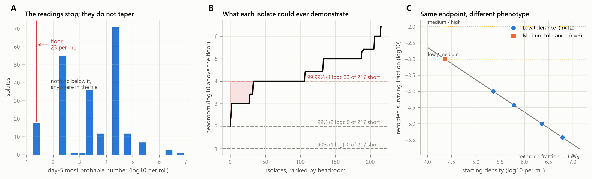
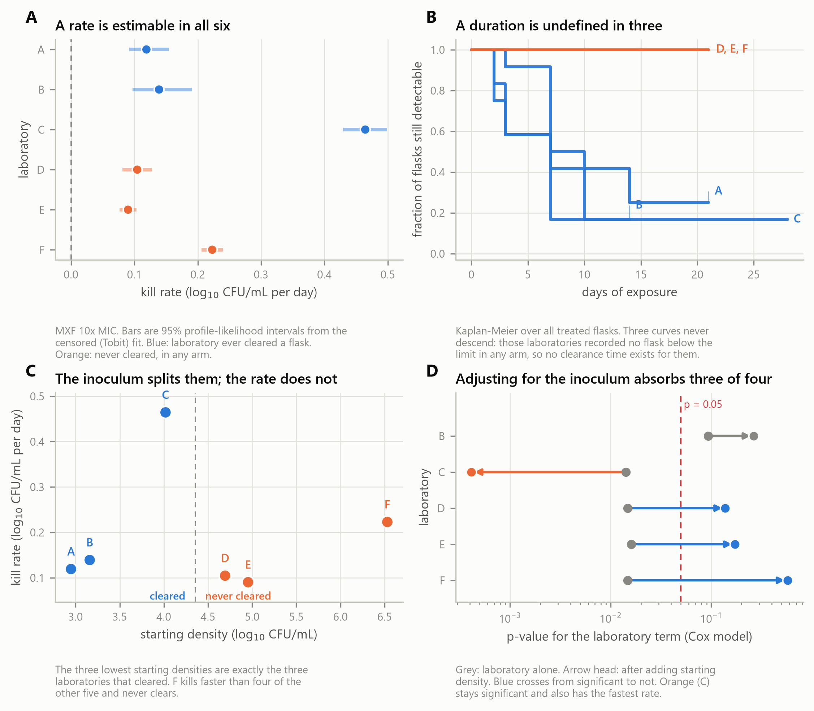
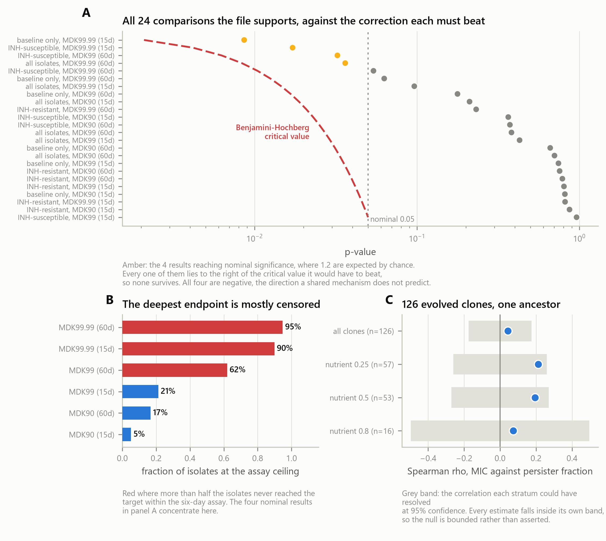

# Antibiotic tolerance is assigned from the starting inoculum wherever killing reaches the assay floor

**Authors:** [to be inserted]

**Correspondence:** [to be inserted]

**Figures:** 4 | **Tables:** 8 | **Supplementary tables:** 2 | **Supplementary figures:** 1

## Abstract

A culture taken after antibiotics have started is not evidence of sterility. The
field's answer was to ask not whether a culture went negative but how far it
fell: the minimum duration for killing, the time
to a 90, 99 or 99.99 per cent reduction, is the accepted quantitative indicator
of antibiotic tolerance. Expressing killing as a fraction of the starting
population is what should make it inoculum-independent. That independence holds
in the definition and fails in the measurement.

A fractional reduction is observable only where the assay resolves it. An
isolate's headroom, the distance from its starting density to the assay floor,
caps the deepest reduction demonstrable whatever the drug does, and a reading
resting on the floor yields a fraction of floor over starting density: the most
inoculum-dependent quantity available.

In 217 clinical *Mycobacterium tuberculosis* isolates carrying their authors'
own tolerance classification, none lacks the headroom for a 90 or 99 per cent
endpoint, while 33 lack it for the 99.99 per cent endpoint the classification
uses, and all 33 are recorded as failing to reach it. Eighteen
isolates ended at the same unmeasurable floor and a single threshold on their
starting density reproduces every label they were given; for twelve, no count the
assay could have returned would have changed the class. The label tracks
growth state, which survives adjustment for starting density, and isoniazid
resistance, which does not: resistant isolates enter ten-fold lower and lose
two-thirds of their apparent tolerance once that is accounted for.

In a six-laboratory exercise distributing one strain under one protocol, the
population that fell faster crossed the detection limit later in 36.6 per cent
comparisons, though the kill rate still carries more of the spread. A tolerance
call reported without its starting density and quantification limit cannot be
interpreted.

**Keywords:** antibiotic tolerance; minimum duration for killing; *Mycobacterium
tuberculosis*; limit of quantification; censored data; time-kill kinetics;
inoculum effect

## Introduction

Every clinical microbiologist is taught that a culture taken after antibiotics
have started is not evidence of sterility. It is why blood cultures are drawn
before the first dose. A drug suppresses growth, injures cells sublethally,
carries over into the medium, and drives the population beneath what the plate
can see; the plate then reports absence, and absence is not what happened. The
rule is old, it is correct, and nobody disputes it.

Tuberculosis makes the rule expensive. Regimens run for four to six months, the
compounds that could shorten them must be selected from in vitro killing
experiments, and the phenotype invoked to explain why treatment takes so long —
tolerance, the capacity of a genetically susceptible population to survive
exposure that should kill it — is defined by how long killing takes. A phenotype
defined by a duration is a phenotype defined by exactly the observation the old
rule warns about.

The field's response was not to ignore the warning but to engineer around it.
Rather than asking whether a culture went negative, the modern definition asks
how many logs the population fell: the minimum duration for killing, MDK, is the
time to a specified fractional reduction — 90, 99 or 99.99 per cent — and it is
proposed as the tolerance counterpart to the minimum inhibitory concentration
(Brauner et al. 2016; Brauner et al. 2017). The choice of a *fraction* is the
whole point. A ratio to the starting population is scale-free: on a log-linear
decline at rate *b*, the time to a *q*-log reduction is *q/b*, and the starting
density cancels. By construction, MDK cannot be contaminated by how much culture
went into the tube. That is the property it was built to have.

We report that the property holds only in the estimand, not in the measurement,
and that the difference is consequential. A *q*-log reduction can be estimated
only if *q* logs are visible, and what is visible is bounded below by the assay's
floor. Writing *L* for that floor and *N₀* for the starting density, an isolate
has

    headroom  H = log10(N₀ / L)

and no experiment can demonstrate a reduction deeper than *H*, however completely
the drug worked. Where *H < q* the endpoint is unreachable before the drug is
added. Worse, when the final reading sits *at* the floor, the recorded fraction
is not a measurement at all but the ratio *L/N₀* — the most starting-density-
dependent quantity available. The metric designed to be inoculum-independent
becomes a pure inoculum readout precisely at the depth where tolerance is scored.

This is testable rather than arguable, because one published deposit assigns the
tolerance phenotype itself. Vijay and colleagues (2024) scored 217 clinical
*Mycobacterium tuberculosis* isolates as having low, medium or high tolerance to
rifampicin, and deposited alongside each call the starting most probable number,
the growth rate, the isoniazid susceptibility and the killing readings the call
was built from. The classification, the inputs to it, and the assay geometry that
bounds it are all in the same file.

The aim of this study is to determine what a log-reduction tolerance
classification measures when the assay floor is within reach of the endpoint, and
to establish whether real isolates have been assigned tolerance phenotypes on
that basis. We test the hypothesis that a deep log-reduction endpoint is
inoculum-dependent through its observability even though it is
inoculum-independent in its definition, using the classification and the assay
geometry of 217 clinical isolates; we then ask what the resulting phenotype
tracks — drug susceptibility, or the physiological state of the culture. Two
further deposits establish that the same arithmetic governs killing experiments
where inoculum is controlled by protocol rather than by clinical accident: a
six-laboratory consortium exercise distributing one strain under one written
protocol, and a concentration-by-time grid in the same organism. If the
hypothesis holds, a tolerance call reported without its starting density and its
limit of quantification cannot be interpreted, and the phenotypes assigned in its
name are, in part, a record of how the assay was set up.

---

## Results

### 1. The assay floor limits the dynamic range available to a log-reduction endpoint

The most probable number readings take the discrete values of an MPN table, and
the day-5 column does not taper towards zero but stops. Eighteen isolates sit at
exactly 23 per mL in the 15-day panel and six in the 60-day panel, with no value
anywhere in the file below it (Fig. 1A). That is the behaviour of a floor rather
than of a tail, and it is treated as one throughout.

The consequence is that each isolate carries a fixed budget of observable
killing. At 15 days of prior culture the starting densities span 3.36 to 7.79
log10, so headroom spans 2.00 to 6.42 log10 (Fig. 1B, Table 2). Against that budget the
three deposited endpoints behave very differently. No isolate lacks the headroom
for a 90 or a 99 per cent reduction: 0 of 217 in both cases. **Thirty-three of
217 isolates — 15.2 per cent — lack the headroom for the 99.99 per cent
endpoint**, which is to say that a four-log reduction was unobservable for them
before rifampicin was added.

**Table 2.** The reduction each tolerance endpoint requires against the reduction the assay can resolve. Headroom is the distance from an isolate's starting density to the MPN floor of 23 per mL. An isolate short of headroom cannot reach that endpoint however completely the drug worked, and every such isolate is recorded at the assay ceiling.

| Prior culture | Endpoint | Isolates | Short of headroom | Fraction short | At ceiling: short vs ample |
| --- | ---: | ---: | ---: | ---: | ---: |
| 15 days | 90% (1 log) | 217 | 0 | 0.0% | - |
| 15 days | 99% (2 log) | 217 | 0 | 0.0% | - |
| 15 days | 99.99% (4 log) | 217 | 33 | 15.2% | 100% vs 88% |
| 60 days | 90% (1 log) | 210 | 0 | 0.0% | - |
| 60 days | 99% (2 log) | 210 | 0 | 0.0% | - |
| 60 days | 99.99% (4 log) | 210 | 7 | 3.3% | 100% vs 95% |

All 33 are recorded as not having reached it. Among the 184 isolates that did
have four logs of headroom, 162 are at the ceiling, 88.0 per cent (Fisher exact
p = 0.030). The deepest endpoint is therefore the only one at risk, and it is the
one the tolerance classification is built on.

### 2. Identical floor observations received different tolerance phenotypes

The deposited tolerance level is a threshold on the recorded surviving fraction,
with no overlap between classes: at day 5 and 15 days of prior culture, low
tolerance covers fractions below 10⁻³, medium covers 10⁻³ to 10⁻², and high
exceeds 10⁻². The label is a deterministic function of that fraction.

Eighteen isolates ended at the floor, which is to say that as far as the assay
could see they were killed to the same degree. Their recorded surviving fractions
span 265-fold, from 3.8 × 10⁻⁶ to 1.0 × 10⁻³, and that span is exactly the
265-fold span of their starting densities, because for a reading at the floor the
recorded fraction is *L*/*N₀* (Fig. 1C). These are upper bounds on survival, not
measurements of it.

The tolerance labels assigned to them differ. Six isolates that began at 23 000
per mL received a fraction of 10⁻³ and were classified **medium** tolerance;
twelve that began at 230 000 or above received 10⁻⁴ or less and were classified
**low**. Predicting the label from the starting density alone, with a single cut,
reproduces all eighteen (Table 3). For these isolates the recorded phenotype is a
function of where the culture started and not of how rifampicin acted on it.

**Table 3.** Isolates whose day-5 reading sat on the MPN floor, so that as far as the assay could resolve they were killed to the same degree. Because a reading at the floor gives a recorded fraction of L/N0, the spread in their apparent survival equals the spread in their starting densities exactly, and the labels they received differ. The last three columns sort every call in the panel, not only those at the floor: a floor reading bounds the class from above; sweeping the true count across that range shows twelve labels for which only one class was ever reachable and six the assay cannot decide between.

| Prior culture | At the floor | Starting density spread | Recorded survival spread | Labels assigned at the floor | Determinable | Forced by inoculum | Undecidable |
| --- | ---: | ---: | ---: | ---: | ---: | ---: | ---: |
| 15 days | 18 | 265x | 265x | Low: 12, Medium: 6 | 185 | 12 | 6 |
| 60 days | 6 | 100x | 100x | Low: 6 | 191 | 6 | 0 |

The question this raises is not whether those labels are wrong but whether the
assay could have returned any other answer, and for these eighteen it could not.
A reading at the floor places the true count somewhere between zero and *L*.
Sweeping the true count across that whole range and applying the deposited
thresholds gives the classes that were reachable at all. For the twelve isolates
that began at 230 000 per mL or above, every admissible count from zero to the
floor yields a fraction below 10⁻³ and therefore the label **low**: the answer
was fixed by the starting density before rifampicin was added, and the reading
contributed nothing to it. For the six that began at 23 000, the admissible range
spans the low–medium threshold, so the assay cannot say which class the isolate
belongs to. Twelve labels are arithmetic and six are undecidable. None of the
eighteen is a measurement of what the drug did.

Sorting every call in the panel this way gives how much of a published
classification is observation and how much is arithmetic (Table 3). At 15 days of
prior culture, 185 of 203 calls are determinable, 12 are forced by the inoculum,
and 6 are undecidable; at 60 days the counts are 191, 6 and none, because the
cultures are denser and few readings reach the floor.

The larger effect is at the deeper endpoint and it falls unevenly on the groups a
study would compare. The 99.99 per cent endpoint is unreachable for 26.2 per cent
of isoniazid-resistant isolates against 7.6 per cent of susceptible ones (Fisher
exact p = 0.00056), and their median headroom differs by a full log, 4 against 5.
A comparison of tolerance between those groups is therefore in part a comparison
of how well each group could be measured, which is the disposition the previous
section quantifies.

### 3. The deposited labels track growth state, and resistance only until density is included

Eight association tests are available between the deposited label and its
candidate determinants — two predictors, at two culture ages and two endpoint
depths — and they are corrected as one family. Two survive (Table 4).

**Table 4.** The family of 8 tests between the deposited tolerance label and its candidate determinants, corrected together at a false discovery rate of 5%. 2 survive. The final column shows what happens to the resistance association once the starting density enters the model.

| Predictor | Prior culture | Depth | n | Coefficient | p | Survives BH | After adjusting for starting density |
| --- | ---: | ---: | ---: | ---: | ---: | ---: | ---: |
| growth | 15 d | D5 | 202 | +0.0266 | 0.0025 | yes | - |
| resistance | 15 d | D5 | 202 | +0.2589 | 0.0035 | yes | +0.089 (p=0.374) |
| growth | 60 d | D2 | 196 | -0.0195 | 0.0590 | no | - |
| growth | 15 d | D2 | 202 | +0.0116 | 0.0812 | no | - |
| resistance | 15 d | D2 | 202 | +0.0515 | 0.4446 | no | -0.132 (p=0.078) |
| resistance | 60 d | D2 | 196 | -0.0551 | 0.5486 | no | -0.107 (p=0.243) |
| resistance | 60 d | D5 | 196 | +0.0389 | 0.6797 | no | -0.004 (p=0.967) |
| growth | 60 d | D5 | 196 | -0.0041 | 0.6999 | no | - |

The label tracks the **growth rate** of the isolate: slower growth accompanies a
higher tolerance class, and the association survives adjustment for starting
density (β = +0.027 per unit time to OD 0.4, p = 0.0025). It also tracks
**isoniazid resistance**, until the starting density enters the model. Unadjusted,
resistant isolates sit 0.259 tolerance classes higher (95 per cent CI +0.086 to
+0.431, p = 0.0035); adjusted, the coefficient falls by 66 per cent to +0.089
(95 per cent CI −0.108 to +0.285, p = 0.374). The interval no longer excludes
zero. We describe this as attenuation rather than elimination.

The mechanism of that attenuation is measurable. Isoniazid-resistant isolates
enter this assay at 5.36 log10 against 6.36 for susceptible isolates, ten-fold
lower (Mann–Whitney p = 9.1 × 10⁻¹⁴), and 26 per cent of them lack the headroom
for the deepest endpoint against 8 per cent of susceptible isolates. They are
one log poorer in observable killing before the experiment begins.

Why they seed lower is not established here, and the obvious explanation fails:
resistant isolates do not grow significantly more slowly in this deposit (median
time to OD 0.4 of 19 against 17, p = 0.24), and 85 of them carry *katG* S315X,
the mutation that predominates clinically precisely because it is close to
fitness-neutral. The association between resistance and a low starting inoculum
is real, large and unexplained, and we record it as such.

Neither surviving association appears in the 60-day panel, and for the growth
association the difference between panels is itself supported (interaction
p = 0.0072); for resistance it is not (p = 0.088). The panels differ in exactly
the way the mechanism requires: by 60 days the cultures are 38-fold denser, the
spread of starting densities has more than halved, from an interquartile range of
1.00 to 0.42 log10, and the fraction of isolates short of headroom falls from
15.2 to 3.3 per cent. The confound is a property of a thin assay and it thins out
when the assay is not. Because the same isolates appear in both panels, this
comparison is not independent and bounds the evidence rather than establishing it.

### 4. The same arithmetic appears where the inoculum is set by protocol

If the effect is a property of assay geometry rather than of clinical sampling,
it should appear where one protocol, one strain and one stock are distributed
deliberately. It does.

At ten times the minimum inhibitory concentration of moxifloxacin all six
laboratories return a positive kill rate spanning 5.2-fold, from 0.090 to 0.464
log10 CFU/mL per day, and across all 30 laboratory-by-arm cells the Tobit and
imputation estimates never differ by more than 0.003 log10 per day (Fig. 2A,
Table 5). The duration endpoint behaves differently on the same flasks. Of 72
treated flasks, 29 ever fell below the limit; institutes A, B and C cleared
flasks in every arm and institutes D, E and F cleared none in any arm (Fig. 2B).
For half the laboratories the time to clearance is right-censored throughout.

**Table 5.** Moxifloxacin at ten times MIC. Every laboratory yields a rate; three yield no clearance time in any arm. The two censoring estimators agree to 0.003 log10 per day.

| Lab | Starting density (log10 CFU/mL) | Kill rate (log10/day) | 95% profile interval | By imputation | Readings censored | Flasks ever cleared (all arms) |
| --- | ---: | ---: | ---: | ---: | ---: | ---: |
| A | 2.95 | 0.119 | 0.092 to 0.155 | 0.119 | 51% | 9 / 12 |
| B | 3.16 | 0.139 | 0.097 to 0.191 | 0.138 | 58% | 10 / 12 |
| C | 4.02 | 0.464 | 0.430 to 0.499 | 0.464 | 44% | 10 / 12 |
| D | 4.69 | 0.104 | 0.081 to 0.128 | 0.105 | 3% | 0 / 12 |
| E | 4.95 | 0.090 | 0.077 to 0.104 | 0.090 | 1% | 0 / 12 |
| F | 6.53 | 0.223 | 0.206 to 0.240 | 0.223 | 0% | 0 / 12 |

The two orderings do not correspond. Ranked by starting density, the three lowest
laboratories are exactly the three that cleared and the three highest exactly the
three that did not, without exception; ranked by kill rate there is no such
correspondence (Fig. 2C). Institute F, with the highest starting density at 6.53
log10, kills faster than four of the other five at 0.223 log10 per day and never
clears. Institute E returns the slowest rate of all at 0.090 and also never
clears.

Starting density separates flasks that ever cleared from those that never did
with an area under the curve of 0.974 (Mann–Whitney p = 1.2 × 10⁻¹⁰). In a Cox
model on laboratory alone, institutes D, E and F carry hazard ratios of 0.20 with
p-values of 0.015, 0.016 and 0.015; adding starting density moves those to 0.138,
0.172 and 0.576, and concordance rises from 0.896 to 0.930 (Fig. 2D). Institute C
does not dissolve: it remains distinguishable after adjustment with a hazard
ratio of 5.27 (p < 0.001), and it is also the fastest killer, which is the
behaviour expected of a laboratory that genuinely kills faster. The Schoenfeld
test gives no evidence against proportional hazards (smallest p = 0.63).

Killing here is not sustained, and this is stronger than a caveat about
individual flasks. Of the 64 treated series carrying at least three quantified
readings at the most sensitive plating volume, the final step is not a decline in
48, and 44 end more than one log10 above their own lowest reading, with a median
rebound of 2.17 log10 and a largest of 5.54. Seventeen of the 32 flasks that fell
below the limit were detectable again at a later visit, 14 of them in treated
arms. A crossing of the detection limit in this deposit is therefore usually a
transient rather than an endpoint, which is a further reason it summarises less
than the trajectory that produced it. Killing itself is real and dose-dependent:
at one times the inhibitory concentration five of six laboratories record net
growth under moxifloxacin, between −0.047 and −0.214 log10 per day, and at ten
times all six record net decline.

One feature of this design limits what the Cox adjustment can be said to show,
and we state it rather than leave it to be found. Starting density is not
independent of laboratory here: 87.0 per cent of the variance in flask-level
starting density lies between laboratories rather than within them, the
laboratory means spanning 3.62 log10 against a median within-laboratory standard
deviation of 0.43. Adding starting density to a model that already contains
laboratory is therefore closer to replacing a label with a number carrying much
the same information than to separating two independent covariates. What the
adjustment establishes is that a continuous measure of where the cultures began
accounts for the laboratory term at least as well as the laboratory identity
does, and that one institute resists even that. It does not establish that
laboratory and inoculum are separable in this dataset. They are not, and a design
that fixed the inoculum across laboratories would be required to separate them.

### 5. Rank inversions are common and are explained by distance over rate

Across 191 pairs of flasks in the same treatment arm from different laboratories,
with 45 further pairs that the censoring could not settle and which are excluded
rather than imputed, **70 pairs — 36.6 per cent (95 per cent CI 30.1 to 43.6) —
are inversions**: the flask in which the population fell faster crossed the
detection limit later (Table 6). The criterion *D_A*/*D_B* > *b_A*/*b_B* calls
83.8 per cent of pairs correctly, so the inversions are accounted for by the
arithmetic of the crossing-time decomposition in the Methods rather than by
anything else.

**Table 6.** Pairs of flasks in the same arm from different laboratories. An inversion is a pair in which the population that fell faster crossed the detection limit later. 45 further pairs that the censoring could not settle are excluded rather than imputed. The last two columns decompose the spread in crossing time; the rate term is the larger in every arm.

| Arm | Comparable pairs | Inversions | Rate | 95% CI | Called by D/b criterion | Variance: distance | Variance: rate |
| --- | ---: | ---: | ---: | ---: | ---: | ---: | ---: |
| All arms pooled | 191 | 70 | 36.6% | 30.1-43.6% | 83.8% |  |  |
| INH 10X MIC |  |  |  |  |  | 31.4% | 68.6% |
| INH 1X MIC |  |  |  |  |  | 19.6% | 80.4% |
| MXF 10X MIC |  |  |  |  |  | 39.4% | 60.6% |

The variance decomposition sets the size of the effect and bounds the claim. Of
the variation available to move a clearance time, the distance term carries 39.4
per cent at ten times moxifloxacin, 31.4 per cent at ten times isoniazid and 19.6
per cent at one times isoniazid; the rate term carries the remainder. **The rate
contributes more of the spread than the distance does in every arm.** A clearance
time is therefore not predominantly an inoculum measurement. It is a mixture, in
which the inoculum is a large minority contribution — large enough to reverse the
ranking in more than a third of comparisons, and not large enough to justify
treating the endpoint as an inoculum readout in general.

The decomposition inherits one assumption that the trajectories do not honour.
It fits a single slope across the window, and most of these series decline and
then regrow, so the fitted rate is an average across two regimes rather than a
kill rate. The inversion count does not depend on it, because an inversion is
read from the observed crossings; the variance shares do, and they should be read
as a decomposition of that averaged slope. This works against the distance term
rather than for it: a slope averaged over decline and regrowth is closer to zero
and more variable than the killing phase alone, which inflates the rate term's
share. The share attributable to the distance is therefore a lower bound, and the
conclusion it supports, that the rate carries more of the spread than the
inoculum does, is the conservative one.

### 6. A deep endpoint also loses the dose-response signal

In the concentration-by-time grid, survivors across a 32-fold range of apramycin
separate 6.9-fold at day 3, 48.2-fold at day 7 and 5.2-fold at day 14 (Fig. 3,
Table 7). An experiment read at 14 days would report this drug as insensitive to
a 32-fold change in dose. Fitted per interval on a bootstrap resampling all three
replicates at both ends of every interval, the concentration slope is +0.059
log10 per day per doubling over days 0 to 3 (95 per cent interval +0.030 to
+0.088, p = 0.013), +0.033 over days 3 to 7 (−0.052 to +0.118, p = 0.24) and
−0.025 over days 7 to 14 (−0.060 to +0.010, p = 0.091); the early-versus-late
contrast is firm (+0.084, +0.037 to +0.128) and the early-versus-middle contrast
is not (p = 0.43).

**Table 7.** The same 32-fold concentration range summarised at each sampling day (upper rows), and the concentration slope fitted separately in each interval (lower rows). Slopes and intervals are from the replicate-level bootstrap described in Section 2.

| Read at | Survivor ratio (low/high dose) | log10 separation | Slope per doubling | 95% interval | p |
| --- | ---: | ---: | ---: | ---: | ---: |
| day 3 | 6.9x | 0.84 |  |  |  |
| day 7 | 48.2x | 1.68 |  |  |  |
| day 14 | 5.2x | 0.71 |  |  |  |
| days 0-3 |  |  | +0.0590 | +0.0302 to +0.0878 | 0.013 |
| days 3-7 |  |  | +0.0330 | -0.0517 to +0.1176 | 0.236 |
| days 7-14 |  |  | -0.0251 | -0.0602 to +0.0099 | 0.091 |

The sign of the late slope is not claimed. By day 14 the highest arm sits at
65 CFU/mL and the source states no limit of quantification; at any limit of
100 CFU/mL or above, which is what routine 10 µL plating gives, that arm is
censored and its apparent rate is a lower bound. What holds without any
assumption about the floor is that the separation collapses.

### 7. Resistance and tolerance remain separate axes

That the two axes are separate is the premise of the framework that defines them
(Brauner et al. 2016), and the deposits bound rather than assert it. The
217-isolate file supports 24 comparisons between the concentration axis and the
duration axis. Four reach nominal significance where 1.2 are expected by chance
and none survives Benjamini–Hochberg correction (Fig. 4, Table 8). The four are
negative, so a higher inhibitory concentration accompanies a *shorter* duration,
which is not the direction a shared mechanism predicts, and they concentrate in
the deepest endpoint — the one shown above to be compromised. The design
resolves correlations of 0.14 to 0.25 depending on stratum.

**Table 8.** The six strongest of the 24 comparisons the 217-isolate file supports. 4 reach nominal significance where 1.2 are expected by chance; none exceeds its Benjamini-Hochberg critical value. The final column is the correlation each design could have resolved at 95% confidence.

| Stratum | Endpoint | n | Spearman rho | p | BH critical value | Survives correction | Resolvable rho |
| --- | ---: | ---: | ---: | ---: | ---: | ---: | ---: |
| baseline only | MDK99.99 (15d) | 162 | -0.206 | 0.0086 | 0.0021 | no | 0.15 |
| INH-susceptible | MDK99.99 (15d) | 119 | -0.218 | 0.0171 | 0.0042 | no | 0.18 |
| INH-susceptible | MDK99 (60d) | 117 | -0.198 | 0.0324 | 0.0063 | no | 0.18 |
| all isolates | MDK99.99 (60d) | 187 | -0.153 | 0.0361 | 0.0083 | no | 0.14 |
| INH-susceptible | MDK99.99 (60d) | 117 | -0.179 | 0.0540 | 0.0104 | no | 0.18 |
| baseline only | MDK99.99 (60d) | 156 | -0.149 | 0.0628 | 0.0125 | no | 0.16 |

---

## Supplementary tables

These support Sections 4.2 and 4.5 but are not part of the main argument, and are held here so the Results stay on one line of reasoning.

**Table S1.** Every mycobacterial rate admissible under the rule of Section 2.3, against the constant in routine use. Values reported as a cumulative log reduction over a fixed window are excluded and are not listed.

| Constant | State measured in | Published (ln/h) | Assumed (ln/h) | Gap | Source PMID |
| --- | ---: | ---: | ---: | ---: | ---: |
| psi max | intracellular, THP-1 macrophage | +0.0330 | +0.9903 | 30x | 28356552 |
| psi max | extracellular, planktonic 7H9 | +0.0769 | +0.9903 | 13x | 28356552 |
| psi max | in vivo, sputum | +0.0010 | +0.9903 | 1,011x | 34871099 |
| psi min | rifampicin, intracellular | -0.0220 | -6.0000 | 273x | 28356552 |
| psi min | ethambutol, intracellular | -0.0200 | -6.0000 | 300x | 28356552 |
| psi min | pyrazinamide, intracellular | -0.0100 | -6.0000 | 600x | 28356552 |
| psi min | isoniazid, intracellular | -0.0080 | -6.0000 | 750x | 28356552 |
| psi min | bedaquiline, in vivo sputum | -0.0210 | -6.0000 | 286x | 34871099 |
| psi min | rifampicin, extracellular (provisional) | -0.1011 | -6.0000 | 59x | 28356552 |
| psi min | ethambutol, extracellular (provisional) | -0.0651 | -6.0000 | 92x | 28356552 |

**Table S2.** The same nominal concentration expressed in multiples of the minimum inhibitory concentration each population actually evolved to. At 25 ug/mL the same number denotes a sub-inhibitory exposure in one nutrient condition and a strongly inhibitory one in another.

| Nominal concentration (ug/mL) | Nutrient levels | Lowest exposure (x MIC) | Highest exposure (x MIC) | Spread | Straddles the MIC |
| --- | ---: | ---: | ---: | ---: | ---: |
| 12.5 | 3 | 1.49 | 4.74 | 3.2x | no |
| 25 | 3 | 0.55 | 9.47 | 17.1x | yes |
| 50 | 2 | 5.08 | 10.95 | 2.2x | no |
| 100 | 1 | 9.72 | 9.72 | 1.0x | no |

The same question in 126 evolved clones sharing an ancestor gives ρ = +0.043
(p = 0.63) against a resolvable ρ of 0.175, and independence holds within every
nutrient stratum separately.

---

## Discussion

### What fails, and where

That a negative culture under antibiotic exposure is not evidence of sterility is
established clinical microbiology and is not what this paper reports. What it
reports is that the quantitative metric introduced to replace that judgement
carries the same defect into a number, where it is harder to see.

The minimum duration for killing is scale-free by construction: a fractional
reduction divides out the starting density, and that is the property that makes
it the intended counterpart to the minimum inhibitory concentration. The property
holds in the estimand. It fails in the measurement, for a reason that is
arithmetic rather than statistical. A *q*-log reduction is observable only where
*q* logs are visible, and when the final reading rests on the floor the recorded
fraction reduces to *L*/*N₀* — a quantity determined entirely by the starting
culture. Fifteen per cent of the clinical isolates examined here could not have
demonstrated the deepest endpoint under any drug effect whatever, and all of them
are recorded as having failed to demonstrate it. Eighteen isolates that ended at
the same unmeasurable value carry tolerance labels that a single threshold on
their starting density reproduces exactly. Sweeping the true count across the
range the floor admits shows why: for twelve of them only one class was ever
reachable, so the label was fixed before the drug was added, and for the other
six more than one class is reachable, so the assay cannot decide between them.
Twelve are arithmetic and six are undecidable.

The failure is specific and it is bounded. Neither the 90 nor the 99 per cent
endpoint is compromised in this deposit: no isolate lacks headroom for either.
It is the 99.99 per cent endpoint that is unreachable for a substantial minority,
and it is the deep endpoint the clinical classification uses. That specificity is
what makes the problem fixable rather than fatal.

### What the tolerance phenotype tracks instead

Removing the assay's contribution leaves something rather than nothing, and what
remains is biologically coherent. Growth state predicts the tolerance class and
survives adjustment for starting density, which is the expected direction:
isoniazid requires KatG activation and active cell-wall synthesis, rifampicin
requires transcription, and a population that is not dividing presents less of
what these drugs act on. Physiological state, not drug susceptibility, is the
axis the classification is reading.

The isoniazid-resistance association behaves differently and instructively. It is
present unadjusted and loses two-thirds of its coefficient once starting density
is included, with an interval that then spans zero. The mechanism is visible in
the same file: resistant isolates enter the assay ten-fold lower and a quarter of
them lack the headroom the endpoint requires. We do not know why they seed lower.
The natural explanation — that resistance carries a fitness cost — is not
supported here, since these isolates do not grow measurably more slowly and most
carry the near-neutral *katG* S315X allele. That gap is a finding in its own
right and belongs in the next study rather than in a speculative sentence in this
one.

We are careful about the direction of this inference. Starting density could be a
mediator rather than a confounder: if resistance slows growth and slow growth
causes genuine tolerance, adjusting for the density that slow growth produces
would remove real signal. The asymmetry is what makes us prefer the confounding
reading — growth survives adjustment and resistance does not — but it is an
argument, not a proof, and a design that fixes the inoculum would settle it.

### The size of the effect, stated against our own interest

Where the inoculum is set deliberately rather than by clinical accident, the same
arithmetic operates and can be measured rather than inferred. In more than a
third of cross-laboratory comparisons the flask in which the population fell
faster crossed the detection limit later, and the simple distance-over-rate
criterion accounts for six in seven of those inversions.

The variance decomposition, however, does not support the stronger reading, and
we report it because it is ours to report. The rate term carries more of the
spread in clearance time than the distance term in every arm examined. A
clearance time is not mostly a measurement of the inoculum. It is a mixture in
which the inoculum is a large minority — enough to reverse the ranking of two
populations in a third of comparisons, which is the number that matters to anyone
choosing between two compounds, and not enough to license the claim that the
endpoint measures the starting culture. Both halves of that sentence are load
bearing.

### Relation to the analyses these deposits were made for

Our reading and van Wijk's agree where they overlap. They report the inoculum
spread themselves and conclude that baseline burden varied between laboratories
while net drug effect varied less; that conclusion anticipates part of ours and
belongs to them. The separation is that they excluded readings outside the
quantification limits from numerical analysis, which is a defensible reporting
decision that forecloses the question asked here, because it removes the
observations from which a duration is built.

Vijay and colleagues report associations between tolerance, resistance status and
treatment history in the same isolates. We do not dispute the measurements; the
deposit is unusually complete, and it is only because they deposited the
classification, its inputs and the assay geometry together that this analysis was
possible at all. What we add is that the deepest of their endpoints has a
dynamic-range constraint that varies systematically with the isolate groups being
compared, and that the resistance association does not survive its inclusion.

### What should change

**Report the starting density and the limit of quantification with every
tolerance measurement.** Together they give the headroom, and without the
headroom a log-reduction endpoint cannot be interpreted. Neither costs anything
to record. Four of the deposits examined in the course of this project state no
limit anywhere.

**Choose the endpoint depth against the headroom actually available.** A 99 per
cent endpoint was reachable for every isolate in this deposit and a 99.99 per
cent endpoint for 85 per cent of them. Where the deep endpoint is wanted, the
starting culture must be concentrated or the assay floor lowered until the budget
covers it; where it cannot be, the shallower endpoint is the honest one. This is
a design decision that is currently not being made.

**Treat an endpoint at the floor as a bound, not a value.** A recorded fraction of
*L*/*N₀* is an upper limit on survival. Analysed as a measurement it manufactures
differences between isolates that were killed identically as far as anyone can
tell.

None of this requires new apparatus or a statistician, and to make that concrete
the four checks are released as a small command-line tool alongside the analysis
code. Given a starting density and either an assay floor or a plated volume, it
returns the headroom, states which of the 90, 99, 99.9 and 99.99 per cent
endpoints that headroom can support, and reports the recorded fraction a
floor-level reading would produce, labelled as the bound it is. Where a culture
volume is known it also returns the viable burden a blank reading is consistent
with; where it is not, it declines to compute it rather than assuming one. The
tool exits non-zero when a requested endpoint is unreachable, so it can be run
before an experiment rather than after it.

**Report physiological state as a required field.** It is what the classification
is reading, and it is currently the least documented variable in the assay.

**Fix the inoculum, or adjust for it, before comparing tolerance across groups.**
The comparison that motivated this work — resistant against susceptible isolates
— is confounded by a ten-fold difference in starting density whose cause is
unknown. Until that is understood, group comparisons of tolerance in clinical
isolates should carry the starting density as a covariate.

---

## Conclusion

A negative culture under antibiotic exposure has never been evidence of
sterility, and the field knows it. The remedy adopted was to stop asking whether
the culture went negative and to start asking how far it fell, expressed as a
fraction of where it began so that the starting culture could not matter. We find
that the fraction stops being a fraction when the population reaches the floor,
and becomes a reading of the starting density instead — in this deposit, for
fifteen per cent of isolates at the depth the classification uses, and
demonstrably for the eighteen isolates whose recorded phenotype a single
threshold on their inoculum reproduces exactly, and for whom no admissible count
the assay could have returned would have changed the answer.

The consequence is not that tolerance is an artefact. It is that a tolerance call
made without its headroom cannot be told apart from an inoculum measurement, and
that the phenotype which does survive the correction is physiological state
rather than drug susceptibility. Reporting the starting density and the
quantification limit, matching endpoint depth to the range actually available,
and treating a reading at the floor as a bound would make a tolerance
classification mean the same thing in one laboratory as in the next. Until then,
some of what the field calls tolerance is a record of how much culture went into
the tube.

---

## Methods

### Datasets

Four published deposits are analysed (Table 1). None was generated for this
study, all are openly licensed, and no dataset was selected after its result was
known.

**Table 1.** The four published deposits reanalysed. None was generated for this study, and none was selected after its result was known.

| Dataset | Organism | Drug and range | Design | Deposit | Licence |
| --- | --- | --- | --- | --- | --- |
| Six-laboratory exercise | *M. tuberculosis* H37Rv | moxifloxacin, isoniazid, 1x and 10x MIC | 90 flasks, 2 775 readings | figshare 19766083 | CC BY 4.0 |
| Clinical isolates | *M. tuberculosis*, 217 isolates | rifampicin | 6 duration endpoints per isolate | eLife 93243, suppl. file 2 | CC BY 4.0 |
| Evolved clones | *E. coli*, 126 clones | amikacin | MIC and persister fraction per clone | Zenodo 7550302 | CC BY 4.0 |
| Concentration-by-time grid | *M. tuberculosis* | apramycin, amikacin, 1-128 ug/mL | 5 concentrations x 4 days x 3 replicates | figshare 26462791 | CC BY 4.0 |

**Clinical isolates with a deposited tolerance classification.** 217 *M.
tuberculosis* isolates assayed under rifampicin, each carrying a minimum
inhibitory concentration, minimum durations for 90, 99 and 99.99 per cent killing
at 15 and 60 days of prior culture, most probable number readings at days 0, 2
and 5, a growth-rate proxy, isoniazid susceptibility with the resistance mutation
where present, months on treatment, and the authors' own tolerance level for each
isolate (Vijay et al. 2024; eLife 93243 supplementary file 2). The killing assay
runs for six days, so an isolate not reaching its target within that window is
recorded at the ceiling. Of the 217 rows, 43 are follow-up isolates from patients
already represented, so a baseline-only stratum is analysed separately.

**The six-laboratory exercise.** *M. tuberculosis* H37Rv from one stock,
distributed with one written protocol to six laboratories blinded and labelled A
to F (van Wijk et al. 2023; figshare 19766083, CC BY 4.0). Moxifloxacin and
isoniazid at one and ten times the minimum inhibitory concentration, an untreated
control, three flasks per arm, sampled to day 21 or 28. Each sample was plated at
four volumes: 100 µL in quadruplicate, 10 µL as four drops, 10 µL as a single
drop, and 2.5 µL as a single drop. In the deposited file the colony count is
already expressed per millilitre, confirmed by the smallest count recorded at
each volume being exactly 1000 divided by that volume, which is one colony per
millilitre. The limit of quantification is therefore a property of the plated
volume and equals 1.0, 2.0, 2.0 and 2.6 log10 CFU/mL respectively. The analysis
covers 2 775 readings, of which 19.3 per cent are flagged below the limit and 24
above it.

**Evolved clones.** 126 *Escherichia coli* clones from a parallel evolution
experiment under amikacin, each carrying an endpoint minimum inhibitory
concentration and a persister fraction measured on the same clone, labelled by
the antibiotic concentration and nutrient level its population evolved under
(Windels et al. 2024; Zenodo 10.5281/zenodo.7550302, CC BY 4.0).

**Concentration-by-time grid.** Apramycin and amikacin against *M. tuberculosis*
at 128, 32, 8, 4 and 1 µg/mL, triplicate log10 CFU at days 0, 3, 7 and 14, with a
concurrent drug-free control at every visit (Kaur et al. 2024; figshare 26462791,
CC BY 4.0).

### Two kinds of limit, kept apart

Two distinct censoring problems arise and are handled separately, because
conflating them is the error this paper is about.

A **count below the assay floor** is left-censored: the population is somewhere
below a known value. In the six-laboratory deposit that value is a property of
the plated volume, as above. In the clinical deposit the readings are most
probable numbers taking the discrete values of an MPN table, and the day-5 column
bottoms out at 23 per mL with a visible pile-up there; that value is treated as
the floor, and the first Results section reports the evidence for it.

The six-laboratory deposit also carries the evidence for judging each reading
against its own volume rather than pooling. Each sample is plated at four
volumes at the same visit, so a below-limit flag can be checked against the other
platings of the same flask. Of its 498 flags, 83, or 16.7 per cent, are
contradicted: another plating of the same sample at the same visit, with a limit
at least as sensitive, returns a quantified count above the flagged reading's
limit. Those flags record a drop that missed rather than a culture that fell.
Pooling the four volumes to a single limit would treat them as evidence about the
population; judging each against the limit its own volume implies does not, and
that is the reason the analysis is built the way it is.

A **crossing time not observed within the study** is right-censored: the event
has not happened yet, which is not the same as the event having no time. A flask
that never fell below the limit contributes the information that its crossing
time exceeds its last visit, and enters the survival likelihood as such. It is
never recorded as missing.

### Dynamic range

For an isolate starting at *N₀* against a floor *L*, the **headroom** is
*H* = log10(*N₀*/*L*). It is the deepest reduction the assay can resolve and is
fixed by the dilution scheme and the starting culture before any drug acts. An
endpoint requiring a *q*-log reduction is **unreachable** for that isolate when
*H* < *q*, and an isolate whose final reading sits at the floor has a recorded
surviving fraction of exactly *L*/*N₀*, which is an upper bound on its true
survival rather than a measurement of it.

### Estimation

A **Tobit model** fits log10 CFU/mL linearly in time by maximum likelihood. An
observed reading contributes the usual Gaussian density; a censored reading
contributes log Φ((limit − µ)/σ), the probability that it fell below its own
limit. This is Beal's M3 (Beal 2001) written for this assay. Intervals come from
the profile likelihood.

**Multiple imputation** draws each censored reading from the fitted normal
truncated at its own limit, refits by ordinary least squares, and pools 50 fits
by Rubin's rules. It makes a different assumption from the Tobit model about what
happened below the limit, so agreement between them shows the answer is not
driven by either.

**Survival analysis** treats the first undetectable culture as the event, with
flasks never falling below the limit right-censored at their last visit. Curves
are estimated by Kaplan–Meier, compared by log-rank, and modelled by Cox
proportional hazards fitted on laboratory alone and then with starting density
added. Proportionality is tested on Schoenfeld residuals.

A cell is fitted only when it retains at least six quantified readings at three
distinct times; below that the slope is determined by the censoring pattern
rather than by the counts.

### The decomposition of a crossing time

Over an interval in which the decline is close to log-linear, log10 *N*(*t*) =
*a* − *bt*, and with *ℓ* the log10 detection limit and *D* = *a* − *ℓ* the
distance the population starts above it, the crossing time is *T* = *D*/*b*. For
two flasks,

    log(T_A / T_B) = log(D_A / D_B) − log(b_A / b_B)

which is exact on this model and splits a difference in clearance time into a
distance term and a rate term. An **inversion** is a pair in which A fell faster
yet crossed later, which occurs exactly when *D_A*/*D_B* > *b_A*/*b_B*. A single
slope is not a full description of a biphasic trajectory, so *b* is the average
decline over the window fitted; *D* is taken from the measured day 0 to 1 density
rather than from the fitted intercept, because a single line through a biphasic
curve extrapolates back to an intercept well below the culture the flask started
from.

### Multiplicity

Where a question admits more than one test, every test the deposit supports is
run, and the family is corrected by the Benjamini–Hochberg procedure at a false
discovery rate of 5 per cent. For each test we report the correlation the sample
size could have resolved at 95 per cent confidence, so that a null is bounded
rather than asserted.

### Reproducibility

Every number in this paper is regenerated by a script that writes a receipt
recording the software versions it ran under, and a separate audit script
recomputes each quantity quoted in the text from the table it came from and
reports any that disagree. Analyses used Python 3.14 with numpy 2.5.0, scipy
1.18.0, pandas 3.0.3 and lifelines 0.30.3.

---

## Data and code availability

Every dataset analysed here is already public under an open licence, and each is
identified by its deposit in Table 1. Nothing in this study required new patient
samples or new experimental data.

The analysis code, the audit script, the headroom tool described above and the
machine-readable receipts recording the software versions each stage ran under
will be released in a public repository on publication. Every number quoted in this manuscript is regenerated
from the deposits by that code, and a separate audit stage recomputes each one
from the table it came from and reports any that disagree.

---

## Declarations

**Ethics.** This study reanalysed publicly available, de-identified datasets. No
new patient samples were collected and no new experimental data were generated.

**Funding:** [to be inserted]

**Competing interests:** [to be inserted]

**Author contributions:** [to be inserted]

**Archived version:** [commit identifier of the submitted version, to be inserted]

---

## References

[Deliberately not yet compiled. The reference list is held back until the text
stops moving, so that citations are not renumbered repeatedly. Sources are named
in full in the text and in the deposit table.]

---

## Figure legends

**Figure 1. A log-reduction endpoint is bounded by the assay floor, and the bound
decides the phenotype.** 217 clinical *M. tuberculosis* isolates under
rifampicin, from the deposit that carries the tolerance classification.
(**A**) The distribution of day-5 most probable numbers. It stops at 23 per mL
with a pile-up on it rather than tapering, and no value anywhere in the file lies
below; that is the behaviour of a floor. (**B**) Headroom, the distance from each
isolate's starting density down to that floor, ranked across isolates, against
the depth each tolerance endpoint requires. No isolate is short of the 90 or 99
per cent endpoint. Thirty-three of 217 fall in the shaded band below the 99.99
per cent endpoint, and all 33 are recorded as failing to reach it. (**C**) The
eighteen isolates that ended at the floor. Their recorded surviving fractions lie
on the curve *L*/*N₀*, which is what a reading at the floor computes, so the
265-fold span in their apparent survival is exactly the 265-fold span in their
starting densities. The dotted lines are the deposited classification
thresholds: the isolates fall either side of the low/medium cut according to
where they began, not according to what rifampicin did. For the twelve below the
cut no other class was reachable from any admissible count; for the six above it
the admissible range straddles the cut and the class is undecidable.

**Figure 2. Where the inoculum is set by protocol, the two summaries still
diverge.** Six laboratories, one written protocol, one stock of *M. tuberculosis*
H37Rv, moxifloxacin at ten times the minimum inhibitory concentration.
(**A**) The kill rate by censored maximum likelihood with 95 per cent
profile-likelihood intervals; every laboratory yields one, spanning 5.2-fold.
(**B**) Kaplan–Meier curves for time to the first undetectable culture. Three
curves never descend: those laboratories recorded no flask below the limit in any
arm, so their clearance times are right-censored throughout. (**C**) The two
summaries against each other. The three lowest starting densities are exactly the
three laboratories that cleared; the kill rate produces no such separation.
(**D**) The p-value attached to each laboratory in a Cox model before (grey) and
after (arrow head) starting density is added. Blue: crosses from significant to
not. Orange: institute C remains distinguishable, and it also returns the fastest
rate.

**Figure 3. A late endpoint cannot resolve a 32-fold concentration range.**
Apramycin against *M. tuberculosis*, five concentrations, triplicate counts.
(**A**) The trajectories, with the quantification limit implied by 10 µL plating
drawn as a band; by day 14 the highest arm lies within it, so its apparent rate
over the final interval is a lower bound. (**B**) The ratio of survivors between
the lowest and highest concentration at each sampling day, rising to 48.2-fold at
day 7 and collapsing to 5.2-fold at day 14. (**C**) The concentration slope fitted
separately in each interval from a replicate-level bootstrap, 20 000 draws.

**Figure 4. Resistance and tolerance occupy separate axes, in two designs.**
(**A**) All 24 comparisons between the concentration axis and the duration axis
that the 217-isolate file supports, each against the Benjamini–Hochberg critical
value it would have to beat. Amber marks the four reaching nominal significance;
none survives. (**B**) The censoring behind them: the fraction of isolates at the
assay ceiling rises with endpoint depth, and the nominal hits concentrate where
censoring is heaviest. (**C**) The same question in 126 evolved *E. coli* clones,
by nutrient stratum.
